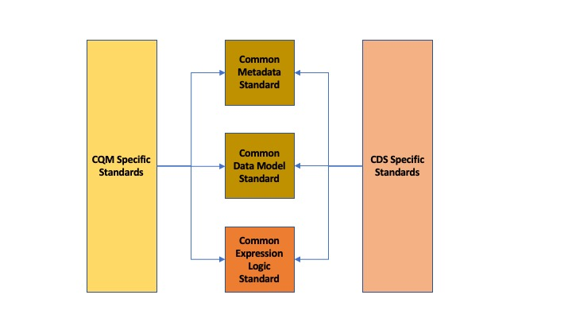
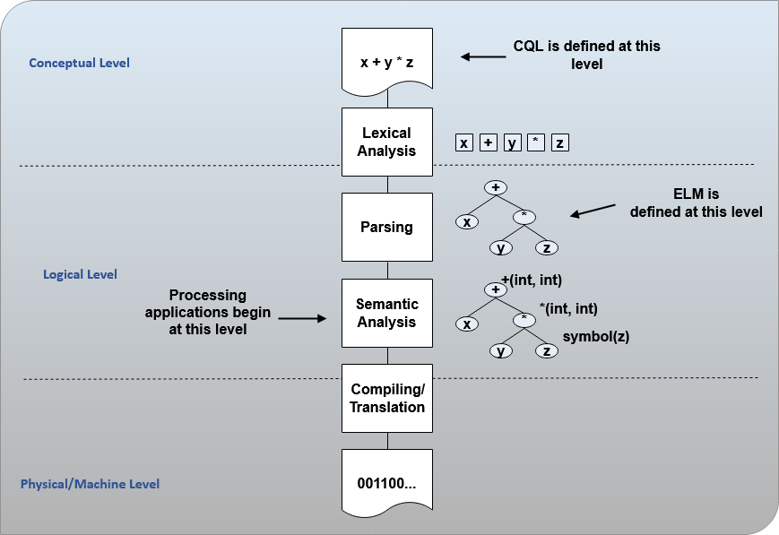

[[introduction]]
= 1. Introduction
:page-layout: dev
:backend: xhtml
:sectnums:
:sectanchors:
:toc:
:page-standards-status: normative

The Clinical Quality Language Specification footnote:[Note that CQL is unrelated to the Cassandra Query Language (see: http://cassandra.apache.org/doc/latest/cql/)] defines a representation for the expression of clinical knowledge that can be used within both the Clinical Decision Support (CDS) and Clinical Quality Measurement (CQM) domains. Although several standards exist for the expression of clinical quality logic, these standards are not widely adopted and present various barriers to point-to-point sharing of clinical knowledge artifacts such as lack of tooling, complexity of implementation, or insufficient expressivity.footnote:[As of the time of this publication, Clinical Quality Language has been adopted by the Centers for Medicare and Medicaid Services (CMS) for use in distributing electronic Clinical Quality Measure (eCQM) specifications, and is being investigated by multiple organizations for use in the representation and sharing of decision support. In addition, the language has been implemented in multiple commercial products and open source projects. See the link:10-c-referenceimplementations.html[Reference Implementations] topic for more information on the adoption of Clinical Quality Language.]

Rather than attempt to address these shortcomings in one of the existing standards, this specification provides a solution to enable shared understanding of clinical knowledge by defining a syntax-independent, canonical representation of logic that can be used to express the knowledge in any given artifact, and point-to-point sharing by defining a serialization for that representation.

The canonical representation, the Expression Logical Model (ELM)footnote:[Note that ELM is unrelated to the similarly named _elm_ programming language (see http://elm-lang.org).], is informed conceptually by the requirements of the clinical quality domains of measurement and improvement, and technically by compiler design best practices. The resulting canonical representation provides a basis for sharing logic in a way that is at once verifiable, computable, and can serve as the input to language processing applications such as translation, tooling, or even execution engines.

In addition, this specification introduces a high-level, domain-specific language, Clinical Quality Language (CQL), focused on clinical quality and targeted at measure and decision support artifact authors. This high-level syntax can then be rendered in the canonical representation provided by ELM.

[[background]]
== Background

Clinical Decision Support and Clinical Quality Measurement are closely related, share many common requirements, and both support improving healthcare quality. However, the standards used for the electronic representation of CDS and CQM artifacts have not been developed in consideration of each other, and the domains use different approaches to the representation of patient data and computable expression logic. The first step in enabling a harmonization of these approaches is clearly identifying the various components involved in the specification of quality artifacts, and then establishing as a principle the notion that they should be treated independently. Broadly, the components of an artifact involve specifying:

* Metadata – Information about the artifact such as its identifier and version, what health topics it covers, supporting evidence, related artifacts, etc.
* Clinical Quality Information – The structure and content of the clinical data involved in the artifact
* Expression Logic – The actual knowledge and reasoning being communicated by the artifact

Considering each of these components separately, the next step involves identifying the relationship of the current specifications to each component, as shown in the following table:

[[table-1-a]]
[cols=",,,,",options="header"]
|========================================================================================================================================================================================
| | Model Type | Quality Information | Computable Expression Logic | Metadata
| *Clinical Decision Support (CDS)* |Physical and logical |Virtual Medical Record (vMR) |CDS Knowledge Artifact Specification |CDS Knowledge Artifact Specification/Decision Support Service
1.2+| *Electronic Clinical Quality Measurement (eCQM)* |Physical |Quality Reporting Document Architecture (QRDA) |Health Quality Measure Format (HQMF) |Health Quality Measure Format (HQMF)
1.1+|Logical |Quality Data Model (QDM) |Quality Data Model (QDM)|
|========================================================================================================================================================================================
Table 1‑A - Relationship of the current specifications to each component

The discrepancy shown here between standards used in the different domains introduces burdens on both vendors and providers in electronic healthcare quality domains, including:

* Inability to share logic between CDS and CQM artifacts, even though large portions of the logic involved represent the same conceptual knowledge
* Duplicated effort in the interpretation, integration, and execution of CDS and CQM artifacts
* Duplicated effort in the mapping of clinical information from vendor and provider systems to the different CDS and CQM artifacts

Using the framework of metadata, data model, and expression logic, the following diagram depicts the overall target specification areas involved in clinical quality artifact representation:

[[figure-1-a]]
Figure 1‑A - The overall target specification areas involved in clinical quality artifact representation

Following this overall structure, this specification focuses on the common representation of expression logic that CQM and CDS-specific artifact standards can then reference. Separate specifications address metadata and data model. A harmonized data model specification is being developed for use with quality improvement applications called Quality Improvement Core (QI-Core), an HL7 FHIR implementation guide. The QI-Core profiles include a mapping from QDM to QI-Core for the use of FHIR-based data models for quality improvement use cases. The mappings are available at link:http://hl7.org/fhir/us/qicore/qdm-to-qicore.html[QI-Core Implementation Guide - QDM -> QI-Core Mapping].

In addition, this specification is designed to be data model independent, meaning that CQL and ELM have no explicit dependencies on any aspect of any particular data model. Rather, the specification allows for any data model to be used, so long as a suitable description of that data model is supplied. Chapter 7 of this specification discusses how that description is supplied, and what facilities an implementation must support in order to enable complete data model independence of CQL and ELM.

[[clinical-quality-framework-initiative]]
== Clinical Quality Framework Initiative

The Clinical Quality Framework (CQF) was initially a collaborative community of participants from the public and private sectors, convened in 2013 by the Centers for Medicare & Medicaid Services (CMS) and the U.S. Office of the National Coordinator (ONC), focused on identifying, defining, and harmonizing standards and specifications that promote integration and reuse between Clinical Decision Support (CDS) and Clinical Quality Measurement (CQM). The link:https://confluence.hl7.org/display/CQIWC/Clinical+Quality+Framework[Clinical Quality Framework] effort transitioned to HL7's Clinical Quality Information (CQI) and Clinical Decision Support (CDS) Work Groups in 2016. The HL7 CDS Work Group maintains this specification, co-sponsored by the CQI Work Group.

[[approach]]
== Approach

As discussed in Section 1.1, one key principle underlying the current harmonization efforts is the separation of responsibilities within an artifact into _metadata_, _clinical information_, and _expression logic_. Focusing on the expression logic component and identifying the requirements common to both quality measurement and decision support, the Clinical Decision Support HL7 Work Group produced a harmonized conceptual requirements document: _HL7 Domain Analysis Model: Harmonization of Health Quality Artifact Reasoning and Expression Logic._ To view this document, refer to the link:11-d-references.html[References] section. These requirements form the basis for the reasoning capabilities that this specification provides.

Building on those conceptual requirements, this specification defines the logical and physical layers necessary to achieve the goal of a unified specification for expression logic for use by both the clinical quality and decision support domains.

Broadly, this specification can be viewed from three perspectives:

* Author – The author perspective is concerned with clearly and correctly communicating and interpreting the semantics defined at the conceptual level, from a human perspective.
* Logical – The logical perspective is concerned with representing the semantics of expressions in the simplest complete way.
* Physical – The physical perspective is concerned with clearly and correctly communicating or interpreting the semantics defined at the logical level, from a machine perspective.

In other words, the logical level of the specification can be thought of as a complete bi-directional mapping between the author and physical levels. The various components involved in the specification are then concerned with ensuring that semantics can be clearly communicated through each of these levels.

[[author-perspective]]
=== Author Perspective

At the highest level, the author perspective is concerned with the human-readable description of clinical quality logic. This level is represented within this specification as a high-level syntax called Clinical Quality Language (CQL). CQL is a domain-specific language for clinical quality and is intended to be usable by clinical domain experts to both author and read clinical knowledge.

The author perspective is informed conceptually by the Quality Data Model (QDM), the current conceptual representation of electronic clinical quality measures, and so the language being used is informed by the QDM-based logic. This heritage is intended to provide familiarity and continuity for authors coming from the quality domain.

[[logical-perspective]]
=== Logical Perspective

The logical perspective of the specification is concerned with complete and accurate representation of the semantics involved in the expression of quality logic, independent of the syntax in which that logic is rendered.

For the logical layer, this specification defines a Unified Modeling Language (UML) model called the Expression Logical Model (ELM) that defines a canonical representation of expression logic. This approach is intended to simplify implementation and machine processing by focusing on the content of an expression, rather than the syntax used to render it. The approach is based on and motivated by the concept of an Abstract Syntax Tree from traditional compiler implementation. The following diagram depicts the steps performed by a traditional compiler:

[[figure-1-b]]

Figure 1‑B - The steps performed by a traditional compiler

As shown here, the ELM representation is defined as an Abstract Syntax Tree, eliminating the need for lexical analysis and parsing steps, and allowing implementations to concentrate on the core representation of the logic.

In addition, this approach avoids potential ambiguity that must be resolved with operator precedence and/or the use of parentheses in traditional expression languages.

The result is a dramatic reduction in the complexity of processing quality artifacts, whether that processing involves translation to another format, evaluation of the logic, or building a user-interface for authoring or visual representation of the artifact.

The logical perspective is informed conceptually by the HL7 Version 3 Standard: Clinical Decision Support Knowledge Artifact Specification, Release 1.2 (CDS KAS), a prior version of a standard for the representation of clinical decision support artifacts. This heritage is intended to provide familiarity and continuity for authors and consumers in the decision support space. The current version of that standard, Release 1.3, has been updated to use the ELM as defined in this specification.

[[physical-perspective]]
=== Physical Perspective

The physical perspective is concerned with the implementation and communication aspects of the logical model—specifically, with how the canonical representation of expression logic is shared between producers and consumers. This specification defines an XML schema representation of the ELM for this purpose, describes the intended semantics of CQL, and discusses various implementation approaches.

[[audience]]
== Audience

The audience for this specification includes stakeholders and interested parties from a broad range of health quality applications, including health IT vendors, quality agencies, quality artifact authors and consumers, and any party interested in producing or consuming health quality artifacts.

The specification is written with the following major roles in mind:

[[table-1-b]]
[cols=",",options="header"]
|====================================================================================================================================================================================================================================
|Role |Description
|*Author* |A clinical domain expert or clinical artifact author intending to use the Clinical Quality Language specification to author or understand quality artifacts
|*Developer* |A developer interested in building more complex clinical quality artifacts as well as shared libraries for use by authors
|*Integrator*  |A health IT professional interested in integrating quality artifacts based on the Clinical Quality Language specification into a health quality system
|*Implementer* |A systems analyst, architect, or developer interested in building language processing applications for artifacts based on the Clinical Quality Language specification, such as translators, interpreters, tooling, etc.
|====================================================================================================================================================================================================================================

Table 1‑B - Major roles that this specification was written for

Note that although Chapter 2 is intended for a non-technical audience, the material is still somewhat technical in nature, and that readers will benefit from some familiarity with and/or training in basic computer language and database language topics.

In general, each of these roles will benefit from focusing on different aspects of the specification. In particular, the Author role will be primarily interested in Chapter 2, the Language Guide for the high-level CQL syntax; the Developer role will be primarily interested in Chapters 2 & 3; the Integrator role will be primarily interested in Chapter 4, the formal description of the logical model; and the Implementer role will be primarily interested in Chapters 5, 6, and 7, which discuss the intended execution semantics, translation semantics, and physical representation, respectively, as well as Chapter 9 - Appendix B, and ELM UML model artifacts.

[[scope-of-the-specification]]
== Scope of the Specification

The Clinical Quality Language specification includes the following components:

* CQL Grammar – An ANTLR4 (ANother Tool for Language Recognition) grammar file formally defining the syntax for the high-level authoring language described by this specification
* Expression Logical Model – A UML model that specifies a canonical representation for expression logic
* ELM XML Schemas – XML schemata defining a physical representation for the serialization and sharing of expression logic specified in the ELM

Note that syntax highlighting is used throughout the specification to make the examples easier to read. However, the highlighting is for example use only and is not a normative aspect of the specification.

[[alignment-to-cqf-artifact-sharing-use-case]]
== Alignment to CQF Artifact Sharing Use Case

The specific requirements implemented within this specification focus on the structure, semantics, and encoding of expression logic representation within quality artifacts. These requirements are directly tied to the Clinical Quality Framework Artifact Sharing Use Case. Full material on this Use Case can be found here:

https://oncprojectracking.healthit.gov/wiki/display/TechLabSC/CQF+Use+Cases+-+Discovery

In particular, this specification enables the sharing use case by defining a high-level syntax suitable for authors, a logical-level representation suitable for language processing applications, and a mechanism for translation between them. The following diagram depicts how these specifications will be used in the sharing use case:

[[figure-1-c]]
image:extracted-media/media/image4.png[image,width=626,height=382]

Figure 1‑C - How the CQL and ELM specifications will be used in the sharing use case

[[use-case-assumptions-and-conditions]]
=== Use Case Assumptions and Conditions

It is important for implementers to clearly understand the underlying environmental assumptions, defined in Section 5 of the CQF Use Case document referenced in the previous section, to ensure that these assumptions align to the implementation environment in which content will be exchanged using a knowledge artifact. Failure to meet any of these assumptions could impact implementation of the knowledge artifact.

[[relationship-to-other-hl7-specifications]]
== Relationship to Other HL7 Specifications

The Clinical Quality Language specification is designed as a domain-specific language suitable for querying as well as a general purpose query language suitable for describing clinical knowledge in a broad range of applications. As such, it has relationships to, and can be used by, several other HL7 specifications, as explained in the sections that follow. For more information about other HL7 specifications, refer to the the link:11-d-references.html[References] section.

[[health-quality-measure-format-hqmf]]
=== Health Quality Measure Format (HQMF)

Health Quality Measure Format is an HL7 V3 Standard for the representation of electronic Clinical Quality Measures (eCQMs). HQMF uses a conceptual model of clinical information called Quality Data Model (QDM) to represent patient information in population criteria for the measure. QDM originally (and through version 4.3) also included an expression language for use in eCQMs. Clinical Quality Language is capable of providing more precise and flexible semantics and HQMF-based eCQMs have transitioned to using Clinical Quality Language.

[[clinical-decision-support-knowledge-artifact-specification-kas]]
=== Clinical Decision Support Knowledge Artifact Specification (KAS)

The Knowledge Artifact Specification is an HL7 Standard for the representation of clinical decision support artifacts such as order sets, documentation templates, and event-condition-action rules. The original version (and through release 1.2) of that specification included an XML-based syntax for encoding the logic involved in the knowledge artifacts. The Expression Logical Model defined by this specification is a derivative of that XML-based syntax, and in release 1.3 of KAS, the syntax was updated to reference this specification.

[[fast-healthcare-interoperability-resources-fhir]]
=== Fast Healthcare Interoperability Resources (FHIR)

FHIR is an HL7 standard for enabling healthcare interoperability by defining a framework for reliable data exchange. The Clinical Reasoning Module of FHIR describes how Clinical Quality Language can be used within FHIR to represent the logic involved in knowledge artifacts.

[[fhirpath]]
=== FHIRPath

FHIRPath is an HL7 specification for a path-based navigation and extraction language, somewhat like XPath. CQL is a superset of FHIRPath, meaning that any valid FHIRPath expression is also a valid CQL expression. This allows CQL to easily express path navigation in hierarchical data models. For more information, see the Using FHIRPath topic in the Developer’s Guide.

[[organization-of-this-specification]]
== Organization of this Specification

The organization of this specification follows the outline of the perspectives discussed in the Approach section—conceptual, logical, and physical. Below is a listing of the chapters with a short summary of the content of each.

link:01-introduction.html[Chapter 1] – Introduction provides introductory and background material for the specification.

link:02-authorsguide.html[Chapter 2] – Author’s Guide provides a high-level discussion of the Clinical Quality Language syntax. This discussion is a self-contained introduction to the language targeted at clinical quality authors.

link:03-developersguide.html[Chapter 3] – Developer’s Guide provides a more in-depth look at the Clinical Quality Language targeted at developers familiar with typical development languages such as Java, C#, and SQL.

link:04-logicalspecification.html[Chapter 4] – Logical Specification provides a complete description of the elements that can be used to represent quality logic. Note that Chapters 2 and 3 describe the same functional capabilities of the language, and that anything that can be expressed in one mechanism can be equivalently expressed in the other.

link:05-languagesemantics.html[Chapter 5] – Language Semantics describes the intended semantics of the language, covering topics such as data layer integration and expected run-time behavior.

link:06-translationsemantics.html[Chapter 6] – Translation Semantics describes the mapping between CQL and ELM, as well as outlines for how to perform translation from CQL to ELM, and vice versa.

link:07-physicalrepresentation.html[Chapter 7] – Physical Representation is reference documentation for the XML schema used to persist ELM.

link:08-a-cqlsyntax.html[Appendix A – CQL Syntax Formal Specification] discusses the ANTLR4 grammar for the Clinical Quality Language.

link:09-b-cqlreference.html[Appendix B] – CQL Reference provides a complete reference for the types and operators available in CQL, and is intended to be used by authors and developers alike.

link:10-c-referenceimplementations.html[Appendix C] – Reference Implementations provides information about where to find reference implementations for a CQL-ELM translator, a CQL Execution Framework for JavaScript, and other related tooling.

link:11-d-references.html[Appendix D] – References

link:12-e-acronyms.html[Appendix E] – Acronyms

link:13-f-glossary.html[Appendix F] – Glossary

link:14-g-formattingconventions.html[Appendix G] – Formatting Conventions

link:15-h-timeintervalcalculations.html[Appendix H] – Timing Interval Calculation Examples

link:16-i-fhirpathtranslation.html[Appendix I] – FHIRPath Function Translation

link:17-j-listoftables.html[Appendix J] - List of Tables

link:18-k-listoffigures.html[Appendix K] - List of Figures
