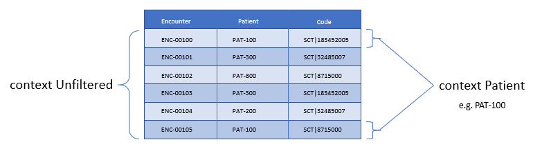
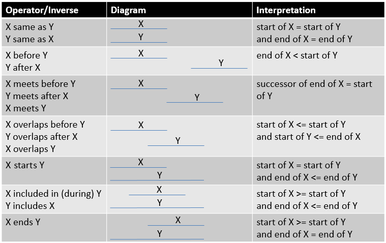

[[authors-guide]]
= 2. Author’s Guide
:page-layout: dev
:backend: xhtml
:sectnums:
:sectanchors:
:toc:
:page-standards-status: normative

This chapter introduces the high-level syntax for the Clinical Quality Language focused on measure and decision support authors. This syntax provides a human-readable, yet precise mechanism for expressing logic in both the measurement and improvement domains of clinical quality.

The syntax, or structure, of CQL is built from several basic elements that are all classified as _tokens_. There are four different types of tokens present in CQL: _symbols_, such as [.sym]#+# and [.sym]#*#, _keywords_, such as [.kw]#define# and [.kw]#from#, _literals_, such as [.lit]#5# and [.lit]#'active'#, and _identifiers_, such as [.id]#Person# and [.id]#"Inpatient Encounters"#.

Statements of CQL are built up by combining these basic elements, separated by _whitespace_ (spaces, tabs, and returns), to produce language elements. The most basic of these language elements is an _expression_, which is any statement of CQL that returns a value.

Expressions are made up of _terms_ (literals or identifiers) combined using _operators_, either symbolic operators, such as [.sym]#+# and [.sym]#-#, operator phrases such as [.kw]#and# and [.kw]#exists#, or named operators called _functions_, such as [.id]#First()# and [.id]#AgeInYears()#.

At the highest level, CQL is organized around the concept of a _library_, which can be thought of as a container for artifact logic. Libraries contain _declarations_ which specify the items the library contains. The most important of these declarations is the _named expression_, which is the basic unit of logic definition in CQL.

In the sections that follow, the various constructs introduced above will be discussed in more detail, beginning with the kinds of declarations that can be made in a CQL library, and then moving through the various ways that clinical information is referenced and queried within CQL, followed by an overview of the operators available in CQL, and ending with a detailed walkthrough of authoring specific quality artifacts using a running example.

It is important to keep in mind throughout the discussion that follows that CQL is a _query language_, which means that the statements of the language are really _questions_, formulated in terms of a _data model_ that describes the available data. Depending on the use case, these questions will be evaluated in different ways to produce a response. For example, for decision  support, the questions will likely be evaluated in the context of a specific patient and at some specific point in a workflow. For quality measurement, the questions will likely be evaluated for each of a set of patients in an overall population. However the evaluation occurs, the discussions in this chapter refer generally to the notion of an _evaluation request_ that represents a request by some consumer to evaluate a CQL expression. This evaluation request generally includes the _context_ of the evaluation (i.e. the inputs to the evaluation such as the patient and any parameter values), as well as a _timestamp_ associated with when the evaluation request occurs.

Throughout the discussion, readers may find it helpful to refer to link:09-b-cqlreference.html[Appendix B – CQL Reference] for more detailed discussion of particular concepts.

And as a final introductory note, CQL is designed to support two levels of usage. The first level focuses on the simplest possible expression of the most common use cases encountered in quality measurement and decision support, while the second level focuses on more advanced capabilities such as multi-source queries and user-defined functions. The first level is covered in this chapter, the Author's Guide, while the second level is covered in the next chapter, the Developer's Guide.

[[declarations]]
== Declarations

All the constructs that can be expressed within CQL are packaged in a container called a _library_. Libraries provide a convenient unit for the definition, versioning, and distribution of logic. For simplicity, libraries in CQL correspond directly with a single file.

Libraries in CQL provide the overall packaging for CQL definitions. Each library allows a set of declarations to provide information about the library as well as to define constructs that will be available within the library.

Libraries can contain any or all of the following constructs:

[[table-2-a]]
[cols=",",options="header"]
|====================================================================================================================================================================
|Construct |Description
|*library* |Header information for the library, including the name and version, if any.
|*using* |Data model information, specifying that the library may access types from the referenced data model.
|*include* |Referenced library information, specifying that the library may access constructs defined in the referenced library.
|*codesystem* |Codesystem information, specifying that logic within the library may reference the specified codesystem by the given name.
|*valueset* |Valueset information, specifying that logic within the library may reference the specified valueset by the given name.
|*code* |Code information, specifying that logic within the library may reference the specified code by the given name.
|*concept* |Concept information, specifying that logic within the library may reference the specified concept by the given name.
|*parameter* |Parameter information, specifying that the library expects parameters to be supplied by the evaluating environment.
|*context* |Specifies the overall context, such as Patient or Practitioner, to be used in the statements that are declared in the library. Note that a library may have multiple context declarations, and that each context declaration establishes the context for the statements that follow, until the next context declaration is encountered. However, best practice is that each library should only contain a single context declaration as the first statement in the library.
|*define* |The basic unit of logic within a library, a define statement introduces a named expression that can be referenced within the library, or by other libraries.
|*function* |Libraries may also contain function definitions. A function in CQL is a named expression that is allowed to take any number of arguments, each of which has a name and a declared type. These are most often used as part of shared libraries.
|====================================================================================================================================================================

Table 2‑A - Constructs that CQL libraries can contain

The following sections discuss these constructs in more detail.

[[library]]
=== Library

The [.kw]#library# declaration specifies both the name of the library and an optional version for the library. The library name is used as an identifier to reference the library from other CQL libraries, as well as eCQM and CDS artifacts. A library can have at most one library declaration.

The following example illustrates the library declaration:

[source,cql]
----
library CMS153_CQM version '2'
----

The above declaration names the library with the identifier [.id]#CMS153_CQM# and specifies the version [.lit]#'2'#.

[[data-models]]
=== Data Models

A CQL library can reference zero or more data models with [.kw]#using# declarations. These data models define the structures that can be used within retrieve expressions in the library.

For more information on how these data models are used, see the <<Retrieve>> section.

The following example illustrates the using declaration:

[source,cql]
----
using QUICK
----

The above declaration specifies that the [.id]#QUICK# model will be used as the data model within the library.

If necessary, a version specifier can be provided to indicate which version of the data model should be used.

[[libraries]]
=== Libraries

A CQL library can reference zero or more other CQL libraries with [.kw]#include# declarations. Components defined within these included libraries can then be referenced within the library by using the locally assigned name for the library.

For more information on libraries, refer to the <<Using Libraries to Share Logic>> section.

The following example illustrates an include declaration:

[source,cql]
----
include CMS153_Common version '2' called Common
----

Components defined in the CMS153_Common library, version 2, can now be referenced using the assigned name of Common. For example:

[source,cql]
----
define "SexuallyActive":
  exists (Common"ConditionsIndicatingSexualActivity")
    or exists (Common"LaboratoryTestsIndicatingSexualActivity")
----

This expression references [.id]#ConditionsIndicatingSexualActivity# and [.id]#LaboratoryTestsIndicatingSexualActivity# defined in the [.id]#CMS153_Common# library using the local alias [.id]#Common#.

The syntax used to reference these expressions is a _qualified identifier_ consisting of two parts. The qualifier, [.id]#Common#, and the identifier, [.id]#ConditionsIndicatingSexualActivity#, separated by a dot ([.sym]#.#).

The [.kw]#called# clause of the [.kw]#include# declaration is optional; if omitted, the identifier of the library is used to refer to the library. For example, given the following include:

[source,cql]
----
include CMS153_Common version '2'
----

The above expression would need to be:

[source,cql]
----
define "SexuallyActive":
  exists (CMS153_Common"ConditionsIndicatingSexualActivity")
    or exists (CMS153_Common"LaboratoryTestsIndicatingSexualActivity")
----

[[terminology]]
=== Terminology

A CQL library may contain zero or more named terminology declarations, including codesystems, valuesets, codes, and concepts, using the [.kw]#codesystem#, [.kw]#valueset#, [.kw]#code#, and [.kw]#concept# declarations.

These declarations specify a local name that represents a codesystem, valueset, code, or concept and can be used anywhere within the library where the terminology is expected.

Consider the following valueset declaration:

[source,cql]
----
valueset "Female Administrative Sex": 'urn:oid:2.16.840.1.113883.3.560.100.2'
----

This definition establishes the local name [.id]#"Female Administrative Sex"# as a reference to the external identifier for the valueset, more specifically, an Object Identifier (OID) in this particular case: [.lit]#'urn:oid:2.16.840.1.113883.3.560.100.2'#. The external identifier need not be an OID; instead, it may be a uniform resource identifier (URI), or any other identification system. CQL does not interpret the external id, it only specifies that the external identifier be a string that can be used to uniquely identify the valueset within the implementation environment.

This valueset definition can then be used within the library wherever a valueset can be used:

[source,cql]
----
define "PatientIsFemale": Patient.gender in "Female Administrative Sex"
----

The above example defines the [.id]#PatientIsFemale# expression as [.kw]#true# for patients whose gender is a code in the valueset identified by [.id]#"Female Administrative Sex"#.

Note that the name of the valueset uses double quotes, unlike the string representation of the OID for the valueset, which uses single quotes. Single quotes are used to build arbitrary strings in CQL; double quotes are used to represent names of constructs such as valuesets and expression definitions.

Note also that the local name for a valueset is user-defined and not required to match the actual name of the valueset identified within the external valueset repository. However, when using external terminologies, authors should use the name of the terminology as defined externally to avoid introducing any potential confusion of meaning.

The following example illustrates a _code system_ and a _code_ declaration:

[source,cql]
----
codesystem "SNOMED": 'http://snomed.info/sct'
code "Screening for Chlamydia trachomatis (procedure)":
  '442487003' from "SNOMED" display 'Screening for Chlamydia trachomatis (procedure)'
----

This codesystem declaration in this example establishes the local name "SNOMED" as a reference to the external identifier for the codesystem, the URI "http://snomed.info/sct". The code declaration in this example establishes the local name "Screening for Chlamydia trachomatis (procedure)" as a reference to the code '442487003' from the "SNOMED" code system already defined.

For more information about terminologies as values within CQL, refer to the <<Clinical Values>> section.

[[parameters]]
=== Parameters

A CQL library can define zero or more parameters. Each parameter is defined with the elements listed in the following table:

[[table-2-b]]
[cols=",",options="header",]
|=====================================================================================================================================================================================
|Element |Description
|*Name* |A unique identifier for the parameter within the library
|*Type* |The type of the parameter – Note that the type is only required if no default value is provided. Otherwise, the type of the parameter is determined based on the default value.
|*Default Value* |An optional default value for the parameter
|=====================================================================================================================================================================================

Table 2‑B - Elements that define a parameter

The parameters defined in a library may be referenced by name in any expression within the library. When expressions in a CQL library are evaluated, the values for parameters are provided by the environment. For example, a library that defines criteria for a quality measure may define a parameter to represent the measurement period:

[source,cql]
----
parameter MeasurementPeriod default Interval[@2013-01-01, @2014-01-01)
----

Note the syntax for the default here is called an _interval selector_ and will be discussed in more detail in the section on <<Interval Values>>.

This parameter definition can now be referenced anywhere within the CQL library:

[source,cql]
----
define "Patient16To23":
  AgeInYearsAt(start of MeasurementPeriod) >= 16
    and AgeInYearsAt(start of MeasurementPeriod) < 24
----

The above example defines the [.id]#Patient16To23# expression as patients whose age at the start of the MeasurementPeriod was at least 16 and less than 24.

The default value for a parameter is optional, but if no default is provided, the parameter must include a type specifier:

[source,cql]
----
parameter MeasurementPeriod Interval<DateTime>
----

If a parameter definition does not indicate a default value, a parameter value may be supplied by the evaluation environment, typically as part of the evaluation request. If the evaluation environment does not supply a parameter value, the parameter will be [.kw]#null#.

In addition, because parameter defaults are part of the declaration, the expressions used to define them have the following restrictions applied:

. Parameter defaults cannot reference run-time data (i.e. they cannot contain Retrieve expressions)
. Parameter defaults cannot reference expressions or functions defined in the current library
. Parameter defaults cannot reference included libraries
. Parameter defaults cannot perform terminology operations. For more information on terminology operations, see the <<Terminology Operators>> section.
. Parameter defaults cannot reference other parameters

In other words, the value for the default of a parameter must be able to be calculated at compile-time.

[[context]]
=== Context

The context declaration defines the scope of data available to statements within the language. Models define the available contexts, including at least one context named [.id]#Unfiltered# that indicates that statements are not restricted to a particular context. The following table lists some typical contexts:

[[table-2-c]]
[cols=",",options="header",]
|========================================================================================================================================
|Context |Description
|*Patient* |The Patient context specifies that expressions should be interpreted with reference to a single patient.
|*Practitioner* |The Practitioner context specifies that expressions should be interpreted with reference to a single practitioner.
|*Unfiltered* |The Unfiltered context indicates that expressions are not interpreted with reference to a particular context.
|========================================================================================================================================

Table 2‑C - Typical contexts for CQL

Depending on different needs, models may define any context appropriate to their use case, but should identify a default context that is used when authors do not declare a specific context.

When no context is specified in the library, and the model has not declared a default context, the default context is [.id]#Unfiltered#.

[source,cql]
----
context Patient

define "Patient16To23AndFemale":
  AgeInYearsAt(start of MeasurementPeriod) >= 16
    and AgeInYearsAt(start of MeasurementPeriod) < 24
    and Patient.gender in "Female Administrative Sex"
----

Because the context has been established as Patient, the expression has access to patient-specific concepts such as the [.id]#AgeInYearsAt()# operator and the [.id]#Patient.gender# attribute. Note that the attributes available in the Patient context are defined by the data model in use.

A library may contain zero or more context statements, with each context statement establishing the context for subsequent statements in the library.

Effectively, the statement [.kw]#context# [.id]#Patient# defines an expression named [.id]#Patient# that returns the patient data for the current patient, as well as restricts the information that will be returned from a retrieve to a single patient, as opposed to all patients.

As another example, consider a [.id]#Practitioner# context:

[source,cql]
----
context Practitioner

define "Encounters":
  ["Encounter": "Inpatient Encounter"]
----

The above definition results in all the encounters for a particular practitioner. For more information on context, refer to the <<Retrieve Context>> discussion below.

[[statements]]
=== Statements

A CQL Library can contain zero or more [.kw]#define# statements describing named expressions that can be referenced either from other expressions within the same library or by containing quality and decision support artifacts.

The following example illustrates a simple define statement:

[source,cql]
----
define "InpatientEncounters":
  [Encounter: "Inpatient"] E
    where E.length <= 120 days
      and E.period ends during MeasurementPeriod
----

This example defines the [.id]#InpatientEncounters# expression as [.id]#Encounter# events whose code is in the [.id]#"Inpatient"# valueset, whose length is less than or equal to 120 days, and whose period ended (i.e. patient was discharged) during MeasurementPeriod.

Note that the use of terms like [.id]#Encounter#, [.id]#length#, and [.id]#period#, as well as which code attribute is used to compare with the valueset, are defined by the data model being used within the library; they are not defined by CQL.

For more information on the use of define statements, refer to the <<Using Define Statements>> section.

[[retrieve]]
== Retrieve

The _retrieve_ expression is the central construct for accessing clinical information within CQL. The result of a retrieve is always a list of some type of clinical data, based on the type described by the retrieve and the context (such as [.id]#Patient#, [.id]#Practitioner#, or [.id]#Unfiltered#) in which the retrieve is evaluated.

The retrieve in CQL has two main parts: first, the _type_ part, which identifies the type of data that is to be retrieved; and second, the _filter_ part, which optionally provides filtering information based on specific types of filters common to most clinical data.

Note that the retrieve only introduces data into an expression; operations for further filtering, shaping, computation, and sorting will be discussed in later sections.

[[clinical-statement-structure]]
=== Clinical Statement Structure

The retrieve expression is a reflection of the idea that clinical data in general can be viewed as clinical statements of some type as defined by the model. The type of the clinical statement determines the structure of the data that is returned by the retrieve, as well as the semantics of the data involved.

The type may be a general category, such as a Condition, Procedure, or Encounter, or a more specific instance such as an ImagingProcedure or a LaboratoryTest. The data model defines the available types that may be referenced by a retrieve.

In the simplest case, a retrieve specifies only the type of data to be retrieved. For example:

[source,cql]
----
[Encounter]
----

Assuming the default context of [.id]#Patient#, this example retrieves all [.id]#Encounter# statements for a patient.

[[filtering-with-terminology]]
=== Filtering with Terminology

In addition to describing the type of clinical statements, the retrieve expression allows the results to be filtered using terminology, including valuesets, code systems, or by specifying a single code. The use of codes within clinical data is ubiquitous, and most clinical statements have at least one code-valued attribute. In addition, there is typically a “primary” code-valued attribute for each type of clinical statement. This primary code is used to drive the terminology filter. For example:

[source,cql]
----
[Condition: "Acute Pharyngitis"]
----

This example requests only those [.id]#Conditions# whose primary code attribute is a code from the valueset identified by [.id]#"Acute Pharyngitis"#. The attribute used as the primary code attribute is defined by the data model being used.

In addition, the retrieve expression allows the filtering attribute name to be specified:

[source,cql]
----
[Condition: severity in "Acute Severity"]
----

This requests clinical statements that assert the presence of a condition with a severity in the [.id]#"Acute Severity"# valueset.

Note that the terminology reference [.id]#"Acute Severity"# in the above examples is a valueset, but it could also be a code system, a concept, or a specific code:

[source,cql]
----
codesystem "SNOMED": 'http://snomed.info/sct'
code "Acute Pharyngitis Code":
  '363746003' from "SNOMED" display 'Acute pharyngitis (disorder)'

define "Get Condition from Code Declaration":
  [Condition: "Acute Pharyngitis Code"]

define "Get Condition from CodeSystem Declaration":
  [Condition: "SNOMED"]
----

The [.id]#"Get Condition from Code Declaration"# expression returns conditions for the patient where the code is equivalent to the [.id]#"Acute Pharyngitis Code"# code. The [.id]#"Get Condition from CodeSystem Declaration"# expression returns conditions for the patient where the code is some code in the [.id]#"SNOMED"# code system.

When the primary code attribute is used (i.e. no filtering attribute name is specified in the retrieve), the retrieve uses [.kw]#in# if the terminology target is a valueset or code system, and [.sym]#~# otherwise. For more information about the [.sym]#~# symbol, refer to the <<Comparison Operators>> section. When the code path is specified, the code comparison operation can be specified as well:

[source,cql]
----
codesystem "SNOMED": 'http://snomed.info/sct'
code "Acute Pharyngitis Code":
  '363746003' from "SNOMED" display 'Acute pharyngitis (disorder)'

define "Get Condition from Code Declaration":
  [Condition: code ~ "Acute Pharyngitis Code"]

define "Get Condition from CodeSystem Declaration":
  [Condition: code in "SNOMED"]
----

[[retrieve-context]]
=== Retrieve Context

Within the [.id]#Patient# context, the results of any given retrieve will always be scoped to a single patient, as determined by the environment. For example, in a quality measure evaluation environment, the [.id]#Patient# context may be the current patient being considered. In a clinical decision support environment, the [.id]#Patient# context would be the patient for which guidance is being sought.

By contrast, if the [.id]#Unfiltered# context is used, the results of any given retrieve will not be limited to a particular context. For example:

[source,cql]
----
[Condition: "Acute Pharyngitis"] C where C.onsetDateTime during MeasurementPeriod
----

When evaluated within the [.id]#Patient# context, the above example returns [.id]#"Acute Pharyngitis"# conditions that onset during [.id]#MeasurementPeriod# for the current patient only. In the [.id]#Unfiltered# context, this example returns all [.id]#"Acute Pharyngitis"# conditions that onset during [.id]#MeasurementPeriod#, regardless of patient.

As another example, consider the set of encounters:

[source,cql]
----
[Encounter: "Inpatient"]
----

As the following diagram illustrates, in the [.id]#Unfiltered# context, this retrieve will return all the encounters in the underlying system, whereas in the [.id]#Patient# context, this retrieve will return only encounters for the _current_ patient, where _current_ is determined by the evaluation:

Because context is associated with each declaration, it is possible for expressions defined in a particular context to reference expressions defined in the [.id]#Unfiltered# context and vice versa. Best practice is for each library to have expressions in only one context, and for that context declaration to be the first declaration in the library. Note that this only applies to the [.id]#Unfiltered# context. It is not legal for an expression in one specified context to reference an expression in another specified context. This is because there must be a way to relate cross-context queries, which is only possible in the [.id]#Unfiltered# context.

In an [.id]#Unfiltered# context, a reference to a specified context expression (such as [.id]#Patient#) results in the execution of that expression for each patient in the unfiltered context, and the implementation environment combines the results.

If the result type of an expression in a specific context is not a list, the result of accessing it from an [.id]#Unfiltered# context will be a list with elements of the type of the  expression. For example:

[source,cql]
----
context Patient

define "InInitialPopulation":
  AgeInYearsAt(@2013-01-01) >= 16 and AgeInYearsAt(@2013-01-01) < 24

context Unfiltered

define "InitialPopulationCount":
  Count(InInitialPopulation IP where IP is true)
----

In the above example, the [.id]#InitialPopulationCount# expression returns the number of patients for which the [.id]#InInitialPopulation# expression evaluated to [.kw]#true#.

If the result type of the [.id]#Patient# context expression is a list, the result will be a list of the same type, but with the results of the evaluation for each patient in the unfiltered context flattened into a single list.

In a specific context (such as [.id]#Patient#), a reference to an [.id]#Unfiltered# context expression results in the evaluation of the [.id]#Unfiltered# context expression, and the result type is unaffected.

[.note-info]
____
In some cases, measures or decision support artifacts may need to access data for a related person, such as the mother’s record from an infant’s context. For information on how to do this in CQL, refer to <<03-developersguide.adoc#related-context-retrieves,Related Context Retrieves>>.

____

[[queries]]
== Queries

Beyond the retrieve expression, CQL provides a _query_ construct that allows the results of retrieves to be further filtered, shaped, and extended to enable the expression of arbitrary clinical logic that can be used in quality and decision support artifacts.

Although similar to a retrieve in that a query will typically result in a list of patient information, a query is a more general construct than a retrieve. Retrieves are by design restricted to a particular set of criteria that are commonly used when referencing clinical information, and specifically constructed to allow implementations to easily build data access layers suitable for use with CQL. For more information on the design of the retrieve construct, refer to <<05-languagesemantics.adoc#clinical-data-retrieval-in-quality-artifacts,Clinical Data Retrieval in Quality Artifacts>>.

The query construct has a _primary source_ and four main _clauses_ that each allow for different types of operations to be performed:

[[table-2-d]]
[cols=",",options="header",]
|============================================================================================================================================
|Clause |Operation
|*Relationship (with/without)* |Allows relationships between the primary source and other clinical information to be used to filter the result.
|*Where* |The where clause allows conditions to be expressed that filter the result to only the information that meets the condition.
|*Return* |The return clause allows the result set to be shaped as needed, removing elements, or including new calculated values.
|*Sort* |The sort clause allows the result set to be ordered according to any criteria as needed.
|============================================================================================================================================

Table 2‑D - Four main clauses for a query construct

Each of these clauses will be discussed in more detail in the following sections.

A query construct begins by introducing an _alias_ for the primary source:

[source,cql]
----
[Encounter: "Inpatient"] E
----

The primary source for this query is the retrieve expression +++[+++[.id]#Encounter#: [.id]#"Inpatient"#], and the alias is [.id]#E#. Subsequent clauses in the query must reference elements of this source by using this alias.

Although the alias in this example is a single-letter abbreviation, [.id]#E#, it could also be a longer abbreviation:

[source,cql]
----
[Encounter: "Inpatient"] Enc
----

Note that alias names, as with all language constructs, may be the subject of language conventions. The link:14-g-formattingconventions.html[Formatting Conventions] section defines a very general set of formatting conventions for use with Clinical Quality Languages. Within specific domains, institutions or stakeholders may create additional conventions and style guides appropriate to their domains.

[[filtering]]
=== Filtering

The [.kw]#where# clause allows the results of the query to be filtered by a condition that is evaluated for each element of the query being filtered. If the condition evaluates to [.kw]#true# for the element being tested, that element is included in the result. Otherwise, the element is excluded from the resulting list.

For example:

[source,cql]
----
[Encounter: "Inpatient"] E
  where duration in days of E.period >= 120
----

The alias [.id]#E# is used to access the period attribute of each encounter in the primary source. The filter condition tests whether the duration of that range is at least 120 days.

The condition of a [.kw]#where# clause is allowed to contain any arbitrary combination of operations of CQL, so long as the overall result of the condition is boolean-valued. For example, the following where clause includes multiple conditions on different attributes of the source:

[source,cql]
----
[CommunicationRequest] C
  where C.mode = 'ordered'
    and C.sender.role = 'nurse'
    and C.recipient.role = 'doctor'
    and C.indication in "Fever"
----

Note that because CQL uses three-valued logic, the result of evaluating any given boolean-valued condition may be _unknown_ ([.kw]#null#). For example, if the list of inpatient encounters from the first example contains some elements whose [.id]#period# attribute is [.kw]#null#, the result of the condition for that element will not be [.kw]#false#, but [.kw]#null#, indicating that it is not known whether or not the duration of the encounter was at least 120 days. For the purposes of evaluating a filter, only elements where the condition evaluates to [.kw]#true# are included in the result, effectively treating the unknown results as [.kw]#false#.  For more discussion on three-valued logic, see the section on <<Missing Information>> in the Author's Guide, as well as the section on <<03-developersguide.adoc#nullological-operators,Nullological Operators>> in the Developer's guide.

[[shaping]]
=== Shaping

The [.kw]#return# clause of a CQL query allows the results of the query to be shaped. In most cases, the results of a query will be of the same type as the primary source of the query. However, some scenarios require only specific elements be extracted, or computations on the data involved in each element be performed. The [.kw]#return# clause enables this type of query.

For example:

[source,cql]
----
[Encounter: "Inpatient"] E
  return Tuple { id: E.identifier, lengthOfStay: duration in days of E.period }
----

This example returns a list of tuples (structured values), one for each inpatient encounter performed, where each tuple consists of the [.id]#id# of the encounter as well as a [.id]#lengthOfStay# element, whose value is calculated by taking the duration of the period for the encounter. Tuples are discussed in detail in later sections. For more information on Tuples, see <<Structured Values (Tuples)>>.

By default, queries return a distinct list of results.  In other words, any duplicate values are suppressed from the results. To include duplicates, use the [.kw]#all# keyword in the [.kw]#return# clause. For example, the following will return a list of the lengths of stay for each Encounter:

[source,cql]
----
[Encounter: "Inpatient"] E
  return E.lengthOfStay
----

If two encounters have the same value for [.id]#lengthOfStay#, that value will only appear once in the result unless the [.kw]#all# keyword is used:

[source,cql]
----
[Encounter: "Inpatient"] E
  return all E.lengthOfStay
----

[[sorting]]
=== Sorting

CQL queries can sort results in any order using the [.kw]#sort by# clause. For example:

[source,cql]
----
[Encounter: "Inpatient"] E sort by start of period
----

This example returns inpatient encounters, sorted by period.

Calculated values such as [.kw]#asc# (ascending) or [.kw]#desc# (descending) can also be used to determine the sort:

[source,cql]
----
[Encounter: "Inpatient"] E
  return Tuple { id: E.identifier, lengthOfStay: duration in days of E.period }
    sort by lengthOfStay desc
----

Note that the properties that can be specified within the [.kw]#sort# clause are determined by the result type of the query. In the above example, [id]#lengthOfStay# can be referenced because it is introduced in the [.kw]#return# clause. Because the sort applies after the query results have been determined, alias references are neither required nor allowed in the sort.

If no ascending or descending specifier is provided, the order is ascending.

If no [.kw]#sort# clause is provided, the order of the result is undefined and may vary by implementation.

The [.kw]#sort# clause may include multiple attributes, each with their own sort order:

[source,cql]
----
[Encounter: "Inpatient"] E sort by start of period desc, identifier asc
----

Sorting is performed in the order in which the attributes are defined in the [.kw]#sort# clause, so this example sorts by period descending, then by [.id]#identifier# ascending.

When the sort elements do not provide a unique ordering (i.e. there is a possibility of duplicate sort values in the result), the order of duplicates is unspecified.

A query may only contain a single [.kw]#sort# clause, and it must always appear last in the query.

When the data being sorted includes [.kw]#nulls#, they are sorted first, meaning they will appear at the beginning of the list when the data is sorted ascending, and at the end of the list when the data is sorted descending.

[[relationships]]
=== Relationships

In addition to filtering by conditions, some scenarios need to be able to filter based on relationships to other sources. The CQL [.kw]#with# and [.kw]#without# clauses provide this capability. For example:

[source,cql]
----
[Encounter: "Ambulatory/ED Visit"] E
  with [Condition: "Acute Pharyngitis"] P
    such that P.onsetDateTime during E.period
      and P.abatementDate after end of E.period
----

This query returns [.id]#"Ambulatory/ED Visit"# encounters performed where the patient also has a condition of [.id]#"Acute Pharyngitis"# that overlaps after the period of the encounter.

The [.kw]#without# clause returns only those elements from the primary source that do not have a specific relationship to another source. For example:

[source,cql]
----
[Encounter: "Ambulatory/ED Visit"] E
  without [Condition: "Acute Pharyngitis"] P
    such that P.onsetDateTime during E.period
      and P.abatementDate after end of E.period
----

This query is the same as the previous example, except that only encounters that _do not_ have overlapping conditions of [.id]#"Acute Pharyngitis"# are returned. In other words, if the _such that_ condition evaluates to [.kw]#true# (if the Encounter has an overlapping Condition of [.id]#Acute Pharyngitis# in this case), then that Encounter is not included in the result.

A given query may include any number of [.kw]#with# and [.kw]#without# clauses in any order, but they must all come before any [.kw]#where#, [.kw]#return#, or [.kw]#sort# clauses.

The [.kw]#such that# conditions in the examples above used <<Timing Relationships>> (e.g. during, after end of), but any expression may be used, so long as the overall result is boolean-valued. For example:

[source,cql]
----
[MedicationDispense: "Warfarin"] D
  with [MedicationPrescription: "Warfarin"] P
    such that P.status = 'active'
      and P.identifier = D.authorizingPrescription.identifier
----
This example retrieves all dispense records for active prescriptions of [.id]#Warfarin#.

When multiple [.kw]#with# or [.kw]#without# clauses appear in a single query, the result will only include elements that meet the [.kw]#such that# conditions for all the relationship clauses. For example:

[source,cql]
----
MeasurementPeriodEncounters E
  with Pharyngitis P
    such that Interval[P.onsetDateTime, P.abatementDateTime] includes E.period
      or P.onsetDateTime.value in E.period
  with Antibiotics A such that A.dateWritten 3 days or less after start of E.period
----

This example retrieves all the elements returned by the expression [.id]#MeasurementPeriodEncounters# that have both a related [.id]#Pharyngitis# and [.id]#Antibiotics# result.

[[full-query]]
=== Full Query

The clauses described in the previous section must appear in the correct order in order to specify a valid CQL query. The general order of clauses is:

[source,cql]
----
<primary-source> <alias>
  <with-or-without-clauses>
  <where-clause>
  <return-clause>
  <sort-clause>
----

A query must contain an aliased primary source, but this is the only required clause.

A query may contain zero or more [.kw]#with# or [.kw]#without# clauses, but they must all appear before any [.kw]#where#, [.kw]#return#, or [.kw]#sort# clauses.

A query may contain at most one [.kw]#where# clause, and it must appear after any [.kw]#with# or [.kw]#without# clauses, and before any [.kw]#return# or [.kw]#sort# clauses.

A query may contain at most one [.kw]#return# clause, and it must appear after any [.kw]#with# or [.kw]#without# or [.kw]#where# clauses, and before any [.kw]#sort# clause.

A query may contain at most one [.kw]#sort# clause, and it must be the last clause in the query.

For example:

[source,cql]
----
[Encounter: "Inpatient"] E
  with [Condition: "Acute Pharyngitis"] P
    such that P.onsetDateTime during E.period
      and P.abatementDate after end of E.period
  where duration in days of E.period >= 120
  return Tuple { id: E.id, lengthOfStay: duration in days of E.period }
  sort by lengthOfStay desc
----

This query returns all [.id]#"Inpatient"# encounter events that have an overlapping condition of [.id]#"Acute Pharyngitis"# and a duration of at least 120 days. For each such event, the result will include the [.id]#id# of the event and the duration in days, and the results will be ordered by that duration descending.

As another example, consider a query with multiple [.kw]#without# clauses:

[source,cql]
----
SingleLiveBirthEncounter E
  without [Condition: "Galactosemia"] G
    such that G.onsetDatetime during E.period
  without [Procedure: "Parenteral Nutrition"] P
    such that P.performed starts during E.period
  where not exists ( E.diagnosis ED
    where ED.code in "Galactosemia"
  )
----

Even though this example has multiple [.kw]#without# clauses, there is still only a single [.kw]#where# clause for the query.

Note that the query construct in CQL supports other clauses that are not discussed here. For more information on these, refer to <<03-developersguide.adoc#introducing-context-in-queries,Introducing Scoped Definitions In Queries>> and <<03-developersguide.adoc#multi-source-queries,Multi-Source Queries>>.

[[values]]
== Values

CQL supports several categories of values:

* Simple values, such as strings, numbers, and dates
* Clinical values, such as quantities, ratios, and valuesets
* Structured values (called tuples), such as Medications, Encounters, and Patients
* Lists, which can contain any number of elements of the same type
* Intervals, which define ranges of ordered values, such as numbers or dates

The result of evaluating any expression in CQL is a value of some type. For example, the expression [.lit]#5# results in the value [.lit]#5# of type [.id]#Integer#. CQL is a _strongly-typed_ language, meaning that every value is of some type, and that every operation expects arguments of a particular type.

As a result, any given expression of CQL can be verified as meaningful or be determined meaningless, at least in terms of the operations performed. For example, consider the following expression:

[source,cql]
----
6 + 6
----

The expression involves the addition of values of type [.id]#Integer#, and so is a meaningful expression of CQL. By contrast:

[source,cql]
----
6 + 'active'
----

This expression involves the addition of a value of type [.id]#Integer#, [.lit]#6#, to a value of type [.id]#String#, [.lit]#'active'#. This expression is meaningless since CQL does not define addition for values of type [.id]#Integer# and [.id]#String#.

However, there are cases where an expression is meaningful, even if the types do not match exactly. For example, consider the following addition:

[source,cql]
----
6 + 6.0
----

This expression involves the addition of a value of type [.id]#Integer#, and a value of type [.id]#Decimal#. This is meaningful, but in order to infer the correct result type, the [.id]#Integer# value will be implicitly converted to a value of type [.id]#Decimal#, and the [.id]#Decimal# addition operator will be used, resulting in a value of type [.id]#Decimal#.

To ensure there can never be a loss of information, this implicit conversion will only happen from [.id]#Integer# to [.id]#Decimal#, never from [.id]#Decimal# to [.id]#Integer#.

In the sections that follow, the various categories of values that can be represented in CQL will be considered in more detail.

[[simple-values]]
=== Simple Values

CQL supports several types of simple values:

[[table-2-e]]
[cols=",",options="header",]
|=======================================
|Value |Examples
|*Boolean* |[.kw]#true#, [.kw]#false#, [.kw]#null#
|*Integer* |[.lit]#16#, [.lit]#-28#
|*Decimal* |[.lit]#100.015#
|*String* |[.lit]#'pending'#, [.lit]#'active'#, [.lit]#'complete'#
|*Date* |[.lit]#@2014-01-25#
|*DateTime* |[.lit]#@2014-01-25T14:30:14.559#

[.lit]#@2014-01T#

|*Time* |[.lit]#@T12:00#

[.lit]#@T14:30:14.559#

|=======================================

Table 2‑E - Types of simple values that CQL supports

[[boolean]]
==== Boolean

The [.id]#Boolean# type in CQL supports the logical values [.kw]#true#, [.kw]#false#, and [.kw]#null# (meaning unknown). These values are most often encountered as the result of <<Comparison Operators>>, and can be combined with other boolean-valued expressions using <<Logical Operators>>. Note that CQL supports three-valued logic, see the section on <<Missing Information>> in the Author's Guide, as well as the section on <<03-developersguide.adoc#nullological-operators,Nullological Operators>> in the Developer's guide for more information.

[[integer]]
==== Integer

The [.id]#Integer# type in CQL supports the representation of whole numbers, positive and negative. CQL supports a full set of <<Arithmetic Operators>> for performing computations involving whole numbers.

In addition, any operation involving [.id]#Decimal# values can be used with values of type [.id]#Integer# because [.id]#Integer# values can always be implicitly converted to [.id]#Decimal# values.

[[decimal]]
==== Decimal

The [.id]#Decimal# type in CQL supports the representation of real numbers, positive and negative. As with [.id]#Integer# values, CQL supports a full set of <<Arithmetic Operators>> for performing computations involving real numbers.

[[string]]
==== String

[.id]#String# values within CQL are represented using single-quotes:

[source,cql]
----
'active'
----

Note that if the value you are attempting to represent contains a single-quote, use a backslash to include it within the string in CQL:

[source,cql]
----
'patient\'s condition is normal'
----

Comparison of [.id]#String# values in CQL is case-sensitive, meaning that the strings 'patient' and 'Patient' are not equal:

[source,cql]
----
'Patient' = 'Patient'
'Patient' != 'patient'
'Patient' ~ 'patient'
----

For case- and locale-insensitive comparison, locale-insensitive meaning that an operator will behave identically for all users, regardless of their system locale settings, use the equivalent ([.sym]#~#) operator. Note that string equivalence will also "normalize whitespace", meaning that all whitespace characters are treated as equivalent.

[[date-datetime-and-time]]
==== Date, DateTime, and Time

CQL supports the representation of [.id]#Date#, [.id]#DateTime#, and [.id]#Time# values.

[.id]#DateTime# values are used to represent an instant along the timeline, known to at least the year precision, and potentially to the millisecond precision. [.id]#DateTime# values are specified using an at-symbol ([.sym]#@#) followed by an ISO-8601 textual representation of the [.id]#DateTime# value:

[source,cql]
----
@2014-01-25T14:30
@2014-01-25T14:30:14.559
----

[.id]#Date# values are used to represent only dates on a calendar, irrespective of the time of day. [.id]#Date# values are specified using an at-symbol ([.sym]#@#) followed by an ISO-8601 textual representation of the [.id]#Date# value:

[source,cql]
----
@2014-01-25
----

Note that the [.id]#Date# value literal format is identical to the date value portion of the [.id]#DateTime# literal format.

[.id]#Time# values are used to represent a time of day, independent of the date. [.id]#Time# value must be known to at least the hour precision, and potentially to the millisecond precision. [.id]#Time# values are specified using an at-symbol with a capital T ([.sym]#@T#) followed by an ISO-8601 textual representation of the [.id]#Time# value:

[source,cql]
----
@T12:00
@T14:30:14.559
----

Note that the [.id]#Time# value literal format is identical to the time value portion of the [.id]#DateTime# literal format.

Only [.id]#DateTime# values may specify a timezone offset, either as UTC ([.sym]#Z#), or as a timezone offset. If no timezone offset is specified, the timezone offset of the evaluation request timestamp is used.

For both [.id]#DateTime# and [.id]#Time# values, although the milliseconds are specified with a separate component, seconds and milliseconds are combined and represented as a [.id]#Decimal# for the purposes of comparison.

For more information on the use of date and time values within CQL, refer to the <<Date and Time Operators>> section.

Specifically, because [.id]#Date#, [.id]#DateTime#, and [.id]#Time# values may be specified to varying levels of precisions, operations such as comparison and duration calculation may result in [.kw]#null#, rather than the [.kw]#true# or [.kw]#false# that would result from the same operation involving fully specified values. For a discussion of the effect of imprecision on date and time operations, refer to the <<Comparing Dates and Times>> section.

[[clinical-values]]
=== Clinical Values

In addition to simple values, CQL supports some types of values that are specific to the clinical quality domain. For example, CQL supports _codes_, _concepts_, _quantities_, _ratios_, and _valuesets_.

[[quantities]]
==== Quantities

A quantity is a number with an associated unit. For example:

[source,cql]
----
6 'gm/cm3'
80 'mm[Hg]'
3 months
----

The number portion of a quantity can be an [.id]#Integer# or [.id]#Decimal#, and the unit portion is a (single-quoted) [.id]#String# representing a valid http://unitsofmeasure.org/ucum.html[Unified Code for Units of Measure (UCUM)] unit or calendar duration keyword, singular or plural. To avoid the possibility of ambiguity, UCUM codes shall be specified using the case-sensitive (c/s) form.

For time-valued quantities, in addition to the definite duration UCUM units, CQL defines calendar duration keywords for calendar duration units:

|===
|Calendar Duration |Unit Representation |Relationship to Definite Duration UCUM Unit

|`year`/`years` |`'year'` |`~ 1 'a'`
|`month`/`months` |`'month'` |`~ 1 'mo'`
|`week`/`weeks` |`'week'` |`~ 1 'wk'`
|`day`/`days` |`'day'` |`~ 1 'd'`
|`hour`/`hours` |`'hour'` |`~ 1 'h'`
|`minute`/`minutes` |`'minute'` |`~ 1 'min'`
|`second`/`seconds` |`'second'` |`= 1 's'`
|`millisecond`/`milliseconds` |`'millisecond'` |`= 1 'ms'`
|===

For example, the following quantities are _calendar duration_ quantities:

[source,cql]
----
1 year
4 days
----

Whereas the following quantities are _definite duration_ quantities:

[source,cql]
----
1 'a'
4 'd'
----

The table above defines the equality/equivalence relationship between calendar and definite duration quantities. For example, `1 year` is not _equal_ (`=`) to `1 'a'` (defined in UCUM as 365.25 'd'), but it is _equivalent_ (`~`) to `1 'a'`.

For a discussion of the operations available for quantities, see the <<Quantity Operators>> section.

[[ratios]]
==== Ratios

A ratio is a relationship between two quantities, expressed in CQL using standard mathematical notation:

[source,cql]
----
1:128
5 'mg' : 10 'mL'
----

For a discussion of the operations available for ratios, see the <<Ratio Operators>> section.

[[code]]
==== Code

The use of codes to specify meaning within clinical data is ubiquitous. CQL therefore supports a top-level construct for dealing with codes using a structure called [.id]#Code# that is consistent with the way terminologies are typically represented.

The [.id]#Code# type has the following elements:

[[table-2-f]]
[cols=",,",options="header",]
|==================================================
|Name |Type |Description
|*code* |[.id]#String# |The actual code within the code system.
|*display* |[.id]#String# |A description of the code.
|*system* |[.id]#String# |The identifier of the code system.
|*version* |[.id]#String# |The version of the code system.
|==================================================

Table 2‑F - Elements that make up a [.kw]#code# type

The following examples illustrate the code declaration:

[source,cql]
----
codesystem "LOINC": 'http://loinc.org'

code "Blood pressure": '55284-4' from "LOINC" display 'Blood pressure'
code "Systolic blood pressure": '8480-6' from "LOINC" display 'Systolic blood pressure'
code "Diastolic blood pressure": '8462-4' from "LOINC" display 'Diastolic blood pressure'
----

The above declarations can be referenced directly or within a <<filtering-with-terminology,retrieve expression>>.

In addition, CQL provides a [.id]#Code# literal that can be used to reference an existing code from a specific code system:

[source,cql]
----
Code '66071002' from "SNOMED-CT" display 'Type B viral hepatitis'
----

The example specifies the code [.lit]#'66071002'# from a previously defined [.id]#"SNOMED-CT:2014"# codesystem, which specifies both the [.id]#system# and [.id]#version# of the resulting code. Note that the [.kw]#display# clause is optional. Note that code literals are allowed in CQL for completeness. In general, authors should use code declarations rather than code literals when using codes directly.

This use of code declarations to reference a single code in a CQL expression is referred to as a _direct reference code_:

[source,cql]
----
code "Discharge to home for hospice care (procedure)": '428361000124107' from "SNOMEDCT"

define "Encounters Discharged to Hospice":
  "Encounters" E where E.dischargeDisposition ~ "Discharge to home for hospice care (procedure)"
----

Note the use of the _equivalent_ operator (`~`) rather than _equality_ (`=`). For codes, equivalence tests only that the code system and code are the same, but does not check the code system version.

Although CQL supports both version-specific and version-independent specification of and comparison to direct reference codes, artifact authors should use version-independent direct reference codes and comparisons unless there is a specific reason not to (such as the code is retired in the current version). Even when using version-specific direct reference codes, authors should use equivalence for the comparison (again, unless there is a specific reason to use version-specific comparison with equality).

When using direct reference codes, authors should use the name of the code as defined externally to avoid introducing any potential confusion of meaning.

[.note-warning]
____
Using direct-reference codes can be more difficult for implementations to map to local settings, because modification of the codes for local usage may require modification of the CQL, as opposed to the use of a value set which many systems already have support for mapping to local codes.
____

[[concept]]
==== Concept

Within clinical information, multiple terminologies can often be used to code for the same concept. As such, CQL defines a top-level construct called [.id]#Concept# that allows for multiple codes to be specified.

The [.id]#Concept# type has the following elements:

[[table-2-g]]
[cols=",,",options="header",]
|=========================================================================
|Name |Type |Description
|*codes* |[.id]#List<Code># |The list of semantically equivalent codes representing the concept.
|*display* |[.id]#String# |A description of the concept.
|=========================================================================

Table 2‑G - Elements that make up a [.kw]#Concept# type

[.note-warning]
____
Note that the semantics of [.id]#Concept# are such that the codes within a given concept should be semantically _about_ the same concept (e.g. the same concept represented in different code systems, or the same concept from the same code system represented at different levels of detail), but CQL itself will make no attempt to ensure that is the case. Concepts should never be used as a surrogate for proper valueset definition.
____

The following example illustrates the concept declaration:

[source,cql]
----
codesystem "SNOMED-CT": 'urn:oid:2.16.840.1.113883.6.96'
codesystem "ICD-10-CM": 'urn:oid:2.16.840.1.113883.6.90'

code "Hepatitis Type B (SNOMED)": '66071002' from "SNOMED-CT" display 'Viral hepatitis type B (disorder)'
code "Hepatitis Type B (ICD-10)": 'B18.1' from "ICD-10-CM" display 'Chronic viral hepatitis B without delta-agent'

concept "Type B Hepatitis": { "Hepatitis Type B (SNOMED)", "Hepatitis Type B (ICD-10)" } display 'Type B Hepatitis'
----

The above declaration can be referenced directly or within a <<filtering-with-terminology,retrieve expression>>.

As with codes, local names for concept declarations should be consistent with external declarations to avoid introducing any confusion of meaning.

The following example illustrates the use of a [.id]#Concept# literal:

[source,cql]
----
Concept {
  Code '66071002' from "SNOMED-CT",
  Code 'B18.1' from "ICD-10-CM"
} display 'Type B viral hepatitis'
----

This example constructs a [.id]#Concept# with display [.lit]#'Type B viral hepatitis'# and code of [.lit]#'66071002'#.

[[valuesets]]
==== Valuesets

As a value, a valueset is simply a list of [.id]#Code# values. However, CQL allows valuesets to be used without reference to the codes involved by declaring valuesets as a special type of value within the language.

The following example illustrates some typical valueset declarations:

[source,cql]
----
valueset "Acute Pharyngitis": 'urn:oid:2.16.840.1.113883.3.464.1003.102.12.1011'
valueset "Acute Tonsillitis": 'urn:oid:2.16.840.1.113883.3.464.1003.102.12.1012'
valueset "Ambulatory/ED Visit": 'urn:oid:2.16.840.1.113883.3.464.1003.101.12.1061'
----

Each valueset declaration defines a local identifier that can be used to reference the valueset within the library, as well as the global identifier for the valueset, typically an object identifier (OID) or uniform resource identifier (URI).

These valueset identifiers can then be used throughout the library. For example:

[source,cql]
----
define "Pharyngitis": [Condition: "Acute Pharyngitis"]
----

This example defines [.id]#Pharyngitis# as any Condition where the code is in the [.id]#"Acute Pharyngitis"# valueset.

Whenever a valueset reference is actually evaluated, the resulting _expansion set_, or list of codes, depends on the _binding_ specified by the valueset declaration. By default, all valueset bindings are _dynamic_, meaning that the expansion set should be constructed using the most current published version of the valueset.

However, CQL also allows for _static_ bindings which allow two components to be set:

1.  Version – The version of the valueset to be referenced, specified as a string.
2.  Code Systems – A list of code systems referenced by the valueset definition.

If the binding specifies a valueset version, then the expansion set must be derived from that specific version. This does not restrict the code system versions available for use, therefore more than one expansion set is possible.

If any code systems are specified, they indicate which version of the particular code system should be used when constructing the expansion set. As with valuesets, if no code system version is specified, the expansion set should be constructed using the most current published version of the codesystem. Note that if the external valueset definition explicitly states that a particular version of a code system should be used, then it is an error if the code system version specified in the CQL static binding does not match the code system version specified in the external valueset definition. To create a reliable static binding where only one value set expansion set is possible, both the value set version and the code system versions should be specified.

The following example illustrates the use of static binding based only on the version of the valueset:

[source,cql]
----
valueset "Diabetes": 'urn:oid:2.16.840.1.113883.3.464.1003.103.12.1001' version '20140501'
----

The next example illustrates a static binding based on both the version of the valueset, as well as the versions of the code systems within the valueset:

[source,cql]
----
codesystem "SNOMED-CT:2013-09": 'urn:oid:2.16.840.1.113883.6.96' version '2031-09'
codesystem "ICD-9-CM:2014": 'urn:oid:2.16.840.1.113883.6.103' version '2014'
codesystem "ICD-10-CM:2014": 'urn:oid:2.16.840.1.113883.6.90' version '2014'

valueset "Diabetes": 'urn:oid:2.16.840.1.113883.3.464.1003.103.12.1001' version '20140501'
  codesystems { "SNOMED-CT:2013-09", "ICD-9-CM:2014", "ICD-10-CM:2014" }
----

When using value set declarations, authors should use the name of the value set as defined externally to avoid introducing any potential confusion of meaning. One exception to this is when different value sets are defined with the same name in an external repository, in which case some additional aspect is required to ensure uniqueness of the names within the CQL library.
See the <<Terminology Operators>> section for more information on the use of valuesets within CQL.

[[codesystems]]
==== Codesystems

In addition to their use as part of valueset definitions, codesystem definitions can be referenced directly within an expression, just like valueset definitions. See the <<Valuesets>> section for an example of a codesystems declaration.

For example:

[source,cql]
----
codesystem "LOINC": 'http://loinc.org'

define "LOINC Observations": [Observation: "LOINC"]
----

The above example retrieves all observations coded using LOINC codes.

See the <<Terminology Operators>> section for more information on the use of codesystems within CQL.

[[structured-values-tuples]]
=== Structured Values (Tuples)

Structured values, or _tuples_, are values that contain named elements, each having a value of some type. Clinical information such as a Medication, a Condition, or an Encounter is represented using tuples.

For example, the following expression retrieves the first Condition with a code in the [.id]#"Acute Pharyngitis"# valueset for a patient:

[source,cql]
----
define "FirstPharyngitis":
  First([Condition: "Acute Pharyngitis"] C sort by onsetDateTime desc)
----

The values of the elements of a tuple can be accessed using a dot qualifier ([.sym]#.#) followed by the name of the element:

[source,cql]
----
define "PharyngitisOnSetDateTime": FirstPharyngitis.onsetDateTime
----

Tuples can also be constructed directly using a tuple selector:

[source,cql]
----
define "Info": Tuple { Name: 'Patrick', DOB: @2014-01-01 }
----

If the tuple is of a specific type, the name of the type can be used instead of the Tuple keyword:

[source,cql]
----
define "PatientExpression": Patient { Name: 'Patrick', DOB: @2014-01-01 }
----

If the name of the type is specified, the tuple selector may only contain elements that are defined on the type, and the expressions for each element must evaluate to a value of the defined type for the element. Any elements defined in the class but not present in the selector will be [.kw]#null#.

Note that tuples can contain other tuples, as well as lists:

[source,cql]
----
define "Info":
  Tuple {
    Name: 'Patrick',
    DOB: @2014-01-01,
    Address: Tuple { Line1: '41 Spinning Ave', City: 'Dayton', State: 'OH' },
    Phones: { Tuple { Number: '202-413-1234', Use: 'Home' } }
  }
----

Accordingly, element access can nest as deeply as necessary:

[source,cql]
----
Info.Address.City
----

This accesses the [.id]#City# element of the [.id]#Address# element of [.id]#Info#. Lists can be traversed within element accessors using the list indexer ([.sym]#[]#):

[source,cql]
----
Info.Phones[0].Number
----

This accesses the [.id]#Number# element of the first element of the [.id]#Phones# list within [.id]#Info#.

In addition, to simplify path traversal for models that make extensive use of list-valued attributes, the indexer can be omitted:

[source,cql]
----
Info.Phones.Number
----

The result of this invocation is a list containing the [.id]#Number# elements of all the [.id]#Phones# within [.id]#Info#.

[[missing-information]]
==== Missing Information

Because clinical information is often incomplete, CQL provides a special construct, [.kw]#null#, to represent an _unknown_ or missing value or result. For example, the admission date of an encounter may not be known. In that case, the result of accessing the [.id]#admissionDate# element of the Encounter tuple is [.kw]#null#.

In order to provide consistent behavior in the presence of missing information, CQL defines [.kw]#null# behavior for all operations. For example, consider the following expression:

[source,cql]
----
define "PharyngitisOnSetDateTime": FirstPharyngitis.onsetDateTime
----

If the onsetDateTime is not present, the result of this expression is [.kw]#null#. Furthermore, nulls will in general _propagate_, meaning that if the result of [.id]#FirstPharyngitis# is [.kw]#null#, the result of accessing the [.id]#onsetDateTime# element is also [.kw]#null#.

For more information on missing information, see the <<03-developersguide.adoc#nullological-operators,Nullological Operators>> section.

[[list-values]]
=== List Values

CQL supports the representation of lists of any type of value (including other lists).  Although some operations may result in lists containing mixed types, in normal use cases, lists contain items that are all of the same type.

Lists can be constructed directly, as in:

[source,cql]
----
{ 1, 2, 3, 4, 5 }
----

But more commonly, lists of tuples are the result of retrieve expressions. For example:

[source,cql]
----
[Condition: code in "Acute Pharyngitis"]
----

This expression results in a list of tuples, where each tuple’s elements are determined by the data model in use.

Lists in CQL use zero-based indexes, meaning that the first element in a list has index 0. For example, given the list of integers:

[source,cql]
----
{ 6, 7, 8, 9, 10 }
----

The first element is 6 and has index 0, the second element is 7 and has index 1, and so on.

Note that in general, clinical data may be expected to contain various types of collections such as sets, bags, lists, and arrays. For simplicity, CQL deals with all collections using the same collection type, the _list_, and provides operations to enable dealing with different collection types. For example, a set is a list where each element is unique, and any given list can be converted to a set using the [.kw]#distinct# operator.

For a description of the distinct operator, as well as other operations that can be performed with lists, refer to the <<List Operators>> section.

[[interval-values]]
=== Interval Values

CQL supports the representation of intervals, or ranges, of values of various types. In particular, intervals of date and time values, and ranges of integers and reals.

Intervals in CQL are represented by specifying the low and high points of the [.id]#Interval# and whether the boundary is inclusive (meaning the boundary point is part of the interval) or exclusive (meaning the boundary point is excluded from the interval). Following standard mathematics notation, inclusive (closed) boundaries are indicated with square brackets, and exclusive (open) boundaries are indicated with parentheses. For example:

[source,cql]
----
Interval[3, 5)
----

This expression results in an [.id]#Interval# that contains the integers 3 and 4, but not 5.

[source,cql]
----
Interval[3.0, 5.0)
----

This expression results in an [.id]#Interval# that contains all the real numbers [.sym]#>=# 3.0 and [.sym]#<# 5.0.

Intervals can be constructed based on any type that supports unique and ordered comparison. For example:

[source,cql]
----
Interval[@2014-01-01T00:00:00.0, @2015-01-01T00:00:00.0)
----

This expression results in an [.id]#Interval# that begins at midnight on January 1, 2014, ends just before midnight on December 31, 2014 and is equivalent to the following interval:

[source,cql]
----
Interval[@2014-01-01T00:00:00.0, @2014-12-31T23:59:59.999]
----

Furthermore, take the following example:

[source,cql]
----
Interval[@2014-01-01, @2015-01-01)
----

This expression results in an [.id]#Interval# that begins on January 1, 2014 at an undefined time, ends at an undefined time on December 31, 2014 and is equivalent to the following interval:

[source,cql]
----
Interval[@2014-01-01, @2014-12-31]
----

Note that the ending boundary must be greater than or equal to the starting boundary to construct a valid interval. Attempting to specify an invalid [.id]#Interval# will result in a run-time error. For example:

[source,cql]
----
Interval[1, -1] // Invalid interval, this will result in an error
----

It is valid to construct an [.id]#Interval# with the same start and end boundary, so long as the boundaries are inclusive:

[source,cql]
----
Interval[1, 1] // Unit interval containing only the point 1
Interval[1, 1) // Invalid interval, conflicting to say it both includes and excludes 1
----

Such an [.id]#Interval# contains only a single point and can be called a _unit interval_. For unit intervals, the [.kw]#point from# operator can be used to extract the single point from the interval. Attempting to use [.kw]#point from# on a non-unit-interval will result in a run-time error.

[source,cql]
----
point from Interval[1, 1] // Results in 1
point from Interval[1, 5] // Invalid extractor, this will result in an error
----

[[operations]]
== Operations

In addition to retrieving clinical information about a patient or set of patients, the expression of clinical knowledge artifacts often involves the use of various operations such as comparison, logical operations such as [.kw]#and# and [.kw]#or#, computation, and so on. To ensure that the language can effectively express a broad range of knowledge artifacts, CQL includes a comprehensive set of operations. In general, these operations are all _expressions_ in that they can be evaluated to return a value of some type, and the type of that return value can be determined by examining the types of values and operations involved in the expression.

This means that for each operation, CQL defines the number and type of each input (_argument_) to the operation and the type of the result, given the types of each argument.

The following sections define the operations that can be used within CQL, divided into semantically related categories.

[[comparison-operators]]
=== Comparison Operators

For all the comparison operators, the result type of the operation is [.id]#Boolean#, meaning they may result in [.kw]#true#, [.kw]#false#, or [.kw]#null# (meaning _unknown_). In general, if either or both of the values being compared is [.kw]#null#, the result of the comparison is [.kw]#null#.

The most basic operation in CQL involves comparison of two values. This is accomplished with the built-in comparison operators:

[[table-2-h]]
[cols=",,",options="header",]
|===========================================================================================================================================
|Operator |Name |Description
|*=* |Equality |Returns [.kw]#true# if the arguments are the same value. Returns [.kw]#false# if arguments are not the same value. Returns [.kw]#null# if either or both arguments are [.kw]#null#
|*!=* |Inequality |Returns [.kw]#true# if the arguments are not the same value. Returns [.kw]#false# if the arguments are the same value. Returns [.kw]#null# if either or both arguments are [.kw]#null#
|*>* |Greater than |Returns [.kw]#true# if the left argument is greater than the right argument. Returns [.kw]#false# if the left argument is less than the right argument, or if the arguments are the same value. Returns [.kw]#null# if either or both arguments are [.kw]#null#
|*<* |Less than |Returns [.kw]#true# if the left argument is less than the right argument. Returns [.kw]#false# if the left argument is greater than the right argument, or if the arguments are the same value. Returns [.kw]#null# if either or both arguments are [.kw]#null#
|*>=* |Greater than or equal |Returns [.kw]#true# if the left argument is greater than or equal to the right argument. Returns [.kw]#false# if the left argument is less than the right argument. Returns [.kw]#null# if either or both arguments are [.kw]#null#
|*\<=* |Less than or equal |Returns [.kw]#true# if the left argument is less than or equal to the right argument. Returns [.kw]#false# if the left argument is greater than the right argument. Returns [.kw]#null# if either or both arguments are [.kw]#null#
|*between* | |Returns [.kw]#true# if the first argument is greater than or equal to the second argument, and less than or equal to the third argument. Returns [.kw]#false# if the first argument is less than the second argument or greater than the third argument. Returns [.kw]#null# if any or all arguments are [.kw]#null#.
|*~* |Equivalent |Returns [.kw]#true# if the arguments are equivalent in value, or are both [.kw]#null#; otherwise [.kw]#false#
|*!~* |Inequivalent |Returns [.kw]#true# if the arguments are not equivalent and [.kw]#false# otherwise.
|===========================================================================================================================================

Table 2‑H - The built-in comparison operators that CQL provides

In general, the equality and inequality operators can be used on any type of value within CQL, but both arguments must be the same type. For example, the following equality comparison is legal, and returns [.kw]#true#:

[source,cql]
----
5 = 5
----

However, the following equality comparison is invalid because numbers and strings cannot be meaningfully compared:

[source,cql]
----
5 = 'completed'
----

Attempting to compare numbers and strings as in this example will result in an error message indicating that there is no equality ([.sym]#=#) operator available to compare numbers and strings.

For [.id]#Decimal# values, equality is defined to ignore trailing zeroes.

For [.id]#Date# and [.id]#Time# values, equality is defined to account for the possibility that the [.id]#Date# and [.id]#Time# values involved are specified to varying levels of precision. For a complete discussion of this behavior, refer to <<Comparing Dates and Times>>.

For structured values, equality returns [.kw]#true# if the values being compared are the same type (meaning they have the same types of elements) and the values for each element are the same value. For example, the following comparison returns [.kw]#true#:

[source,cql]
----
Tuple { id: 'ABC-001', name: 'John Smith' } = Tuple { id: 'ABC-001', name: 'John Smith' }
----

For lists, equality returns [.kw]#true# if the lists contain the same elements in the same order. For example, the following lists are equal:

[source,cql]
----
{ 1, 2, 3, 4, 5 } = { 1, 2, 3, 4, 5 }
----

And the following lists are not equal:

[source,cql]
----
{ 1, 2, 3, 4, 5 } != { 5, 4, 3, 2, 1 }
----

Note that in the above example, if the second list was sorted ascending prior to the comparison, the result would be [.kw]#true#.

For intervals, equality returns [.kw]#true# if the intervals use the same point type and cover the same range. For example:

[source,cql]
----
Interval[1,5] = Interval[1,6)
----

This returns [.kw]#true# because the intervals cover the same set of points, 1 through 5.

The relative comparison operators ([.sym]#>#, [.sym]#>=#, [.sym]#<#, [.sym]#\<=#) can be used on types of values that have a natural ordering such as numbers, strings, and dates.

The [.kw]#between# operator is shorthand for comparison of an expression against an upper and lower bound. For example:

[source,cql]
----
4 between 2 and 8
----

This expression is equivalent to:

[source,cql]
----
4 >= 2 and 4 <= 8
----

For all the comparison operators, the result type of the operation is [.id]#Boolean#. Note that because CQL uses three-valued logic, if either or both of the arguments is [.kw]#null#, the result of the comparison is [.kw]#null# (meaning _unknown_). This is true for all the comparison operators except equivalent ([.sym]#~#) and not equivalent ([.sym]#!~#). The equivalent operator is generally the same as equality, except that it returns [.kw]#true# if both of the arguments are [.kw]#null#, and [.kw]#false# if one argument is [.kw]#null# and the other is not:

[source,cql]
----
define "NullEqualityTest": 1 = null
define "NullEquivalenceTest": 1 ~ null
----

The expression [.id]#NullEqualityTest# results in [.kw]#null#, whereas the expression [.id]#NullEquivalenceTest# results in [.kw]#false#.

In addition, equivalence is defined more loosely than equality for some types:

* For [.id]#String# values, equivalence ignores case, locale, and whitespace.
* For [.id]#Decimal# values, equivalence means the values are the same to the precision of the least precise value being compared.
* For [.id]#Quantity# values, equivalence means the values are the same, allowing for unit conversion.
* For [.id]#Ratio# values, equivalence means the values represent the same ratio.
* For [.id]#DateTime#, [.id]#Date#, and [.id]#Time# values, equivalence is the same as equality except it will return [.kw]#false# instead of [.kw]#null# if the values being compared have differing precisions.
* For [.id]#Code# values, equivalence means the values have the same system and code.
* For [.id]#Concept# values, equivalence means the values have at least one equivalent code.

For more detail, see the definitions of <<09-b-cqlreference.adoc#equal,Equal>> and <<09-b-cqlreference.adoc#equivalent,Equivalent>> in the CQL reference.

[[logical-operators]]
=== Logical Operators

Combining the results of comparisons and other boolean-valued expressions is essential and is performed in CQL using the following logical operations:

[[table-2-i]]
[cols=",",options="header",]
|==================================
|Operator |Description
|*and* |Logical conjunction
|*or* |Logical disjunction
|*xor* |Exclusive logical disjunction
|*not* |Logical negation
|==================================

Table 2‑I - Logical operations that CQL provides

The following examples illustrate some common uses of logical operators:

[source,cql]
----
AgeInYears() >= 18 and AgeInYears() < 24
INRResult > 5 or DischargedOnOverlapTherapy
----

Note that all these operators are defined using three-valued logic, which is defined specifically to ensure that certain well-established relationships that hold in standard [.id]#Boolean# (two-valued) logic also hold. The complete semantics for each operator are described in the <<09-b-cqlreference.adoc#logical-operators-3,Logical Operators>> section of link:09-b-cqlreference.html[Appendix B – CQL Reference].

[.note-info]
____

To ensure that CQL expressions can be freely rewritten by underlying implementations, there is no expectation that an implementation respect short-circuit evaluation, short circuit evaluation meaning that an expression stops being evaluated once the outcome is determined. With regard to performance, implementations may use short-circuit evaluation to reduce computation, but authors should not rely on such behavior, and implementations must not change semantics with short-circuit evaluation. If a condition is needed to ensure correct evaluation of a subsequent expression, the [.kw]#if# or [.kw]#case# expressions should be used to guarantee that the condition determines whether evaluation of an expression will occur at run-time.

____

[[arithmetic-operators]]
=== Arithmetic Operators

The expression of clinical logic often involves numeric computation, and CQL provides a complete set of arithmetic operations for expressing computational logic. In general, these operators have the standard semantics for arithmetic operators, with the general caveat that unless otherwise stated in the documentation for a specific operation, if any argument to an operation is [.kw]#null#, the result is [.kw]#null#. In addition, calculations that cause arithmetic overflow or underflow, or otherwise cannot be performed (such as division by 0) will result in [.kw]#null#, rather than a run-time error.

The following table lists the arithmetic operations available in CQL:

[[table-2-j]]
[cols=",,",options="header",]
|===========================================================================================================================
|Operator |Name |Description
|*+* |addition |Performs numeric addition of its arguments
|*-* |subtraction |Performs numeric subtraction of its arguments
|*** |multiply |Performs numeric multiplication of its arguments
|*/* |divide |Performs numeric division of its arguments
|*div* |truncated divide |Performs integer division of its arguments
|*mod* |modulo |Computes the remainder of the integer division of its arguments
|*Ceiling* | |Returns the first integer greater than or equal to its argument
|*Floor* | |Returns the first integer less than or equal to its argument
|*Truncate* | |Returns the integer component of its argument
|*Abs* | |Returns the absolute value of its argument
|*-* |negate |Returns the negative value of its argument
|*Round* | |Returns the nearest numeric value to its argument, optionally specified to a number of decimal places for rounding
|*Ln* |natural logarithm |Computes the natural logarithm of its argument
|*Log* |logarithm |Computes the logarithm of its first argument, using the second argument as the base
|*Exp* |exponent |Raises e to the power given by its argument
|*^* |exponentiation |Raises the first argument to the power given by the second argument
|===========================================================================================================================

Table 2‑J - Arithmetic operations that CQL provides

[[datetime-operators]]
=== Date and Time Operators

Operations on date and time data are an essential component of expressing clinical knowledge, and CQL provides a complete set of date and time operators. These operators broadly fall into five categories:

* Construction – Building or selecting specific [.id]#Date# and [.id]#Time# values
* Comparison – Comparing [.id]#Date# and [.id]#Time# values
* Extraction – Extracting specific components from [.id]#Date# and [.id]#Time# values
* Arithmetic – Performing [.id]#Date# and [.id]#Time# arithmetic
* Duration – Computing durations between [.id]#Date# and [.id]#Time# values
* Difference - Computing the difference between [.id]#Date# and [.id]#Time# values

[[constructing-datetime-values]]
==== Constructing Date and Time Values

In addition to the literals described in the Date, DateTime, and Time section, the [.id]#Date#, [.id]#DateTime#, and [.id]#Time# operators allow for the construction of specific [.id]#Date# and [.id]#Time# values based on the values for their components. For example:

[source,cql]
----
Date(2014, 7, 5)
DateTime(2014, 7, 5, 4, 0, 0, 0, -7)
----

The first example constructs the [.id]#Date# July 5, 2014. The second example constructs a [.id]#DateTime# of July 5, 2014, 04:00:00.0 UTC-07:00 (Mountain Standard Time).

The [.id]#DateTime# operator takes the following arguments:

[[table-2-k]]
[cols=",,",options="header",]
|==================================================================================
|Name |Type |Description
|*Year* |[.id]#Integer# |The year component of the [.id]#DateTime#
|*Month* |[.id]#Integer# |The month component of the [.id]#DateTime#
|*Day* |[.id]#Integer# |The day component of the [.id]#DateTime#
|*Hour* |[.id]#Integer# |The hour component of the [.id]#DateTime#
|*Minute* |[.id]#Integer# |The minute component of the [.id]#DateTime#
|*Second* |[.id]#Integer# |The second component of the [.id]#DateTime#
|*Millisecond* |[.id]#Integer# |The millisecond component of the [.id]#DateTime#
|*Timezone Offset* |[.id]#Decimal# |The timezone offset component of the [.id]#DateTime# (in hours)
|==================================================================================

Table 2‑K - The arguments that the [.kw]#DateTime# operator takes

The [.id]#Date# operator takes only the first three arguments: Year, Month, and Day.

At least one component other than timezone offset must be provided, and for any particular component that is provided, all the components of broader precision must be provided. For example:

[source,cql]
----
Date(2014)
Date(2014, 7)
Date(2014, 7, 11)
Date(null, null, 11) // invalid
----

The first three expressions above are valid, constructing dates with a specified precision of years, months, and days, respectively. However, the fourth expression is invalid, because it attempts to create a date with a day but no year or month component.

The only component that is ever defaulted is the timezone offset component. If no timezone offset component is supplied, the timezone offset component is defaulted to the timezone offset of the timestamp associated with the evaluation request.

The [.id]#Time# operator takes the following arguments:

[[table-2-l]]
[cols=",,",options="header",]
|=======================================================================
|Name |Type |Description
|*Hour* |[.id]#Integer# |The hour component of the [.id]#DateTime#
|*Minute* |[.id]#Integer# |The minute component of the [.id]#DateTime#
|*Second* |[.id]#Integer# |The second component of the [.id]#DateTime#
|*Millisecond* |[.id]#Integer# |The millisecond component of the [.id]#DateTime#
|=======================================================================

Table 2‑L - The arguments that the [.kw]#Time# operator takes

As with the [.id]#Date# and [.id]#DateTime# operators, at least the first component must be supplied, and for any particular component that is provided, all components of broader precision must be provided. For [.id]#DateTime#, if timezone offset is not supplied, it will be defaulted to the timezone offset of the timestamp associated with the evaluation request.

In addition to the ability to construct specific dates and times using components, CQL supports three operators for retrieving the current date and time:

[[table-2-m]]
[cols=",",options="header",]
|===============================================================================================================
|Operator |Description
|*Now* |Returns the date and time of the start timestamp associated with the evaluation request
|*Today* |Returns the date (with no time components) of the start timestamp associated with the evaluation request
|*TimeOfDay* |Returns the time-of-day of the start timestamp associated with the evaluation request
|===============================================================================================================

Table 2‑M - The operators that CQL supports for retrieving the current date and time

The current date and time operators are defined based on the timestamp of the evaluation request for two reasons:

1.  The operations will always return the same value during any given evaluation request, ensuring that the result of an expression containing Now(), Today(), or TimeOfDay() will always return the same result within the same evaluation (determinism).
2.  The operations are based on the timestamp associated with the evaluation request, allowing the evaluation to be performed with the same timezone information as the data delivered with the evaluation request.

By defining the [.id]#DateTime# construction operators in this way, most clinical logic can ignore timezone offset information, and the logic will be evaluated with the expected semantics. However, if timezone offset information is relevant to a particular calculation, it can still be accessed as a component of each [.id]#DateTime# value.

In addition, all operations on [.id]#DateTime# values are defined to take timezone offset information into account, ensuring that [.id]#DateTime# operations perform correctly and consistently.

As discussed in the <<Quantities>> section above, CQL supports the construction of time durations using the name of the precision as the unit for a quantity. For example:

[source,cql]
----
3 months
1 year
5 minutes
----

Valid time duration units are:

[source,cql]
----
year
years
month
months
week
weeks
day
days
hour
hours
minute
minutes
second
seconds
millisecond
milliseconds
----

Note that CQL supports both plural and singular duration units to allow for the most natural expression, but that no attempt is made to enforce singular or plural usage.

As noted in the <<Quantities>> section, UCUM time-period units can be used to express definite-duration quantities. However, although UCUM defines 'a' as 365.25 days, and 'mo' as 1/12 of a year, date and time arithmetic involving durations shall round using calendar semantics as specified in ISO8601.

For a detailed discussion of calendar calculation semantics, refer to link:15-h-timeintervalcalculations.html[Appendix H – Time Interval Calculation Examples].

For comparisons involving time durations (where no anchor to a calendar is available), the duration of a year is considered to be 365 days, and the duration of a month is considered to be 30 days. Duration calculations involving weeks consider a week as equivalent to 7 days.

[[comparing-dates-and-times]]
==== Comparing Dates and Times

CQL supports comparison of [.id]#Date# and [.id]#Time# values using the expected comparison operators. Note however, that when [.id]#Date# and [.id]#Time# values are not specified completely, the result may be [.kw]#null#, depending on whether there is enough information to make an accurate determination. In general, CQL treats [.id]#Date# and [.id]#Time# values that are only known to some specific precision as an uncertainty over the range at the first unspecified precision. For example:

[source,cql]
----
Date(2014)
----

This value can be read as “some date within the year 2014”, because only the year component is known. Applying these semantics yields the intuitively correct result when comparing [.id]#Date# and [.id]#Time# values with varying levels of precision.

[source,cql]
----
Date(2012) < Date(2014, 2, 15)
----

This example returns [.kw]#true# because even though the month and day of the first date are unknown, the year, 2012, is known to be less than the year of the second date, 2014. By contrast:

[source,cql]
----
Date(2015) < Date(2014, 2, 15)
----

The result in this example is [.kw]#false# because the year, 2015, is not less than the year of the second date. And finally:

[source,cql]
----
Date(2014) < Date(2014, 2, 15)
----

The result in this example is [.kw]#null# because the first date could be any date within the year 2014, so it could be less than the second date, but it could be greater.

Note that due to variability in the way week numbers are calculated, weeks are not valid for [.id]#Date# or [.id]#DateTime# comparisons and will result in an error.

When comparing [.id]#DateTime# values with different timezone offsets, implementations should normalize to the timezone offset of the evaluation request timestamp, but only when the comparison precision is hours, minutes, seconds, or milliseconds.

Date and time comparisons are performed by comparing the values at each precision, beginning with years, and proceeding to the finest precision specified in either input, with seconds and milliseconds treated as a single precision using a [.id]#Decimal#. This means that if one date or time is specified to a different level of precision than the other, the result of the comparison may be [.kw]#null#, or _unknown_. However, it is often the case that comparisons should only be carried to a specific level of precision. To enable this, CQL provides precision-based versions of the comparison operators:

[[table-2-n]]
[cols=",",options="header",]
|==================================
|Operator |Precision-based Operator
|*=* |[.kw]#same as#
|*<* |[.kw]#before#
|*>* |[.kw]#after#
|*\<=* |[.kw]#same or before#
|*>=* |[.kw]#same or after#
|==================================

Table 2‑N - The precision-based comparison operators for [.kw]#Date# and [.kw]#Time# comparisons

If no precision is specified, these operators are synonyms for the symbolic conversion operators, and the comparisons are performed in the same way (from years, or hours for [.id]#Time# values, down to the finest precision specified in either input, with seconds and milliseconds treated as a single precision using a decimal). But if a precision is specified, the comparison is performed beginning with years and proceeding only to the specified level of precision. For example:

[source,cql]
----
Date(2014) same year as Date(2014, 7, 11)
Date(2014, 7) same month as Date(2014, 7, 11)
DateTime(2014, 7, 11) same day as DateTime(2014, 7, 11, 14, 0, 0)
----

Each of these expressions returns [.kw]#true# because the [.id]#Date# and [.id]#Time# values are equal at the specified level of precision and above. For example, [.kw]#same month as# means the same year _and_ the same month.

Note: To compare a specific component of two dates, use the extraction operators covered in the next section.

For relative comparisons involving equality, the [.kw]#same as# operator is suffixed with [.kw]#before# or [.kw]#after#:

[source,cql]
----
Date(2015) same year or after Date(2014, 7, 11)
Date(2014, 4) same month or before Date(2014, 7, 11)
DateTime(2014, 7, 15) same day or after DateTime(2014, 7, 11, 14, 0, 0)
----

Each of these expressions also returns [.kw]#true#. And finally, for the relative inequalities ([.sym]#<# and [.sym]#>#):

[source,cql]
----
Date(2015) after year of Date(2014, 7, 11)
Date(2014, 4) before month of Date(2014, 7, 11)
DateTime(2014, 7, 15) after day of DateTime(2014, 7, 11, 14, 0, 0)
----

Each of these expressions also returns [.kw]#true#.

Note that these operators may still return [.kw]#null# if the [.id]#Date# and [.id]#Time# values involved have unspecified components at or above the specified comparison precision. For example:

[source,cql]
----
Date(2014, 7, 15) after hour of DateTime(2014, 7, 11, 14, 0, 0)
----

The result in this example is [.kw]#null# because the first date has no _hour_ component.

[[extracting-date-and-time-components]]
==== Extracting Date and Time Components

Given a [.id]#Date# and [.id]#Time# value, CQL supports extraction of any of the components. For example:

[source,cql]
----
date from X
year from X
minute from X
----

These examples extract the date from X, the year from X, and the minute from X. The following table lists the valid extraction components and their resulting types:

[[table-2-o]]
[cols=",,",options="header",]
|==================================================================================
|Component |Description |Result Type
|*date from X* |Extracts the date of its argument (with no time components) |[.id]#Date#
|*time from X* |Extracts the time of its argument |[.id]#Time#
|*year from X* |Extracts the year component its argument |[.id]#Integer#
|*month from X* |Extracts the month component of its argument |[.id]#Integer#
|*day from X* |Extracts the day component of its argument |[.id]#Integer#
|*hour from X* |Extracts the hour component of its argument |[.id]#Integer#
|*minute from X* |Extracts the minute component of its argument |[.id]#Integer#
|*second from X* |Extracts the second component of its argument |[.id]#Integer#
|*millisecond from X* |Extracts the millisecond component of its argument |[.id]#Integer#
|*timezoneoffset from X* |Extracts the timezone offset component of its argument |[.id]#Decimal#
|==================================================================================

Table 2‑O - The valid extraction components for extracting [.kw]#Date# and [.kw]#Time# components

Note specifically that `week from X` is not valid; due to variability in the way week numbers are determined, the calculation of week number is not prescribed.

Note that if X is [.kw]#null#, the result is [.kw]#null#. If a date and time value does not have a particular component specified, extracting that component will result in [.kw]#null#. Note also that if the timezone offset component for a particular date and time value was not provided as part of the constructor, because the value is defaulted to the timezone offset of the evaluation request, the result of extracting the timezone offset component will be the timezone offset of the evaluation request, not [.kw]#null#.

When extracting the [.id]#Time# from a [.id]#DateTime# value, implementations should normalize to the timezone offset of the evaluation request timestamp.

[[datetime-arithmetic]]
==== Date and Time Arithmetic

By using quantities of time durations, CQL supports the ability to perform calendar arithmetic with the expected semantics for durations with variable numbers of days such as months and years. The arithmetic addition and subtraction symbols ([.sym]#+# and [.sym]#-#) are used for this purpose. For example:

[source,cql]
----
Today() - 1 year
----

The above expression computes the date one year before today, taking into account variable length years and months. Any valid time duration can be added to or subtracted from any [.id]#Date# and [.id]#Time# value.

Note that as with the numeric arithmetic operators, if either or both arguments are [.kw]#null#, the result of the operation is [.kw]#null#.

For partial date/time values where the time-valued quantity is more precise than the partial date/time, the operation is performed by converting the time-based quantity to the most precise value specified in the first argument (truncating any resulting decimal portion) and then adding it to (or subtracting it from) the first argument. For example, consider the following addition:

[source,cql]
----
DateTime(2014) + 24 months
----

This example results in the value [.id]#DateTime(2016)# even though the [.id]#DateTime# value is not specified to the level of precision of the time-valued quantity.

Note also that this means that if decimals appear in the time-valued quantities, the fractional component will be ignored. For example:

[source,cql]
----
@2016-01-01 – 1.1 years
----

Will result in the value [.lit]#@2015-01-01#, the decimal component is truncated. When this decimal truncation occurs, run-time implementations should issue a warning. When it’s possible to determine at compile-time that this truncation will occur, a warning should be issued by the translator.

To avoid the potential confusion of calendar-based date/time arithmetic with definite duration date/time arithmetic, CQL defines definite-duration date/time arithmetic for seconds and below, and calendar-based date/time arithmetic for seconds and above. At the second, calendar-based and definite-duration-based date/time arithmetic are identical. Using a definite-quantity duration above seconds in a date/time arithmetic calculation will result in a run-time error.

Within CQL, calculations involving date/times and calendar durations shall use calendar semantics as specified in https://www.iso.org/iso-8601-date-and-time-format.html[ISO8601]. Specifically:

[[table-2-p]]
[cols=",",options="header",]
|===
|Date/Time Precision |Calendar Semantic Description
|year |The year, positive or negative, is added to the year component of the date or time value. If the resulting year is out of range, an error is thrown. If the month and day of the date or time value is not a valid date in the resulting year, the last day of the calendar month is used.
|month |The month, positive or negative is divided by 12, and the integer portion of the result is added to the year component. The remaining portion of months is added to the month component. If the resulting date is not a valid date in the resulting year, the last day of the resulting calendar month is used.
|week |The week, positive or negative, is multiplied by 7, and the resulting value is added to the day component, respecting calendar month and calendar year lengths.
|day |The day, positive or negative, is added to the day component, respecting calendar month and calendar year lengths.
|hour |The hours, positive or negative, are added to the hour component, with each 24 hour block counting as a calendar day, and respecting calendar month and calendar year lengths.
|minute |The minutes, positive or negative, are added to the minute component, with each 60 minute block counting as an hour, and respecting calendar month and calendar year lengths.
|second |The seconds, positive or negative, are added to the second component, with each 60 second block counting as a minute, and respecting calendar month and calendar year lengths.
|millisecond |The milliseconds, positive or negative, are added to the millisecond component, with each 1000 millisecond block counting as a second, and respecting calendar month and calendar year lengths.
|===

Table 2‑P - The ISO8601 calendar semantics that should be used for calculations involving [.kw]#Date# and [.kw]#Time#

[[computing-durations-and-differences]]
==== Computing Durations and Differences

In addition to constructing durations, CQL supports the ability to compute duration and difference between two [.id]#DateTimes#. For duration, the calculation is performed based on the calendar duration for the precision. For difference, the calculation is performed by counting the number of boundaries of the specific precision crossed between the two dates.

[source,cql]
----
months between X and Y
----

This example calculates the number of months between its arguments. For variable length precisions (months and years), the operation uses the calendar length of the precision to determine the number of periods.

For example, the following expression returns 2:

[source,cql]
----
months between @2014-01-01 and @2014-03-01
----

This is because there are two whole calendar months between the two dates. Fractional months are not included in the result. This means that the following expression also returns 2:

[source,cql]
----
months between @2014-01-01 and @2014-03-15
----

For difference, the calculation is concerned with the number of boundaries crossed:

[source,cql]
----
difference in months between X and Y
----

The above example calculates the number of month boundaries crossed between X and Y.

To illustrate the difference between the two calculations, consider the following examples:

[source,cql]
----
duration in months between @2014-01-31 and @2014-02-01
difference in months between @2014-01-31 and @2014-02-01
----

The first example returns 0 because there is less than one calendar month between the two dates. The second example, however, returns 1, because a month boundary was crossed between the two dates.

The following duration units are valid for the duration and difference operators:

[source,cql]
----
years
months
weeks
days
hours
minutes
seconds
milliseconds
----

If the first argument is after the second, the result will be negative.

For calculations involving weeks, Sunday is considered the first of the week for the purposes of determining boundaries, and the duration of a week is always considered to be seven (7) days.

In addition, if either date or time value involved is not specified to the level of precision for the duration or difference being calculated, the result will be an _uncertainty_ covering the range of possible values for the duration. Subsequent comparisons using this uncertainty may result in [.kw]#null# rather than [.kw]#true# or [.kw]#false#. For a detailed discussion of the behavior of uncertainties, refer to the <<05-languagesemantics.adoc#uncertainty,Uncertainty>> section.

When computing duration or difference between [.id]#DateTime# values with different timezone offsets, implementations should normalize to the timezone offset of the evaluation request timestamp, but only when the comparison precision is hours, minutes, seconds, or milliseconds.

If either or both arguments are [.kw]#null#, the result is [.kw]#null#.

For a detailed set of examples of calculating time intervals, please refer to link:15-h-timeintervalcalculations.html[Appendix H - Time Interval Calculation Examples].

[[timing-and-interval-operators]]
=== Timing and Interval Operators

Clinical information often contains not only date and time information as timestamps (points in time), but intervals of time, such as the effective time for an encounter or condition. Moreover, clinical logic involving this information often requires the ability to relate this temporal information. For example, a clinical quality measure might look for “patients with an inpatient encounter during which a condition started”. CQL provides an exhaustive set of operators for describing these types of temporal relationships between clinical information.

These interval operations can be broadly categorized as follows:

* General – Construction, extraction, and membership operators
* Comparison – Comparison of two intervals
* Timing – Describing the relationship between two intervals using boundaries
* Computation – Using existing intervals to compute new ones

[[operating-on-intervals]]
==== Operating on Intervals

General interval operators in CQL provide basic operations for dealing with interval values, including construction, extraction, and membership.

Interval values can be constructed using the _interval selector_, as discussed in <<Interval Values>> above.

Membership testing for intervals can be done using the [.kw]#in# and [.kw]#contains# operators. For example:

[source,cql]
----
Interval[3, 5) contains 4
4 in Interval[3, 5)
----

These two expressions are equivalent (inverse of each other) and both return [.kw]#true#.

The boundary point for an interval can be determined using the [.kw]#start of# and [.kw]#end of# operators:

[source,cql]
----
start of Interval[3, 5)
end of Interval[3, 5)
----

The first expression above returns 3, while the second expression returns 4.

To extract a point from an interval, the [.kw]#point from# operator is used:

[source,cql]
----
point from Interval[3, 3]
point from Interval[3, 4)
----

The two expressions are equivalent and both return 3.

Note that the [.kw]#point from# operator may only be used on a _unit interval_, or an interval containing a single point. Attempting to extract a point from an interval with a size greater than one will result in a run-time error.

The starting and ending point of an interval may be [.kw]#null#, the meaning of which depends on whether the interval is closed (inclusive) or open (exclusive). If a boundary point is [.kw]#null# and the boundary is exclusive, the boundary is considered unknown and operations involving that point will return [.kw]#null#. For example:

[source,cql]
----
Interval[3, null) contains 5
----

This expression results in [.kw]#null#. However, if the point is [.kw]#null# and the interval boundary is inclusive, the boundary is interpreted as the beginning or ending of the range of the point type. For example:

[source,cql]
----
Interval[3, null] contains 5
----

This expression returns [.kw]#true# because the [.kw]#null# ending boundary is inclusive and is therefore interpreted as extending to the end of the range of possible values for the point type of the interval.

For numeric intervals, CQL defines a [.kw]#width# operator, which returns the ending boundary minus the starting boundary:

[source,cql]
----
width of Interval[3, 5)
width of Interval[3, 5]
----

The first expression returns 1 (ending boundary of 4, minus the starting boundary of 3), while the second expression returns 2 (ending boundary of 5, minus the starting boundary of 3).

For date and time intervals, CQL defines a [.kw]#duration of# operator as well as a [.kw]#difference of# operator, both of which are defined in the same way as the date and time duration and difference operators, respectively. For example:

[source,cql]
----
duration in days of X
difference in days of X
----

These expressions are equivalent to:

[source,cql]
----
duration in days between start of X and end of X
difference in days between start of X and end of X
----

The first expression returns the number of whole days between the starting and ending dates of the interval X, while the second expression returns the number of day boundaries crossed between the starting and ending dates of the interval X.

[[comparing-intervals]]
==== Comparing Intervals

CQL supports comparison of two interval values using a complete set of operations. The following table describes these operators with a diagram showing the relationship between two intervals that is characterized by each operation:

[[table-2-q]]

Table 2‑Q - Comparison of two interval values using a complete set of operations

Each of these operators returns [.kw]#true# if the intervals X and Y are in the given relationship to each other. If either or both arguments are [.kw]#null#, the result is [.kw]#null#. Otherwise, the result is [.kw]#false#.

In addition, CQL allows [.kw]#meets# and [.kw]#overlaps# to be invoked without the [.kw]#before# or [.kw]#after# suffix, indicating that either relationship should return [.kw]#true#. In other words, X [.kw]#meets# Y is equivalent to X [.kw]#meets before# Y or X [.kw]#meets after# Y, and similarly for the [.kw]#overlaps# operator.

Note that to use these operators, the intervals must be of the same point type. For example, it is invalid to compare an interval of dates or times with an interval of numbers.

[[timing-relationships]]
==== Timing Relationships

In addition to the interval comparison operators described above, CQL allows various timing relationships to be expressed by directly accessing the start and end boundaries of the intervals involved. For example:

[source,cql]
----
X starts before start Y
----

This expression returns [.kw]#true# if the start of X is before the start of Y.

In addition, timing phrases allow the use of time durations to offset the relationship. For example:

[source,cql]
----
X starts 3 days before start Y
----

This returns [.kw]#true# if the start of X is equal to three days before the start of Y. Timing phrases can also include [.kw]#less than#, [.kw]#more than#, [.kw]#or less# and [.kw]#or more# to determine how the time duration is interpreted. For example:

[source,cql]
----
X starts 3 days or less before start Y
X starts less than 3 days before start Y
X starts 3 days or more before start Y
X starts more than 3 days before start Y
----

The first expression returns [.kw]#true# if the start of X is within the interval beginning three days before the start of Y and ending just before the start of Y. The second expression returns [.kw]#true# if the start of X is within the interval beginning just after three days before the start of Y and ending just before the start of Y. The third expression returns [.kw]#true# if the start of X is three days or more before the start of Y. And the fourth expression returns [.kw]#true# if the start of X is more than three days before the start of Y.

Timing phrases can also support inclusive comparisons using [.kw]#on or# and [.kw]#or on# syntax. For example:

[source,cql]
----
X starts 3 days or less before or on start Y
X starts less than 3 days on or after end Y
----

The first expression returns [.kw]#true# if the start of X is within the interval beginning three days before the start of Y and ending exactly on the start of Y. The second expression returns [.kw]#true# if the start of X is within the interval beginning exactly on the end of Y and ending less than 3 days after the end of Y.

Note that [.kw]#on or# and [.kw]#or on# can be used with both [.kw]#before# and [.kw]#after#. This flexibility is to allow for natural phrasing.

Timing phrases also allow the use of [.kw]#within# to establish a range for comparison:

[source,cql]
----
X starts within 3 days of start Y
----

This expression returns [.kw]#true# if the start of X is in the interval beginning three days before the start of Y and ending 3 days after the start of Y.

In addition, if either comparand is a [.id]#Date# or [.id]#Time# value, rather than an interval, it can be used in any of the timing phrases without the boundary access modifiers:

[source,cql]
----
dateTimeX within 3 days of dateTimeY
----

In other words, the timing phrases in general compare two quantities, either of which may be an date- or time-valued interval or date or time point value, and the boundary access modifiers can be added to a given timing phrase to access the boundary of an interval.

The following table describes the operators that can be used to construct timing phrases:

[[table-2-r]]
[cols=",,,,,,,",options="header",]
|====================================================================================================
|Operator |Beginning Boundary (starts/ends) |Ending Boundary (start/end) |Duration Offset |Or Less/ +
Or More |Or Before/ Or After |Less Than/ More Than |Or On/ On Or
|*same as* |yes |yes |no |no |yes |no |no
|*before* |yes |yes |yes |yes |no |yes |yes
|*after* |yes |yes |yes |yes |no |yes |yes
|*within...of* |yes |yes |required |no |no |no |no
|*during* |yes |no |no |no |no |no |no
|*includes* |no |yes |no |no |no |no |no
|====================================================================================================

Table 2‑R - The operators that can be used to construct timing phrases

A yes in the Beginning Boundary column indicates that the operator can be preceded by [.kw]#starts# or [.kw]#ends# if the left comparand is an interval.

A yes in the Ending Boundary column indicates that the timing phrase can be succeeded by a [.kw]#start# or [.kw]#end# if the right comparand is an interval.

A yes in the duration offset column indicates that the timing phrase may include a duration offset.

A yes in the Or Less/OrMore column indicates that the timing phrase may include an [.kw]#or less/or more# modifier.

A yes in the Or Before/Or After column indicates that the timing phrase may include an [.kw]#or before/or after# modifier.

A yes in the Less Than/More Than column indicates that the timing phrase may include a [.kw]#less than/more than# modifier.

And finally, a yes in the Or On/On Or column indicates that the timing phrase may include a [.kw]#on or/or on# modifier.

In addition, to support more natural-language phrasing of timing operations, the keyword [.kw]#occurs# may appear anywhere that [.kw]#starts# or [.kw]#ends# can appear in the timing phrase. For example:

[source,cql]
----
X occurs within 3 days of start Y
----

The [.kw]#occurs# keyword is both optional and ignored by CQL. It is only provided to enable more natural phrasing.

[[computing-intervals]]
==== Computing Intervals

CQL provides several operators that can be used to combine existing intervals into new intervals. For example:

[source,cql]
----
Interval[1, 3] union Interval[3, 6]
----

This expression returns the interval [.lit]#[1, 6]#. Note that interval [.kw]#union# is only defined if the arguments overlap or meet.

Interval [.kw]#intersect# results in the overlapping portion of two intervals:

[source,cql]
----
Interval[1, 4] intersect Interval[3, 6]
----

This expression results in the interval [.lit]#[3, 4]#.

Interval [.kw]#except# computes the difference between two intervals. In other words, the result is points in the left operand that are not in the right operand. For example:

[source,cql]
----
Interval[1, 4] except Interval[3, 6]
----

This expression results in the interval [.lit]#[1, 2]#. Note that [.kw]#except# is only defined for cases that result in a well-formed interval. For example, if either argument properly includes the other and does not start or end it, the result of subtracting one interval from the other would be two intervals, and the result is thus not defined and results in [.kw]#null#.

The following diagrams depict the [.kw]#union#, [.kw]#intersect#, and [.kw]#except# operators for intervals:

[[figure-2-a]]
image:extracted-media/media/image6.png[image,width=626,height=128]

Figure 2‑A - The union, intersect, and except operators for intervals

[[datetime-intervals]]
==== Date and Time Intervals

Because CQL supports date and time values with varying levels of precision, intervals of dates and times can potentially involve imprecise date and time values. To ensure well-defined intervals and consistent semantics, date and time intervals are always considered to contain the full set of values contained by the boundaries of the interval. For example, the following interval expression contains all the instants of time, to the millisecond precision, beginning at midnight on January 1^st^, 2014, and ending at midnight on January 1^st^, 2015:

[source,cql]
----
Interval[DateTime(2014, 1, 1, 0, 0, 0, 0), DateTime(2015, 1, 1, 0, 0, 0, 0)]
----

However, if the boundaries of the interval are specified to a lower precision, the interval is interpreted as beginning at some time within the most specified precision, and ending at some time within the most specified precision. For example, the following interval expression contains all the instants of time, to the millisecond precision, beginning sometime in the year 2014, and ending sometime in the year 2015:

[source,cql]
----
Interval[Date(2014), Date(2015)]
----

When calculating the duration of the interval, this imprecision will in general result in an _uncertainty_, just as it does when calculating the duration between two imprecise date or time values.

In addition, the boundaries may even be specified to different levels of precision. For example, the following interval expression contains all the instants of time, to the millisecond precision, beginning sometime in the year 2014, and ending sometime on January 1^st^, 2015:

[source,cql]
----
Interval[Date(2014), Date(2015, 1, 1)]
----

[[list-operators]]
=== List Operators

Clinical information is almost always stored, collected, and presented in terms of lists of information. As a result, the expression of clinical knowledge almost always involves dealing with lists of information in some way. The query construct already discussed provides a powerful mechanism for dealing with lists, but CQL also provides a comprehensive set of operations for dealing with lists in other ways. These operations can be broadly categorized into three groups:

* General List Operations – Operations for dealing with lists in general, such as constructing lists, accessing elements, and determining the number of elements
* Comparisons – Operations for comparing one list to another
* Computation – Operations for constructing new lists based on existing ones

[[operating-on-lists]]
==== Operating on Lists

Although the most common source of lists in CQL is the retrieve expression, lists can also be constructed directly using the _list selector_ discussed in List Values.

The elements of a list can be accessed using the _indexer_ ([.sym]#[]#) operator. For example:

[source,cql]
----
X[0]
----

This expression accesses the first element of the list X.

If a list contains a single element, [.kw]#the singleton# from operator can be used to extract it:

[source,cql]
----
singleton from { 1 }
singleton from { 1, 2, 3 }
----

Using [.kw]#singleton from# on a list with multiple elements will result in a run-time error.

The index of an element e in a list X can be obtained using the [.id]#IndexOf# operator. For example:

[source,cql]
----
IndexOf({'a', 'b', 'c' }, 'b') // returns 1
----

If the element is not found in the list, [.id]#IndexOf# returns -1.

In addition, the number of elements in a list can be determined using the [.id]#Count# operator. For example:

[source,cql]
----
Count({ 1, 2, 3, 4, 5 })
----

This expression returns the value [.lit]#5#.

Membership in lists can be determined using the [.kw]#in# operator and its inverse, [.kw]#contains#:

[source,cql]
----
{ 1, 2, 3, 4, 5 } contains 4
4 in { 1, 2, 3, 4, 5 }
----

The [.kw]#exists# operator can be used to test whether a list contains any elements:

[source,cql]
----
exists ( { 1, 2, 3, 4, 5 } )
exists ( { } )
----

The first expression returns [.kw]#true#, while the second expression returns [.kw]#false#. This is most often used in queries to determine whether a query returns any results.

The [.id]#First# and [.id]#Last# operators can be used to retrieve the first and last elements of a list. For example:

[source,cql]
----
First({ 1, 2, 3, 4, 5 })
Last({ 1, 2, 3, 4, 5 })
First({})
Last({})
----

In the above examples, the first expression returns [.lit]#1#, and the second expression returns [.lit]#5#. The last two expressions both return [.kw]#null# since there is no first or last element of an empty list. Note that the [.id]#First# and [.id]#Last# operators refer to the position of an element in the list, not the temporal relationship between elements. In order to extract the _earliest_ or _latest_ elements of a list, the list would first need to be sorted appropriately.

In addition, to provide consistent and intuitive semantics when dealing with lists, whenever an operation needs to determine whether or not a given list contains an element (including list operations discussed later such as [.kw]#intersect#, [.kw]#except#, and [.kw]#distinct#), CQL uses equality semantics.

[[comparing-lists]]
==== Comparing Lists

In addition to list equality, already discussed in <<Comparison Operators>>, lists can be compared using the following operators:

[[table-2-s]]
[cols=",",options="header",]
|=============================================================================================================================
|Operator |Description
|*X [.kw]#includes# Y* |Returns [.kw]#true# if every element in list Y is also in list X, using equality semantics
|*X [.kw]#properly includes# Y* |Returns [.kw]#true# if every element in list Y is also in list X and list X has more elements than list Y
|*X [.kw]#included in# Y* |Returns [.kw]#true# if every element in list X is also in list Y, using equality semantics
|*X [.kw]#properly included in# Y* |Returns [.kw]#true# if every element in list X is also in list Y, and list Y has more elements than list X
|=============================================================================================================================

Table 2‑S - The operators that can be used for list comparisons

[source,cql]
----
{ 1, 2, 3, 4, 5 } includes { 5, 2, 3 }
{ 5, 2, 3 } included in { 1, 2, 3, 4, 5 }
{ 1, 2, 3, 4, 5 } includes { 4, 5, 6 }
{ 4, 5, 6 } included in { 1, 2, 3, 4, 5 }
----

In the above examples, the first two expressions are [.kw]#true#, but the last two expressions are [.kw]#false#.

The properly modifier ensures that the lists are not the same list. For example:

[source,cql]
----
{ 1, 2, 3 } includes { 1, 2, 3 }
{ 1, 2, 3 } included in { 1, 2, 3 }
{ 1, 2, 3 } properly includes { 1, 2, 3 }
{ 1, 2, 3 } properly included in { 1, 2, 3 }
{ 1, 2, 3, 4, 5 } properly includes { 2, 3, 4 }
{ 2, 3, 4 } properly included in { 1, 2, 3, 4, 5 }
----

In the above examples, the first two expressions are [.kw]#true#, but the next two expressions are [.kw]#false#, because although each element is in the other list, the properly requires that one list be strictly larger than the other, as in the last two expressions.

Note that [.kw]#during# is a synonym for [.kw]#included in# and can be used anywhere included in is allowed. The syntax allows for both keywords to enable more natural phrasing of time-based relationships depending on context.

[[computing-lists]]
==== Computing Lists

CQL provides several operators for computing new lists from existing ones.

To eliminate duplicates from a list, use the [.kw]#distinct# operator:

[source,cql]
----
distinct { 1, 1, 2, 2, 3, 4, 5 }
----

This example returns:

[source,cql]
----
{ 1, 2, 3, 4, 5 }
----

Note that the distinct operator uses equality semantics ([.sym]#~#) to detect duplicates. Because equality is defined for all types, this means that [.kw]#distinct# can be used on lists with elements of any type. In particular, duplicates can be eliminated from lists of tuples, and the operation will use tuple equality (i.e. tuples are equal if they have the same type and value (or no value) for each element of the same name).

To combine all the elements from multiple lists, use the [.kw]#union# operator:

[source,cql]
----
{ 1, 2, 3 } union { 3, 4, 5 }
----

This example returns:

[source,cql]
----
{ 1, 2, 3, 4, 5 }
----

Note that duplicates are eliminated in the result of a [.kw]#union#.

To compute only the common elements from multiple lists, use the [.kw]#intersect# operator:

[source,cql]
----
{ 1, 2, 3 } intersect { 3, 4, 5 }
----

This example returns:

[source,cql]
----
{ 3 }
----

To remove the elements in one list from another list, use the [.kw]#except# operator:

[source,cql]
----
{ 1, 2, 3 } except { 3, 4, 5 }
----

This example returns:

[source,cql]
----
{ 1, 2 }
----

The following diagrams depict the [.kw]#union#, [.kw]#intersect#, and [.kw]#except# operators:

[[figure-2-b]]
image:extracted-media/media/image7.png[image,width=626,height=176]

Figure 2‑B - The union, intersect, and except operators for lists

As with the [.kw]#distinct# operator, the [.kw]#intersect#, and [.kw]#except# operators use the equality operator to determine when two elements are the same. In particular, this means that nulls in the input to a [.kw]#distinct# will be preserved in the output.

Because lists may contain lists, CQL provides a [.kw]#flatten# operation that can flatten lists of lists:

[source,cql]
----
flatten { { 1, 2, 3 }, { 3, 4, 5 } }
----

This example returns:

[source,cql]
----
{ 1, 2, 3, 3, 4, 5 }
----

Note that unlike the [.kw]#union# operator, duplicate elements are retained in the result.

Note also that flatten only flattens one level, it is not recursive.

Although the examples in this section primarily use lists of integers, these operators work on lists with elements of any type.

[[lists-of-intervals]]
==== Lists of Intervals

Most list operators in CQL operate on lists of any type, but for lists of intervals, CQL supports a [.kw]#collapse# operator that determines the list of _unique_ intervals from a given list of intervals. Consider the following intervals:

[[figure-2-c]]
image:extracted-media/media/image8.png[image,width=353,height=75]

Figure 2‑C - Example intervals to explain how the [.kw]#collapse# operator works on them

If we want to determine the total duration _covered_ by these intervals, we cannot simply use the [.kw]#distinct# operator, because each of these intervals is different. Yet two of them overlap, so they cover part of the same range. We also can’t simply perform an aggregate [.kw]#union# of the intervals because some of them don’t overlap, so there isn’t a single interval that covers the entire range.

The solution is the [.kw]#collapse# operator which returns the set of intervals that _completely cover_ the ranges covered by the inputs:

[[figure-2-d]]
image:extracted-media/media/image9.png[image,width=348,height=56]

Figure 2‑D - Example intervals to explain how the [.kw]#collapse# operator works on them

Now, when we take the Sum of the durations of the intervals, we are guaranteed not to overcount any particular point in the ranges that may have been included in multiple intervals in the original set.

In addition, CQL supports an [.kw]#expand# operator that determines the list of intervals of size _per_ from a given list of intervals. This operator is important for calculations involving sets of intervals, in particular for performing calculations such as average daily dose in a given timeframe. Part of this calculation involves determining the dosage on each day. For example, assuming a definition [.id]#EffectivePeriods# contains the list of intervals corresponding to prescription periods:

[source,cql]
----
expand EffectivePeriods per day
----

This expression would result in the list of _day_ intervals, one for each day in the intervals in the input.

[[aggregate-operators]]
=== Aggregate Operators

Summaries and statistical calculations are a critical aspect of being able to represent clinical knowledge, especially in the quality measurement domain. Thus, CQL includes a comprehensive set of aggregate operators.

Aggregate operators are defined to work on lists of values. For example, the Count operator works on any list:

[source,cql]
----
Count([Encounter])
----

This expression returns the number of [.id]#Encounter# events.

The [.id]#Sum# operator, however, works only on lists of numbers or lists of quantities:

[source,cql]
----
Sum({ 1, 2, 3, 4, 5 })
----

This example results in the sum [.lit]#15#. To sum the results of a list of [.id]#Observation# values, for example, a query is used to extract the values to be summed:

[source,cql]
----
Sum([Observation] R return R.result)
----

In general, [.kw]#nulls# encountered during aggregation are ignored, and with the exception of [.id]#Count#, [.id]#AllTrue#, and [.id]#AnyTrue#, the result of the invocation of an aggregate on an empty list is [.kw]#null#. [.id]#Count# is defined to return [.lit]#0# for an empty list. [.id]#AllTrue# is defined to return [.kw]#true# for an empty list, and [.id]#AnyTrue# is defined to return [.kw]#false# for an empty list. In addition, operations that cause arithmetic overflow or underflow, or otherwise cannot be performed (such as division by 0) will result in [.kw]#null#, rather than a run-time error.

The following table lists the aggregate operators available in CQL:

[[table-2-t]]
[cols=",",options="header",]
|=========================================================================================================================================================================================================================
|Operator |Description
|*Count* |Returns the number of elements in its argument
|*Sum* |Returns the numeric sum of the elements in the list
|*Min* |Returns the minimum value of any element in the list
|*Max* |Returns the maximum value of any element in the list
|*Avg* |Returns the numeric average (mean) of all elements in the list
|*Median* |Returns the statistical median of all elements in the list
|*Mode* |Returns the most frequently occurring value in the list
|*StdDev* |Returns the sample standard deviation (square root of the sample variance) of the elements in the list
|*PopStdDev* |Returns the population standard deviation (square root of the population variance) of the elements in the list
|*Variance* |Returns the sample variance (average distance of the data elements from the sample mean, corrected for bias by using N-1 as the denominator in the mean calculation, rather than N) of the elements in the list
|*PopVariance* |Returns the population variance (average distance of the data elements from the population mean) of the elements in the list
|*AllTrue* |Returns [.kw]#true# if all the elements in the list are [.kw]#true#, [.kw]#false# otherwise
|*AnyTrue* |Returns [.kw]#true# if any of the elements in the list are [.kw]#true#, [.kw]#false# otherwise
|*GeometricMean*| Return the geometric mean of the non-null elements in the list
|*Product*| Returns the geometric product of the elements in the list
|=========================================================================================================================================================================================================================

Table 2‑T - The aggregate operators available in CQL

[[clinical-operators]]
=== Clinical Operators

CQL supports several operators for use with the various clinical types in the language.

[[quantity-operators]]
==== Quantity Operators

All quantities in CQL have _unit_ and _value_ components, which can be accessed in the same way as properties. For example:

[source,cql]
----
define "IsTall": height.units = 'm' and height.value > 2
----

However, because CQL supports operations on quantities directly, this expression could be simplified to:

[source,cql]
----
define "IsTall": height > 2 'm'
----

This formulation also has the advantage of allowing for the case that the actual value of [.id]#height# is expressed in inches.

CQL supports the standard comparison operators ([.sym]#=# [.sym]#!=# [.sym]#~# [.sym]#!~# [.sym]#<# [.sym]#\<=# [.sym]#># [.sym]#>=#) and the standard arithmetic operators ([.sym]#+# [.sym]#-# [.sym]#*# [.sym]#/#) for quantities. In addition, aggregate operators that utilize these basic comparisons and computations are also supported, such as [.id]#Min#, [.id]#Max#, [.id]#Sum#, etc.

[.note-warning]
____

Note that complete support for unit conversion for all valid UCUM units would be ideal, but practical CQL implementations will likely provide support for a subset of units for commonly used clinical dimensions. At a minimum, however, a CQL implementation must respect units and return [.kw]#null# if it is not capable of normalizing the quantities involved in a given expression to a common unit. Implementations should issue a run-time warning in these cases as well.

____

[[ratio-operators]]
==== Ratio Operators

All ratios in CQL have _numerator_ and _denominator_ components, which can be accessed in the same way as properties. For example:

[source,cql]
----
define "TitreRatio": 1:128
define "TitreNumerator": TitreRatio.numerator // 1
----

CQL supports the equality operators ([.sym]#=# [.sym]#!=# [.sym]#~# [.sym]#!~#) for ratios, as well as conversion from strings to ratios using the ToString and ToRatio functions. Other operations on ratios must be specified by accessing the numerator or denominator components. For equality, ratios are considered equal if they have the same value for the numerator and denominator, using quantity equality semantics. Two ratios are considered equivalent if they represent the same ratio:

[source,cql]
----
define "RatioEqualTrue": 1:100 = 1:100
define "RatioEqualFalse": 1:100 = 10:1000
define "RatioEquivalentTrue": 1:100 ~ 10:1000
----

[.note-warning]
____

Note that the relative comparison operators ([.sym]#>#, [.sym]#>=#, [.sym]#<#, [.sym]#\<=#) are specifically not supported for ratios because in healthcare settings, it is often not possible to correctly interpret the meaning of a ratio without the relevant context, resulting in the risk of expressions involving ratio comparisons meaning the exact opposite of what the author intended. Relative comparisons may still be performed explicitly, either by accessing the [.id]#numerator# and [.id]#denominator# components of the ratio directly, or by using the [.id]#ToQuantity# operator to convert the ratio to a decimal quantity.

____

[[terminology-operators]]
==== Terminology Operators

In addition to providing first-class _valueset_ and _codesystem_ constructs, CQL provides operators for retrieving and testing membership in valuesets and codesystems:

[source,cql]
----
valueset "Acute Pharyngitis": 'urn:oid:2.16.840.1.113883.3.464.1003.102.12.1011'
define "InPharyngitis": SomeCodeValue in "Acute Pharyngitis"
----

These statements define the [.id]#InPharyngitis# expression as [.kw]#true# if the Code-valued expression [.id]#SomeCodeValue# is in the [.id]#"Acute Pharyngitis"# valueset.

[.note-info]
____

Note that valueset membership is based strictly on the definition of equivalence (i.e. two codes are the same if they have the same value for the code and system elements, ignoring display and version). CQL explicitly forbids the notion of _terminological_ _equivalence_ among codes being used in this context.

____

Note that this operator can be invoked with a code argument of type [.id]#String#, [.id]#Code#, and [.id]#Concept#. When invoked with a Concept, the result is [.kw]#true# if any Code in the Concept is a member of the given valueset.

A common terminological operation involves determining whether a given concept is _implied_, or _subsumed_ by another. This operation is generally referred to as _subsumption_ and although useful, is deliberately omitted from this specification. The reason for this omission different terminology systems generally provide different mechanisms for defining and interpreting subsumption relationships. As a result, specifying how that occurs is beyond the scope of CQL at this time. This is not to say that a specific library of subsumption operators could not be provided and broadly adopted and used, only that the CQL specification does not prescribe the semantics of that operation.

[[patient-operators]]
==== Patient Operators

To support determination of patient age consistently throughout quality logic, CQL defines several age-related operators:

[[table-2-u]]
[cols=",",options="header",]
|================================================================================================================================================
|Operator |Description
|*AgeInYearsAt(X)* |Determines the age of the patient in years as of the date or datetime X
|*AgeInYears()* |Determines the age of the patient in years as of today. Equivalent to AgeInYearsAt(Today())
|*AgeInMonthsAt(X)* |Determines the age of the patient in months as of the date or datetime X
|*AgeInMonths()* |Determines the age of the patient in months as of today. Equivalent to AgeInMonthsAt(Today())
|*AgeInWeeksAt(X)* |Determines the age of the patient in weeks as of the date or datetime X
|*AgeInWeeks()* |Determines the age of the patient in weeks as of now. Equivalent to AgeInWeeksAt(Now())
|*AgeInDaysAt(X)* |Determines the age of the patient in days as of the date or datetime X
|*AgeInDays()* |Determines the age of the patient in days as of now. Equivalent to AgeInDaysAt(Now())
|*AgeInHoursAt(X)* |Determines the age of the patient in hours as of the datetime X
|*AgeInHours()* |Determines the age of the patient in hours as of now. Equivalent to AgeInHoursAt(Now())
|*CalculateAgeInYearsAt(D, X)* |Determines the age of a person with birth date or datetime D in years as of the date or datetime X
|*CalculateAgeInYears(D)* |Determines the age of a person with birth date or datetime D in years as of today/now. Equivalent to CalculateAgeInYearsAt(D, Today()) or CalculateAgeInYearsAt(D, Now())
|*CalculateAgeInMonthsAt(D, X)* |Determines the age of a person with birth date or datetime D in months as of the date or datetime X
|*CalculateAgeInMonths(D)* |Determines the age of a person with birth date or datetime D in months as of today/now. Equivalent to CalculateAgeInMonthsAt(D, Today()) or CalculateAgeInMonthsAt(D, Now())
|*CalculateAgeInWeeksAt(D, X)* |Determines the age of a person with birth date or datetime D in weeks as of the date or datetime X
|*CalculateAgeInWeeks(D)* |Determines the age of a person with birth date or datetime D in weeks as of today. Equivalent to CalculateAgeInWeeksAt(D, Today()) or CalculateAgeInWeeksAt(D, Now())
|*CalculateAgeInDaysAt(D, X)* |Determines the age of a person with birth date or datetime D in days as of the date or datetime X
|*CalculateAgeInDays(D)* |Determines the age of a person with birth date or datetime D in days as of now. Equivalent to CalculateAgeInDaysAt(D, Today()) or CalculateAgeInDaysAt(D, Now())
|*CalculateAgeInHoursAt(D, X)* |Determines the age of a person with birth datetime D in hours as of the datetime X
|*CalculateAgeInHours(D)* |Determines the age of a person with birth datetime D in hours as of now. Equivalent to CalculateAgeInHoursAt(D, Now())
|================================================================================================================================================

Table 2‑U - The age related operators available in CQL

These operators calculate age using calendar duration.

Note that when Age operators are invoked in an unspecified context, the result is a list of patient ages, not a single age for the current patient.

[[authoring-artifact-logic]]
== Authoring Artifact Logic

This section provides a walkthrough of the process of developing shareable artifact logic using CQL. The walkthrough is based on the development of the logic for a simplified Chlamydia Screening quality measure and its associated decision support rule.

Although the examples in this guide focus on populations of patients, CQL can also be used to express non-patient-based artifacts such as episode-of-care measures, or organizational measures such as number of staff in a facility. For examples of these types of measures, see the link:examples.html[Examples] included with this specification.

[[running-example]]
=== Running Example

The running example for this walkthrough is a simplification of CMS153, version 2, Chlamydia Screening for Women. The original QDM for this measure was simplified by including only references to the following QDM data elements:

* Patient characteristics of Birthdate and Sex
* Diagnosis
* Laboratory Test, Order

* Laboratory Test, Result

This results in the following QDM:

* *Initial Population =*
** AND: "Patient Characteristic Birthdate: birth date" >= 16 year(s) starts before start of "Measurement Period"
** AND: "Patient Characteristic Birthdate: birth date" < 24 year(s) starts before start of "Measurement Period"
** AND: "Patient Characteristic Sex: Female"
** AND:
*** OR: "Diagnosis: Other Female Reproductive Conditions" overlaps with "Measurement Period"
*** OR: "Diagnosis: Genital Herpes" overlaps with "Measurement Period"
*** OR: "Diagnosis: Gonococcal Infections and Venereal Diseases" overlaps with "Measurement Period"
*** OR: "Diagnosis: Inflammatory Diseases of Female Reproductive Organs" overlaps with "Measurement Period"
*** OR: " Diagnosis: Chlamydia" overlaps with "Measurement Period"
*** OR: "Diagnosis: HIV" overlaps with "Measurement Period"
*** OR: "Diagnosis: Syphilis" overlaps with "Measurement Period"
*** OR: "Diagnosis: Complications of Pregnancy, Childbirth and the Puerperium" overlaps with "Measurement Period"
*** OR:
**** OR: "Laboratory Test, Order: Pregnancy Test"
**** OR: "Laboratory Test, Order: Pap Test"
**** OR: "Laboratory Test, Order: Lab Tests During Pregnancy"
**** OR: "Laboratory Test, Order: Lab Tests for Sexually Transmitted Infections"
**** during "Measurement Period"
* *Denominator =*
** AND: "Initial Population"
* *Denominator Exclusions =*
** None
* *Numerator =*
** AND: "Laboratory Test, Result: Chlamydia Screening (result)" during "Measurement Period"
* *Denominator Exceptions =*
** None

Note that these simplifications result in a measure that is not clinically relevant, and the result of this walkthrough is in no way intended to be used in a production scenario. The walkthrough is intended only to demonstrate how CQL can be used to construct shareable clinical logic.

As an aside, one of the simplifications made to the QDM presented above is the removal of the notion of _occurrencing_. Readers familiar with that concept as defined in QDM should be aware that CQL by design does not include this notion. CQL queries are expressive enough that the correlation accomplished by occurrencing in QDM is not required in CQL.

The following table lists the QDM data elements involved and their mappings to the QUICK data structures:

[[table-2-v]]
[cols=",",options="header",]
|===================================================
|QDM Data Element |QUICK Equivalent
|*Patient Characteristic Birthdate* |Patient.birthDate
|*Patient Characteristic Sex* |Patient.gender
|*Diagnosis* |Condition
|*Laboratory Test, Order* |DiagnosticOrder
|*Laboratory Test, Result* |DiagnosticReport
|===================================================

Table 2‑V - QDM Data elements and their mapping to QUICK data structures

Note that the specific mapping to the QUICK data structures is beyond the scope of this walkthrough; it is only provided here to demonstrate the link back to the original QDM.

Note also that the use of the QDM as a starting point was deliberately chosen to provide familiarity and is not a general requirement for building CQL. Artifact development could also begin directly from clinical guidelines expressed in other formats or directly from relevant clinical domain expertise. Using the QDM provides a familiar way to establish the starting requirements.

[[clinical-quality-measure-logic]]
=== Clinical Quality Measure Logic

For clinical quality measures, the CQL library simply provides a repository for definitions of the populations involved. CQL is intended to support both CQM and CDS applications, so it does not contain quality measure specific constructs. Rather, the containing artifact definition, such as an HQMF document, would reference the appropriate criteria expression by name within the CQL document.

With that in mind, a CQL library intended to represent the logic for a CQM must expose at least the population definitions needed for the measure. In this case, we have criteria definitions for:

* Initial Population
* Denominator

* Numerator

Looking at the Initial Population, we have the demographic criteria:

* Patient is at least 16 years old and less than 24 years old at the start of the measurement period.
* Patient is female.

For the age criteria, CQL defines an AgeInYearsAt operator that returns the age of the patient as of a given date or datetime. Using this operator, and assuming a measurement period of the year 2013, we can express the patient age criteria as:

[source,cql]
----
AgeInYearsAt(@2013-01-01) >= 16 and AgeInYearsAt(@2013-01-01) < 24
----

In order to use the [.id]#AgeInYearsAt# operator, we must be in the [.id]#Patient# context:

[source,cql]
----
context Patient
----

In addition, to allow this criteria to be referenced both within the CQL library by other expressions, as well as potentially externally, we need to assign an identifier:

[source,cql]
----
define "InInitialPopulation":
  AgeInYearsAt(@2013-01-01) >= 16 and AgeInYearsAt(@2013-01-01) < 24
----

Because the quality measure is defined over a measurement period, and many, if not all, of the criteria we build will have some relationship to this measurement period, it is useful to define the measurement period directly:

[source,cql]
----
define "MeasurementPeriod": Interval[
  @2013-01-01T00:00:00.0,
  @2014-01-01T00:00:00.0
)
----

This establishes [.id]#MeasurementPeriod# as the interval beginning precisely at midnight on January 1^st^, 2013, and ending immediately before midnight on January 1^st^, 2014. We can now use this in the age criteria:

[source,cql]
----
define "InInitialPopulation":
  AgeInYearsAt(start of MeasurementPeriod) >= 16
    and AgeInYearsAt(start of MeasurementPeriod) < 24
----

Even more useful would be to define [.id]#MeasurementPeriod# as a _parameter_ that can be provided when the quality measure is evaluated. This allows us to use the same logic to evaluate the quality measure for different years. So instead of using a [.kw]#define# statement, we have:

[source,cql]
----
parameter MeasurementPeriod default Interval[
  @2013-01-01T00:00:00.0,
  @2014-01-01T00:00:00.0
)
----

The [.id]#InInitialPopulation# expression remains the same, but it now accesses the value of the parameter instead of the define statement.

Since we are in the [.id]#Patient# context and have access to the attributes of the Patient (as defined by the data model in use), the gender criteria can be expressed as follows:

[source,cql]
----
Patient.gender in "Female Administrative Sex"
----

This criteria requires that the gender attribute of a Patient be a code that is in the valueset identified by [.id]#"Female Administrative Sex"#. Of course, this requires the valueset definition:

[source,cql]
----
valueset "Female Administrative Sex": 'urn:oid:2.16.840.1.113883.3.560.100.2'
----

Putting it all together, we now have:

[source,cql]
----
library CMS153_CQM version '2'

using QUICK

parameter MeasurementPeriod default Interval[
  @2013-01-01T00:00:00.0,
  @2014-01-01T00:00:00.0
)

valueset "Female Administrative Sex": 'urn:oid:2.16.840.1.113883.3.560.100.2'

context Patient

define "InInitialPopulation":
  AgeInYearsAt(start of MeasurementPeriod) >= 16
    and AgeInYearsAt(start of MeasurementPeriod) < 24
    and Patient.gender in "Female Administrative Sex"
----

The next step is to capture the rest of the initial population criteria, beginning with this QDM statement:

[source,cql]
----
"Diagnosis: Other Female Reproductive Conditions" overlaps with "Measurement Period"
----

This criteria has three main components:

* The type of clinical statement involved
* The valueset involved

* The relationship to the measurement period

Using the mapping to QUICK, the equivalent retrieve in CQL is:

[source,cql]
----
[Condition: "Other Female Reproductive Conditions"] C
  where Interval[C.onsetDateTime, C.abatementDate] overlaps MeasurementPeriod
----

This query retrieves all [.id]#Condition# events for the patient with a code in the [.id]#"Other Female Reproductive Conditions"# valueset that overlap the measurement period. Note that in order to use the [.kw]#overlaps# operator, we had to construct an interval from the [.id]#onsetDateTime# and [.id]#abatementDate# elements. If the model had an interval-valued “effective time” element, we could have used that directly, rather than having to construct an interval.

The result of the query is a list of conditions. However, this isn’t quite what the QDM statement is actually saying. In QDM, the statement can be read loosely as “include patients in the initial population that have at least one active diagnosis from the Other Female Reproductive Conditions valueset.” To express this in CQL, what we really need to ask is whether the equivalent retrieve above returns any results, which is accomplished with the [.kw]#exists# operator:

[source,cql]
----
exists ([Condition: "Other Female Reproductive Conditions"] C
  where Interval[C.onsetDateTime, C.abatementDate] overlaps MeasurementPeriod)
----

Incorporating the next QDM statement:

OR: "Diagnosis: Genital Herpes" overlaps with "Measurement Period"

We have:

[source,cql]
----
exists ([Condition: "Other Female Reproductive Conditions"] C
  where Interval[C.onsetDateTime, C.abatementDate] overlaps MeasurementPeriod
)
  or exists ([Condition: "Genital Herpes"] C
    where Interval[C.onsetDateTime, C.abatementDate] overlaps MeasurementPeriod
  )
----

Which we can repeat for each Diagnosis, Active statement. Note here that even though we are using the same alias, C, for each query, they do not clash because they are only declared within their respective queries (or _scopes_).

Next, we get to the Laboratory Test statements:

* OR: "Laboratory Test, Order: Pregnancy Test"
* OR: "Laboratory Test, Order: Pap Test"
* OR: "Laboratory Test, Order: Lab Tests During Pregnancy"
* OR: "Laboratory Test, Order: Lab Tests for Sexually Transmitted Infections"
* during "Measurement Period"

We use the same approach. The equivalent retrieve for the first criteria is:

[source,cql]
----
exists ([DiagnosticOrder: "Pregnancy Test"] O
  where Last(O.event E where E.status = 'completed' sort by date).date
    during MeasurementPeriod)
----

This query is retrieving pregnancy tests that were completed within the measurement period. Because diagnostic orders do not have a top-level completion date, the date must be retrieved with a nested query on the events associated with the diagnostic orders. The nested query returns the set of completed events ordered by their completion date, the [.id]#Last# invocation returns the most recent of those events, and the [.id]#.date# accessor retrieves the value of the [.id]#date# element of that event.

And finally, translating the rest of the statements allows us to express the entire initial population as:

[source,cql]
----
define "InInitialPopulation":
  AgeInYearsAt(start of MeasurementPeriod) >= 16
    and AgeInYearsAt(start of MeasurementPeriod) < 24
    and Patient.gender in "Female Administrative Sex"
    and
    (
      exists ([Condition: "Other Female Reproductive Conditions"] C
        where Interval[C.onsetDateTime, C.abatementDate] overlaps MeasurementPeriod)
      or exists ([Condition: "Genital Herpes"] C
        where Interval[C.onsetDateTime, C.abatementDate] overlaps MeasurementPeriod)
      or exists ([Condition: "Genococcal Infections and Venereal Diseases"] C
        where Interval[C.onsetDateTime, C.abatementDate] overlaps MeasurementPeriod)
      ...
      or exists ([DiagnosticOrder: "Pregnancy Test"] O
        where Last(O.event E where E.status = 'completed' sort by date).date
          during MeasurementPeriod)
      ...
    )
----

[[using-define-statements]]
=== Using Define Statements

Because CQL allows any number of [.kw]#define# statements with any identifiers, we can structure the logic of the measure to communicate more meaning to readers of the logic. For example, if we look at the description of the quality measure:

__________________________________________________________________________________________________________________________________________________________
_Percentage of women 16-24 years of age who were identified as sexually active and who had at least one test for chlamydia during the measurement period._
__________________________________________________________________________________________________________________________________________________________

it becomes clear that the intent of the Diagnosis, Active and Laboratory Test, Order QDM criteria is to attempt to determine whether or not the patient is sexually active. Of course, we’re dealing with a simplified measure and so much of the nuance of the original measure is lost; the intent here is not to determine whether this is in fact a good way in practice to determine whether or not a patient is sexually active, but rather to show how CQL can be used to help communicate aspects of the meaning of quality logic that would otherwise be lost or obscured.

With this in mind, rather than expressing the entire initial population as a single [.kw]#define#, we can break it up into several more understandable and more meaningful expressions:

[source,cql]
----
define "Patient16To23AndFemale":
  AgeInYearsAt(start of MeasurementPeriod) >= 16
    and AgeInYearsAt(start of MeasurementPeriod) < 24
    and Patient.gender in "Female Administrative Sex"

define "SexuallyActive":
  exists ([Condition: "Other Female Reproductive Conditions"] C
    where Interval[C.onsetDateTime, C.abatementDate] overlaps MeasurementPeriod)
  or exists ([Condition: "Genital Herpes"] C
    where Interval[C.onsetDateTime, C.abatementDate] overlaps MeasurementPeriod)
  or exists ([Condition: "Genococcal Infections and Venereal Diseases"] C
    where Interval[C.onsetDateTime, C.abatementDate] overlaps MeasurementPeriod)
  ...
  or exists ([DiagnosticOrder: "Pregnancy Test"] O
    where Last(O.event E where E.status = 'completed' sort by date).date
      during MeasurementPeriod)
  ...

define "InInitialPopulation":
  Patient16To23AndFemale and SexuallyActive
----

Restructuring the logic in this way not only simplifies the expressions involved and makes them more understandable, but it clearly communicates the intent of each group of criteria.

Note that the [.id]#InInitialPopulation# expression is returning a boolean value indicating whether or not the patient should be included in the initial population.

The next population to define is the denominator, which in our simplified expression of the measure is the same as the initial population. Because the intent of the CQL library for a quality measure is only to define the logic involved in defining the populations, it is assumed that the larger context (such as an HQMF artifact definition) is providing the overall structure, including the meaning of the various populations involved. As such, each population definition with the CQL library should include only those aspects that are unique to that population.

For example, the actual criteria for the denominator is that the patient is in the initial population. But because that notion is already implied by the definition of a population measure (that the denominator is a subset of the initial population), the CQL for the denominator should simply be:

[source,cql]
----
define "InDenominator": true
----

This approach to defining the criteria is more flexible from the perspective of actually evaluating a quality measure, but it may be somewhat confusing when looking at the CQL in isolation.

Note that the approach to defining population criteria is established by quality measure-specific guidance outside the scope of this specification. We follow this approach here just for simplicity.

Following this approach then, we express the numerator as:

[source,cql]
----
define "InNumerator":
  exists ([DiagnosticReport: "Chlamydia Screening"] R
  where R.issued during MeasurementPeriod and R.result is not null)
----

Note that the [.id]#R.result# [.kw]#is not null# condition is required because the original QDM statement involves a test for the presence of an attribute:

[source,cql]
----
"Laboratory Test, Result: Chlamydia Screening (result)" during "Measurement Period"
----

The [.id]#(result)# syntax indicates that the item should only be included if there is some value present for the result attribute. The equivalent expression in CQL is the [.kw]#null# test.

Finally, putting it all together, we have a complete, albeit simplified, definition of the logic involved in defining the population criteria for a measure:

[source,cql]
----
library CMS153_CQM version '2'

using QUICK

valueset "Female Administrative Sex": 'urn:oid:2.16.840.1.113883.3.560.100.2'
...
parameter MeasurementPeriod default Interval[
  @2013-01-01T00:00:00.0,
  @2014-01-01T00:00:00.0
)

context Patient

define "Patient16To23AndFemale":
  AgeInYearsAt(start of MeasurementPeriod) >= 16
    and AgeInYearsAt(start of MeasurementPeriod) < 24
    and Patient.gender in "Female Administrative Sex"

define "SexuallyActive":
  exists ([Condition: "Other Female Reproductive Conditions"] C
    where Interval[C.onsetDateTime, C.abatementDate] overlaps MeasurementPeriod)
  or exists ([Condition: "Genital Herpes"] C
    where Interval[C.onsetDateTime, C.abatementDate] overlaps MeasurementPeriod)
  or exists ([Condition: "Genococcal Infections and Venereal Diseases"] C
    where Interval[C.onsetDateTime, C.abatementDate] overlaps MeasurementPeriod)
  ...
  or exists ([DiagnosticOrder: "Pregnancy Test"] O
    where Last(O.event E where E.status = 'completed').date
      during MeasurementPeriod)
  ...

define "InInitialPopulation":
  Patient16To23AndFemale and SexuallyActive

define "InDenominator": true

define "InNumerator":
  exists ([DiagnosticReport: "Chlamydia Screening"] R
    where R.issued during MeasurementPeriod and R.result is not null)
----

[[clinical-decision-support-logic]]
=== Clinical Decision Support Logic

Using the same simplified measure expression as a basis, we will now build a complementary clinical decision support rule that can provide guidance at the point-of-care. In general, when choosing what decision support artifacts will be most complementary to a given quality measure, several factors must be considered including EHR and practitioner workflows, data availability, the potential impacts of the guidance, and many others.

Though these are all important considerations and should not be ignored, they are beyond the scope of this document, and for the purposes of this walkthrough, we will assume that a point-of-care decision support intervention has been selected as the most appropriate artifact.

When building a point-of-care intervention based on a quality measure, several specific factors must be considered.

First, quality measures typically contain logic designed to identify a specific setting in which a particular aspect of health quality is to be measured. This usually involves identifying various types of encounters. By contrast, a point-of-care decision support artifact is typically written to be evaluated in a specific context, so the criteria around establishing the setting can typically be ignored. For the simplified measure we are dealing with, the encounter setting criteria were removed as part of the simplification.

Second, quality measures are designed to measure quality within a specific timeframe, whereas point-of-care measures don’t necessarily have those same restrictions. For example, the diagnoses in the current example are restricted to the measurement period. There may be some clinically relevant limit on the amount of time that should be used to search for diagnoses, but it does not necessarily align with the measurement period. For the purposes of this walkthrough, we will make the simplifying assumption that any past history of the relevant diagnoses is a potential indicator of sexual activity.

Third, quality measures are written retrospectively, that is, they are always dealing with events that occurred in the past. By contrast, decision support artifacts usually involve prospective, as well as retrospective data. As such, different types of clinical events may be involved, such as planned or proposed events.

Fourth, quality measures, especially proportion measures, typically express the numerator criteria as a positive result, whereas the complementary logic for a decision support rule would be looking for the absence of the criteria. For example, the criteria for membership in the numerator of the measure we are using is that the patient has had a Chlamydia screening within the measurement period. For the point-of-care intervention, that logic becomes a test for patients that have _not_ had a Chlamydia screening.

And finally, although present in some quality measures, many do not include criteria to determine whether or not there is some practitioner- or patient-provided reason for not taking some course of action. This is often due to the lack of a standardized mechanism for describing this criteria and is usually handled on a measure-by-measure basis as part of actually evaluating measures. Regardless of the reason, because a point-of-care intervention has the potential to interrupt a practitioner workflow, the ability to determine whether or not a course of action being proposed has already been considered and rejected is critical.

With these factors in mind, and using the CQL for the measure we have already built, deriving a point-of-care intervention is fairly straightforward.

To begin with, we are using the same data model, QUICK, the same valueset declarations, and the same context:

[source,cql]
----
library CMS153_CDS version '2'

using QUICK

codesystem "SNOMED": 'http://snomed.info/sct'

valueset "Female Administrative Sex": 'urn:oid:2.16.840.1.113883.3.560.100.2'
...

context Patient
----

Note that we are not using the [.id]#MeasurementPeriod# parameter. There are other potential uses for parameters within the point-of-care intervention (for example, to specify a threshold for how far back to look for a Chlamydia screening), but we are ignoring those aspects for the purposes of this walkthrough.

For the [.id]#Patient16To23AndFemale# criteria, we are then simply concerned with female patients between the ages of 16 and 24, so we change the criteria to use the [.id]#AgeInYears#, rather than the [.id]#AgeInYearsAt# operator, to determine the patient’s age as of today:

[source,cql]
----
define "Patient16To23AndFemale":
  AgeInYears() >= 16 and AgeInYears() < 24
    and Patient.gender in "Female Administrative Sex"
----

Similarly for the [.id]#SexuallyActive# criteria, we remove the relationship to the measurement period:

[source,cql]
----
define "SexuallyActive":
  exists ([Condition: "Other Female Reproductive Conditions"])
    or exists ([Condition: "Genital Herpes"])
    or exists ([Condition: "Genococcal Infections and Venereal Diseases"])
    ...
    or exists ([DiagnosticOrder: "Pregnancy Test"])
    ...
----

For the numerator, we need to invert the logic, so that we are looking for patients that have not had a Chlamydia screening, and rather than the measurement period, we are looking for the test within the last year:

[source,cql]
----
not exists ([DiagnosticReport: "Chlamydia Screening"] R
  where R.issued during Interval[Today() - 1 years, Today()]
    and R.result is not null)
----

In addition, we need a test to ensure that the patient does not have a planned Chlamydia screening:

[source,cql]
----
not exists ([ProcedureRequest: "Chlamydia Screening"] R
  where R.orderedOn same day or after Today())
----

And to ensure that there is not a reason for not performing a Chlamydia screening:

[source,cql]
----
not exists ([Observation: "Reason for not performing Chlamydia Screening"])
----

We combine those into a [.id]#NoScreening# criteria:

[source,cql]
----
define "NoScreening":
  not exists ([DiagnosticReport: "Chlamydia Screening"] R
    where R.issued during Interval[Today() - 1 years, Today()]
      and R.result is not null)
  and not exists ([ProcedureRequest: "Chlamydia Screening"] R
    where R.orderedOn same day or after Today())
  and not exists ([Observation: "Reason for not performing Chlamydia Screening"])
----

And finally, we provide an overall condition that indicates whether or not this intervention should be triggered:

[source,cql]
----
define "NeedScreening": Patient16To23AndFemale and SexuallyActive and NoScreening
----

Now, this library can be referenced by a CDS knowledge artifact, and the condition can reference the [.id]#NeedScreening# expression, which loosely reads: the patient needs screening if they are in the appropriate demographic, have indicators of sexual activity, and do not have screening.

In addition, this library should include the proposal aspect of the intervention. In general, the overall artifact definition (such as a CDS KAS artifact) would define what actions should be performed when the condition is satisfied. Portions of that action definition may reference other expressions within a CQL library, just as the HQMF for a quality measure may reference multiple expressions within CQL to identify the various populations in the measure. In this case, the intervention may construct a proposal for a Chlamydia Screening:

[source,cql]
----
define "ChlamydiaScreeningRequest": ProcedureRequest {
  type: Code '442487003' from "SNOMED-CT"
  display 'Screening for Chlamydia trachomatis (procedure)',
  status: 'proposed'
  // values for other elements of the request...
}
----

The containing artifact would then use this expression as the target of an action, evaluating the expression if the condition of the decision support rule is met, and returning the result as the proposal to the calling environment.

[[using-libraries-to-share-logic]]
=== Using Libraries to Share Logic

The previous examples of building a quality measure and a decision support artifact have so far demonstrated the ability to describe the logic involved using the same underlying data model, as well as the same expression language. Now we can take that one step further and look at the use of CQL libraries to actually express the artifacts using the same logic, rather than just the same data model and language.

We start by identifying the aspects that are identical between the two:

1.  SexuallyActive criteria, without the timing relationship
2.  ChlamydiaScreening test, without the timing relationship

With these in mind, we can create a new library, [.id]#CMS153_Common#, that will contain the common elements:

[source,cql]
----
library CMS153_Common version '2'

using QUICK

valueset "Female Administrative Sex": 'urn:oid:2.16.840.1.113883.3.560.100.2'
...

context Patient

define "ConditionsIndicatingSexualActivity":
  [Condition: "Other Female Reproductive Conditions"]
    union [Condition: "Genital Herpes"]
    union ...

define "LaboratoryTestsIndicatingSexualActivity":
  [DiagnosticOrder: "Pregnancy Test"]
    union [DiagnosticOrder: "Pap"]
    union ...

define "ResultsPresentForChlamydiaScreening":
  [DiagnosticReport: "Chlamydia Screening"] R where R.result is not null
----

Using this library, we can then rewrite the CQM to reference the common elements from the library:

[source,cql]
----
library CMS153_CQM version '2'

using QUICK

include CMS153_Common version '2' called Common

parameter MeasurementPeriod default Interval[
  @2013-01-01T00:00:00.0,
  @2014-01-01T00:00:00.0
)

context Patient

define "Patient16To23AndFemale":
  AgeInYearsAt(start of MeasurementPeriod) >= 16
    and AgeInYearsAt(start of MeasurementPeriod) < 24
    and Patient.gender in Common."Female Administrative Sex"

define "SexuallyActive":
  exists (Common"ConditionsIndicatingSexualActivity" C
    where Interval[C.onsetDateTime, C.abatementDate] overlaps MeasurementPeriod)
  or exists (Common"LaboratoryTestsIndicatingSexualActivity" R
    where R.issued during MeasurementPeriod)

define "InInitialPopulation":
  Patient16To23AndFemale and SexuallyActive

define "InDenominator":
  true

define "InNumerator":
  exists (Common"ResultsPresentForChlamydiaScreening" S
    where S.issued during MeasurementPeriod)
----

Note: The keyword [.kw]#called# was chosen to avoid confusion with the keyword [.kw]#as#, which is used for type-casting. We also don't use [.kw]#as# for aliasing like many SQL dialects do, for the same reason. We mean [.kw]#called# here in the sense that the library is "called a name" within this context, not that we intend to "call it by this name".

And similarly for the CDS artifact:

[source,cql]
----
library CMS153_CDS version '2'

using QUICK

include CMS153_Common version '2' called Common

valueset "Reason for not performing Chlamydia Screening": 'TBD'

context Patient

define "Patient16To23AndFemale":
  AgeInYears() >= 16 and AgeInYears() < 24
    and Patient.gender in Common."Female Administrative Sex"

define "SexuallyActive":
  exists (Common"ConditionsIndicatingSexualActivity")
  or exists (Common"LaboratoryTestsIndicatingSexualActivity")

define "NoScreening":
  not exists (Common"ResultsPresentForChlamydiaScreening" S
    where S.issued during Interval[Today() - 1 years, Today()])
  and not exists ([ProcedureRequest: Common"Chlamydia Screening"] R
    where R.orderedOn same day or after Today()

define "NeedScreening": Patient16To23AndFemale and SexuallyActive and NoScreening
----

In addition to sharing between quality measures and clinical decision support artifacts, the use of common libraries will allow the same logic to be shared by multiple quality measures or decision support artifacts. For example, a set of artifacts for measurement and improvement of the treatment of diabetes could all use a common library that provides base definitions for determining when a patient is part of the population of interest.
