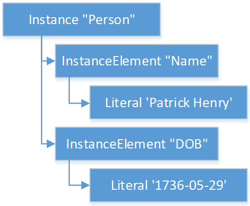

[[logical-specification]]
= 4. Logical Specification
:page-layout: STU3
:backend: xhtml
:sectnums:
:sectanchors:
:toc:

This chapter describes the Expression Logical Model (ELM) and how it is used to represent clinical knowledge within a quality artifact.

The ELM defines a mechanism for representing artifact logic independent of syntax and special-purpose constructs introduced at the syntactic level. ELM is equivalent to CQL syntax in terms of expressive power: every possible expression in CQL has an equivalent canonical-form expression in ELM. Higher-level constructs such as timing phrases and implicit conversions are represented in terms of the more primitive operators in ELM. This takes the burden of interpretation of higher-level constructs off of implementers, allowing them to focus on the implementation of a more primitive set of functionality.

Expressions within ELM are represented as Abstract Syntax Trees. ELM defines the base _Expression_ class, and all language elements and operators are then defined as descendants of the base _Expression_. For example, the _Add_ class descends from _BinaryExpression_, which introduces two operands, each of type _Expression_. The _Literal_ class descends from _Expression_ and allows primitive-typed values such as strings and integers to be represented directly. Using these classes, the expression 2 [.sym]#+# 2 can be represented as instances of the appropriate classes:

[[figure-4-a]]
image:extracted-media/media/image10.png[image,width=107,height=99]

Figure 4‑A

By combining instances of the appropriate classes of ELM, the logic for any expression can be represented. Note that the type of the expression can be inferred from the representation, Integer in this example.

The ELM consists of the following components:

* Expression – This component defines the core structures for representing expressions, as well as the operations available within those expressions.
* Clinical Expression – This component extends the Expression component to introduce expressions specific to the clinical quality domain.
* Library – This component defines the structure of a library, the container, and the basic unit of sharing.

Each of these components is defined fully within the ELM UML model. This model is defined formally as an XMI, and the model definition is also presented as an Enterprise Architect Project file (.eap) for viewing.

* link:elm/model/elm.xmi[Raw XMI Model Definition]
* link:elm/model/ELM.eap[Raw EAP Model Definition]

The documentation provided here serves only as a high-level structural reference for the ELM. The actual content of the specification is defined by the XMI file, and that provides the “source-of-truth” for the ELM specification.

Note that the semantics for the operations described here are defined both in the UML model as comments on the node for each operator, as well as the equivalent CQL operation as defined in link:09-b-cqlreference.html[Appendix B – CQL Reference].

[[simple-values]]
== Simple Values

Support for simple values is provided by the _Literal_ class. This class defines properties to represent the type of the value, as well as the value itself.

=== Literal

[source,elm]
----
Literal : Expression
  ¦
  1..1 --> valueType
  ¦
  0..1 --> value
----

The Literal type defines a single scalar value. For example, the literal 5, the boolean value true or the string "antithrombotic".

[[structured-values]]
== Structured Values

Structured values in ELM are values with sets of named elements (tuples), each of which may have a value of any type. Structured values are most commonly used to represent clinical information such as encounters, problems, and procedures.

The _Tuple_ class represents construction of a new structured value, with the values for each element supplied by _TupleElement_ instances.

To access elements of a structured value, use the _Property_ expression. A property expression has a _path_ attribute, an optional _source_ element, and a _value_ element. The source element returns the structured value to be accessed. In some contexts, such as within a _Filter_ expression, the source is implicit. If used outside such a context, a source must be provided.

The path attribute specifies a property path relative to the source structured value. The property expression returns the value of the property specified by the property path. Property paths are allowed to include qualifiers ([.sym]#.#) as well as indexers ([.sym]#[x]#) to indicate that subelements should be traversed. Indexers specified in paths must be literal integer values.

=== Tuple

[source,elm]
----
Tuple : Expression
  ¦
  0..* --> element : TupleElement
----

The Tuple expression allows tuples of any type to be built up as an expression. The tupleType attribute specifies the type of the tuple being built, if any, and the list of tuple elements specify the values for the elements of the tuple. Note that the value of an element may be any expression, including another Tuple.

The following example illustrates the construction of a tuple using the _Tuple_ class:

[[figure-4-h]]
image:extracted-media/media/image17.png[image,width=190,height=157]

Figure 4‑H

=== Instance

[source,elm]
----
Instance : Expression
  ¦
  0..* --> element : InstanceElement
  ¦
  1..1 --> classType
----

The Instance expression allows class instances of any type to be built up as an expression. The classType attribute specifies the type of the class instance being built, and the list of instance elements specify the values for the elements of the class instance. Note that the value of an element may be any expression, including another Instance.

The following example illustrates the construction of a structured value using the _Instance_ class:

[[figure-4-i]]

Figure 4‑I

=== Property

[source,elm]
----
Property : Expression
  ¦
  0..1 --> source : Expression
  ¦
  1..1 --> path
  ¦
  0..1 --> scope
----

The Property operator returns the value of the property on source specified by the path attribute.

If the result of evaluating source is null, the result is null.

The path attribute may include qualifiers (.) and indexers ([x]). Indexers must be literal integer values.

If the path attribute contains qualifiers or indexers, each qualifier or indexer is traversed to obtain the actual value. If the object of the property access at any point in traversing the path is null, the result is null.

If a scope is specified, the name is used to resolve the scope in which the path will be resolved. Scopes can be named by operators such as Filter and ForEach.

Property expressions can also be used to access the individual points and closed indicators for interval types using the property names low, high, lowClosed, and highClosed.

[[clinical-values]]
== Clinical Values

The following represents clinical information in ELM.

=== Code

[source,elm]
----
Code : Expression
  ¦
  1..1 --> system : CodeSystemRef
  ¦
  1..1 --> code
  ¦
  0..1 --> display
----

The Code type represents a literal code selector.

=== CodeDef

[source,elm]
----
CodeDef : Element
  ¦
  0..1 --> codeSystem : CodeSystemRef <1>
  ¦
  1..1 --> name
  ¦
  1..1 --> id
  ¦
  0..1 --> display
  ¦
  0..1 --> accessLevel
----

<1> The code system that contains the code being referenced.

The CodeDef type defines a code identifier that can then be used to reference single codes anywhere within an expression.

=== CodeRef

[source,elm]
----
CodeRef : Expression
  ¦
  0..1 --> name
  ¦
  0..1 --> libraryName
----

The CodeRef expression allows a previously defined code to be referenced within an expression.

=== CodeSystemDef

[source,elm]
----
CodeSystemDef : Element
  ¦
  1..1 --> name
  ¦
  1..1 --> id
  ¦
  0..1 --> version
  ¦
  0..1 --> accessLevel
----

The CodeSystemDef type defines a code system identifier that can then be used to identify code systems involved in value set definitions.

=== CodeSystemRef

[source,elm]
----
CodeSystemRef : Expression
  ¦
  0..1 --> name
  ¦
  0..1 --> libraryName
----

The CodeSystemRef expression allows a previously defined named code system to be referenced within an expression. Conceptually, referencing a code system returns the set of codes in the code system. Note that this operation should almost never be performed in practice. Code system references are allowed in order to allow for testing of code membership in a particular code system.

=== Concept

[source,elm]
----
Concept : Expression
  ¦
  1..* --> code : Code
  ¦
  0..1 --> display
----

The Concept type represents a literal concept selector.

=== ConceptDef

[source,elm]
----
ConceptDef : Element
  ¦
  1..* --> code : CodeRef <1>
  ¦
  1..1 --> name
  ¦
  0..1 --> display
  ¦
  0..1 --> accessLevel
----

<1> A code that makes up the concept. All codes within a given concept must be synonyms.

The ConceptDef type defines a concept identifier that can then be used to reference single concepts anywhere within an expression.

=== ConceptRef

[source,elm]
----
ConceptRef : Expression
  ¦
  0..1 --> name
  ¦
  0..1 --> libraryName
----

The ConceptRef expression allows a previously defined concept to be referenced within an expression.

=== Quantity

[source,elm]
----
Quantity : Expression
  ¦
  0..1 --> value
  ¦
  0..1 --> unit
----

The Quantity type defines a clinical quantity. For example, the quantity 10 days or 30 mmHg. The value is a decimal, while the unit is expected to be a valid UCUM unit.

=== Ratio

[source,elm]
----
Ratio : Expression
  ¦
  1..1 --> numerator : Quantity
  ¦
  1..1 --> denominator : Quantity
----

The Ratio type defines a ratio between two quantities. For example, the titre 1:128, or the concentration ratio 5 mg/10 mL. The numerator and denominator are both quantities.

=== ValueSetDef

[source,elm]
----
ValueSetDef : Element
  ¦
  0..* --> codeSystem : CodeSystemRef <1>
  ¦
  0..1 --> name
  ¦
  1..1 --> id
  ¦
  0..1 --> version
  ¦
  0..1 --> accessLevel
----

<1> The code system that should be used to construct the expansion set. Note that the recommended approach to statically binding to an expansion set is to use a value set definition that specifies the version of each code system used. The codeSystem elements are provided only to ensure static binding can be achieved when the value set definition does not specify code system versions as part of the definition header.

The ValueSetDef type defines a value set identifier that can be referenced by name anywhere within an expression.

The id specifies the globally unique identifier for the value set. This may be an HL7 OID, a FHIR URL, or a CTS2 value set URL.

If version is specified, it will be used to resolve the version of the value set definition to be used. Otherwise, the most current published version of the value set is assumed.

If codeSystems are specified, they will be used to resolve the code systems used within the value set definition to construct the expansion set.
Note that the recommended approach to statically binding to an expansion set is to use a value set definition that specifies the version of each code system used. The codeSystemVersions attribute is provided only to ensure static binding can be achieved when the value set definition does not specify code system versions as part of the definition header.

=== ValueSetRef

[source,elm]
----
ValueSetRef : Expression
  ¦
  0..1 --> name
  ¦
  0..1 --> libraryName
----

The ValueSetRef expression allows a previously defined named value set to be referenced within an expression. Conceptually, referencing a value set returns the expansion set for the value set as a list of codes.

[[type-specifiers]]
== Type Specifiers

ELM provides the following elements for type specifiers.

=== TypeSpecifier

[source,elm]
----
TypeSpecifier : Element
----

TypeSpecifier is the abstract base type for all type specifiers.

=== NamedTypeSpecifier

[source,elm]
----
NamedTypeSpecifier : TypeSpecifier
  ¦
  1..1 --> name
----

NamedTypeSpecifier defines a type identified by a name, such as Integer, String, Patient, or Encounter.

=== IntervalTypeSpecifier

[source,elm]
----
IntervalTypeSpecifier : TypeSpecifier
  ¦
  1..1 --> pointType : TypeSpecifier
----

IntervalTypeSpecifier defines an interval type by specifying the point type. Any type can serve as the point type for an interval, so long as it supports comparison operators, minimum and maximum value determination, as well as predecessor and successor functions.

=== ListTypeSpecifier

[source,elm]
----
ListTypeSpecifier : TypeSpecifier
  ¦
  1..1 --> elementType : TypeSpecifier
----

ListTypeSpecifier defines a list type by specifying the type of elements the list may contain.

=== TupleTypeSpecifier

[source,elm]
----
TupleTypeSpecifier : TypeSpecifier
  ¦
  0..* --> element : TupleElementDefinition
----

TupleTypeSpecifier defines the possible elements of a tuple.

=== ChoiceTypeSpecifier

[source,elm]
----
ChoiceTypeSpecifier : TypeSpecifier
  ¦
  0..* --> type : TypeSpecifier <1>
  ¦
  0..* --> choice : TypeSpecifier
----

<1> This element is deprecated. New implementations should use the new choice element.

ChoiceTypeSpecifier defines the possible types of a choice type.

[[libraries-2]]
== Libraries

ELM defines the notion of a library as the basic container for logic constructs. Libraries consist of sets of declarations including data model references, library references, valueset definitions, parameters, functions, and named expressions. The _Library_ class defines this unit and defines properties for each of these types of declarations.

Once defined, libraries can then be referenced by other libraries with the _IncludeDef_ class, which defines properties for the name and version of the library being referenced, as well as a local name that is used to access components of the library.

=== Library

[source,elm]
----
Library : Element
  ¦
  1..1 --> identifier : VersionedIdentifier <1>
  ¦
  1..1 --> schemaIdentifier : VersionedIdentifier <2>
  ¦
  0..1 --> usings <3>
  ¦        ¦
  ¦        1..* --> def : UsingDef <4>
  ¦
  0..1 --> includes <5>
  ¦        ¦
  ¦        1..* --> def : IncludeDef <6>
  ¦
  0..1 --> parameters <7>
  ¦        ¦
  ¦        0..* --> def : ParameterDef
  ¦
  0..1 --> codeSystems <8>
  ¦        ¦
  ¦        0..* --> def : CodeSystemDef
  ¦
  0..1 --> valueSets <9>
  ¦        ¦
  ¦        0..* --> def : ValueSetDef
  ¦
  0..1 --> codes <10>
  ¦        ¦
  ¦        0..* --> def : CodeDef
  ¦
  0..1 --> concepts <11>
  ¦        ¦
  ¦        0..* --> def : ConceptDef
  ¦
  0..1 --> statements <12>
           ¦
           0..* --> def : ExpressionDef
----

<1> The identifier element defines a unique identifier for this library,
                and optionally, a version.

<2> This is the identifier of the XML schema (and its version) which
                governs the structure of this Library.

<3> Set of data models referenced in the Expression objects in this
                knowledge artifact.

<4> A reference to a data model that is used in the artifact,
                      e..g., the Virtual Medical Record.

<5> Set of libraries referenced by this artifact. Components of
                referenced libraries may be used within this artifact.

<6> A reference to a library whose components can be used within
                      the artifact.

<7> The parameters defined within this library.

<8> The code systems defined within this library.

<9> The value sets defined within this library.

<10> The codes defined within this library.

<11> The concepts defined within this library.

<12> The statements section contains the expression and function
                definitions for the library.

A Library is an instance of a CQL-ELM library.

=== IncludeDef

[source,elm]
----
IncludeDef : Element
  ¦
  1..1 --> localIdentifier
  ¦
  0..1 --> mediaType
  ¦
  1..1 --> path
  ¦
  0..1 --> version
----

Includes a library for use within the artifact.

=== VersionedIdentifier

[source,elm]
----
VersionedIdentifier
  ¦
  0..1 --> id
  ¦
  0..1 --> system
  ¦
  0..1 --> version
----

VersionedIdentifier is composed of two parts: (1) an identifier which
        identifies the set of all versions of a given resource. (2) the actual version of the
        instance of interest in this set. The VersionedIdentifier therefore points to an individual
        'versioned' instance of a resource such as the third version of a library.

[[data-model]]
== Data Model

ELM does not reference any specific data model, and so can be used to represent logic expressed against any data model. These data models are specified using the _UsingDef_ class. This class provides attributes for specifying the name and version of the data model. An ELM library can reference any number of models.

The name of the model is an implementation-specific identifier that provides the environment with a mechanism for finding the model description. The details of how that model description is provided are part of the physical representation.

=== UsingDef

[source,elm]
----
UsingDef : Element
  ¦
  1..1 --> localIdentifier
  ¦
  1..1 --> uri
  ¦
  0..1 --> version
----

Defines a data model that is available within the artifact.

[[parameters]]
== Parameters

In addition to external data, ELM provides a mechanism for defining parameters to an artifact. A library can define any number of parameters, each of which has a name, and a defined type, as well as an optional default value.

Parameter values, if any, are expected to be provided as part of the evaluation request, and can be accessed with a _ParameterRef_ expression in any expression throughout the library.

=== ParameterDef

[source,elm]
----
ParameterDef : Element
  ¦
  0..1 --> default : Expression
  ¦
  0..1 --> parameterTypeSpecifier : TypeSpecifier
  ¦
  0..1 --> name
  ¦
  0..1 --> parameterType
  ¦
  0..1 --> accessLevel
----

The ParameterDef type defines a parameter that can be referenced by name anywhere within an expression.

Parameters are defined at the artifact level, and may be provided as part of the payload for an evaluation request.

If no parameter value is provided, the default element is used to provide the value for the parameter.

If no parameter or default is provided, the parameter is defined to be null.

Note that the expression specified in the default element must be able to be evaluated at compile-time (i.e. without reference to any run-time capabilities such as data, terminology, and library references, both local and included).

=== ParameterRef

[source,elm]
----
ParameterRef : Expression
  ¦
  0..1 --> name
  ¦
  0..1 --> libraryName
----

The ParameterRef expression allows the value of a parameter to be referenced as part of an expression.

[[expressions]]
== Expressions

The ELM Expression component defines a mechanism for representing the structure of logic.

Every expression in ELM is represented as a descendant of the abstract base element _Expression_. In addition, several abstract descendants are introduced to support the representation of unary, binary, ternary, and n-ary operators. Note that an expression need not descend from one of these descendants, it may descend from _Expression_ directly.

=== Expression

[source,elm]
----
Expression : Element
----

The Expression type defines the abstract base type for all expressions used in the ELM expression language.

=== OperatorExpression

[source,elm]
----
OperatorExpression : Expression
  ¦
  0..* --> signature : TypeSpecifier <1>
----

<1> Specifies the declared signature of the operator or function being called. If no signature is specified, the run-time types of the operands should be used to resolve any overload.

The Operator type defines the abstract base type for all built-in operators used in the ELM expression language. This explicitly excludes FunctionRef, which is the concrete type for all function invocations.

=== UnaryExpression

[source,elm]
----
UnaryExpression : OperatorExpression
  ¦
  1..1 --> operand : Expression
----

The UnaryExpression type defines the abstract base type for expressions that take a single argument.

=== BinaryExpression

[source,elm]
----
BinaryExpression : OperatorExpression
  ¦
  2..2 --> operand : Expression
----

The BinaryExpression type defines the abstract base type for expressions that take two arguments.

=== TernaryExpression

[source,elm]
----
TernaryExpression : OperatorExpression
  ¦
  3..3 --> operand : Expression
----

The TernaryExpression type defines the abstract base type for expressions that take three arguments.

=== NaryExpression

[source,elm]
----
NaryExpression : OperatorExpression
  ¦
  0..* --> operand : Expression
----

The NaryExpression type defines an abstract base class for an expression that takes any number of arguments, including zero.

=== AggregateExpression

[source,elm]
----
AggregateExpression : Expression
  ¦
  0..* --> signature : TypeSpecifier <1>
  ¦
  1..1 --> source : Expression
  ¦
  0..1 --> path
----

<1> Specifies the declared signature of the operator or function being called. If no signature is specified, the run-time types of the operands should be used to resolve any overload.

Aggregate expressions perform operations on lists of data, either directly on a list of scalars, or indirectly on a list of objects, with a reference to a property present on each object in the list.

Aggregate expressions deal with missing information by excluding missing values from consideration before performing the aggregated operation. For example, in a Sum over Dose, any instance of Medication with no value for Dose would be ignored.

An aggregate operation performed over an empty list is defined to return null, except as noted in the documentation for each operator (Count, AllTrue, and AnyTrue are the exceptions).

[[reusing-logic]]
== Reusing Logic

ELM provides a mechanism for reusing expressions by declaring a named expression. This construct is similar to a function call with no parameters in a traditional imperative language, with the exception that since ELM is a pure-functional system, the result of the evaluation could be cached by an implementation to avoid performing the same computation multiple times.

In addition, ELM provides a more traditional function call with named parameters that can then be accessed by the expression in the function body, and passed as part of the call from the invoking context.

The _ExpressionDef_ class is used to define a named expression that can then be referenced by other expressions. The _FunctionDef_ class is used to define a function and its parameters.

Note that circular expression references are not allowed, but that named expressions can be defined in any order, so long as the actual references do not result in a cycle.

The _ExpressionDef_ class introduces the notion of _context_ which can be either Patient or Population. This context defines how the contained expression is evaluated, either with respect to a single patient, defined by the evaluation environment, or with respect to a population. For more information about patient context, please refer to the <<External Data>> section.

=== ExpressionDef

[source,elm]
----
ExpressionDef : Element
  ¦
  0..1 --> expression : Expression
  ¦
  0..1 --> name
  ¦
  0..1 --> context
  ¦
  0..1 --> accessLevel
----

The ExpressionDef type defines an expression and an associated name that can be referenced by any expression in the artifact. The name must be unique within the artifact.
			The context attribute specifies the scope of the execution and is used by the environment to determine when and how to evaluate the expression.

=== ExpressionRef

[source,elm]
----
ExpressionRef : Expression
  ¦
  0..1 --> name
  ¦
  0..1 --> libraryName
----

The ExpressionRef type defines an expression that references a previously defined NamedExpression. The result of evaluating an ExpressionReference is the result of evaluating the referenced NamedExpression.

=== FunctionDef

[source,elm]
----
FunctionDef : ExpressionDef
  ¦
  0..* --> operand : OperandDef
  ¦
  0..1 --> external
----

The FunctionDef type defines a named function that can be invoked by any expression in the artifact. Function names must be unique within the artifact. Functions may take any number of operands.

=== FunctionRef

[source,elm]
----
FunctionRef : ExpressionRef
  ¦
  0..* --> signature : TypeSpecifier <1>
  ¦
  0..* --> operand : Expression
----

<1> Specifies the declared signature of the function being called. If no signature is specified, the run-time types of the operands should be used to resolve any overload.

The FunctionRef type defines an expression that invokes a previously defined function. The result of evaluating each operand is passed to the function.

[[queries]]
== Queries

ELM provides a mechanism for expressing the structure of a query.

For more information on query semantics, refer to the <<02-authorsguide.adoc#queries,Queries>> section of the link:02-authorsguide.html[Author’s Guide], as well as the <<03-developersguide.adoc#multi-source-queries,Multi-Source Queries>> and <<03-developersguide.adoc#non-retrieve-queries,Non-Retrieve Queries>> sections of the link:03-developersguide.html[Developer’s Guide].

=== Query

[source,elm]
----
Query : Expression
  ¦
  1..* --> source : AliasedQuerySource
  ¦
  0..* --> let : LetClause
  ¦
  0..* --> relationship : RelationshipClause
  ¦
  0..1 --> where : Expression
  ¦
  0..1 --> return : ReturnClause
  ¦
  0..1 --> sort : SortClause
----

The Query operator represents a clause-based query. The result of the query is determined by the type of sources included, as well as the clauses used in the query.

=== AliasedQuerySource

[source,elm]
----
AliasedQuerySource : Element
  ¦
  1..1 --> expression : Expression
  ¦
  1..1 --> alias
----

The AliasedQuerySource element defines a single source for inclusion in a query context. The type of the source is determined by the expression element, and the source can be accessed within the query context by the given alias.

=== AliasRef

[source,elm]
----
AliasRef : Expression
  ¦
  0..1 --> name
----

The AliasRef expression allows for the reference of a specific source within the context of a query.

=== ByColumn

[source,elm]
----
ByColumn : SortByItem
  ¦
  0..1 --> path
----

The ByColumn element specifies that the sort should be performed using the given column and direction. This approach is used to specify the sort order for a query when the result is a list of tuples.

=== ByDirection

[source,elm]
----
ByDirection : SortByItem
----

The ByDirection element specifies that the sort should be performed using the given direction. This approach is used when the result of the query is a list of non-tuple elements and only the sort direction needs to be specified.

=== ByExpression

[source,elm]
----
ByExpression : SortByItem
  ¦
  1..1 --> expression : Expression
----

The ByExpression element specifies that the sort should be performed using the given expression and direction. This approach is used to specify the sort order as a calculated expression.

=== LetClause

[source,elm]
----
LetClause : Element
  ¦
  1..1 --> expression : Expression
  ¦
  1..1 --> identifier
----

The LetClause element allows any number of expression definitions to be introduced within a query context. Defined expressions can be referenced by name within the query context.

=== QueryLetRef

[source,elm]
----
QueryLetRef : Expression
  ¦
  0..1 --> name
----

The QueryLetRef expression allows for the reference of a specific let definition within the context of a query.

=== RelationshipClause

[source,elm]
----
RelationshipClause : AliasedQuerySource
  ¦
  1..1 --> suchThat : Expression
----

The RelationshipClause element allows related sources to be used to restrict the elements included from another source in a query context. Note that the elements referenced by the relationship clause can only be accessed within the suchThat condition, and that elements of the related source are not included in the query context.

=== ReturnClause

[source,elm]
----
ReturnClause : Element
  ¦
  1..1 --> expression : Expression
  ¦
  0..1 --> distinct
----

The ReturnClause element defines the shape of the result set of the query.

=== SortClause

[source,elm]
----
SortClause : Element
  ¦
  1..* --> by : SortByItem
----

The SortClause element defines the sort order for the query.

=== With

[source,elm]
----
With : RelationshipClause
----

The With clause restricts the elements of a given source to only those elements that have elements in the related source that satisfy the suchThat condition. This operation is known as a semi-join in database languages.

=== Without

[source,elm]
----
Without : RelationshipClause
----

The Without clause restricts the elements of a given source to only those elements that do not have elements in the related source that satisfy the suchThat condition. This operation is known as a semi-difference in database languages.

[[external-data]]
== External Data

All access to external data within ELM is represented by _Retrieve_ expressions.

The _Retrieve_ class defines the data type of the request, which determines the type of elements to be returned. The result will always be a list of values of the type specified in the request.

The type of the elements to be returned is specified with the _dataType_ attribute of the _Retrieve_, and must refer to the name of a type within a known data model specified in the _dataModels_ element of the library definition.

In addition, the _Retrieve_ introduces the ability to specify optional criteria for the request. The available criteria are intentionally restricted to the set of codes involved, and the date range involved. If these criteria are omitted, the request is interpreted to mean all data of that type.

Note that because every expression is being evaluated within a context (either Patient or Population) as defined by the containing _ExpressionDef_, the data returned by a retrieve depends on the context. For the Patient context, the data is returned for a single patient only, as defined by the evaluation environment. Whereas for the Population context, the data is returned for all patients.

=== Retrieve

[source,elm]
----
Retrieve : Expression
  ¦
  0..1 --> codes : Expression <1>
  ¦
  0..1 --> dateRange : Expression <2>
  ¦
  1..1 --> dataType
  ¦
  0..1 --> templateId
  ¦
  0..1 --> idProperty
  ¦
  0..1 --> codeProperty
  ¦
  0..1 --> dateProperty
  ¦
  0..1 --> dateLowProperty
  ¦
  0..1 --> dateHighProperty
  ¦
  0..1 --> scope
----

<1> The codes element optionally allows a set of codes to be provided. The codes list restricts the set of clinical statements returned to only those clinical statements that matched some code in the set.

<2> The dateRange element optionally allows a date range to be provided. The clinical statements returned would be only those clinical statements whose date fell within the range specified.

The retrieve expression defines clinical data that will be used by the artifact. This expression allows clinically relevant filtering criteria to be provided in a well-defined and computable way. This operation defines the integration boundary for artifacts. The result of a retrieve is defined to return the same data for subsequent invocations within the same evaluation request. This means in particular that patient data updates made during the evaluation request are not visible to the artifact. In effect, the patient data is a snapshot of the data as of the start of the evaluation. This ensures strict deterministic and functional behavior of the artifact, and allows the implementation engine freedom to cache intermediate results in order to improve performance.

[[comparison-operators-1]]
== Comparison Operators

ELM defines a standard set of comparison operators for use with simple values. Each comparison operator takes two arguments of the same type, and returns a boolean indicating the result of the comparison. Note that for comparison operators, if either or both operands evaluate to null, the result of the comparison is _null_, not false.

For more information on the semantics of the various comparison operators, see the <<09-b-cqlreference.adoc#comparison-operators-4,Comparison Operators>> section of the link:09-b-cqlreference.html[CQL Reference].

[[equal]]
=== Equal

[source,elm]
----
Equal : BinaryExpression
----

The Equal operator returns true if the arguments are equal; false if the arguments are known unequal, and null otherwise. Equality semantics are defined to be value-based.

For simple types, this means that equality returns true if and only if the result of each argument evaluates to the same value.

For quantities, this means that the dimensions of each quantity must be the same, but not necessarily the unit. For example, units of 'cm' and 'm' are comparable, but units of 'cm2' and 'cm' are not. Attempting to operate on quantities with invalid units will result in a run-time error.

For tuple types, this means that equality returns true if and only if the tuples are of the same type, and the values for all elements that have values, by name, are equal.

For list types, this means that equality returns true if and only if the lists contain elements of the same type, have the same number of elements, and for each element in the lists, in order, the elements are equal using equality semantics.

For interval types, equality returns true if and only if the intervals are over the same point type, and they have the same value for the starting and ending points of the interval as determined by the Start and End operators.

For date/time values, the comparison is performed by considering each precision in order, beginning with years (or hours for time values). If the values are the same, comparison proceeds to the next precision; if the values are different, the comparison stops and the result is false. If one input has a value for the precision and the other does not, the comparison stops and the result is null; if neither input has a value for the precision or the last precision has been reached, the comparison stops and the result is true.

If either argument is null, the result is null.

The following example illustrates a simple _Equal_ comparison:

[[figure-4-b]]
image:extracted-media/media/image11.png[image,width=109,height=102]

Figure 4‑B

[[equivalent]]
=== Equivalent

[source,elm]
----
Equivalent : BinaryExpression
----

The Equivalent operator returns true if the arguments are the same value, or if they are both null; and false otherwise.

For tuple types, this means that two tuple values are equivalent if and only if the tuples are of the same type, and the values for all elements by name are equivalent.

For list types, this means that two lists are equivalent if and only if the lists contain elements of the same type, have the same number of elements, and for each element in the lists, in order, the elements are equivalent.

For interval types, this means that two intervals are equivalent if and only if the intervals are over the same point type, and the starting and ending points of the intervals as determined by the Start and End operators are equivalent.

For date/time values, the comparison is performed in the same way as it is for equality, except that if one input has a value for a given precision and the other does not, the comparison stops and the result is false, rather than null.

For Code values, equivalence is defined based on the code and system elements only. The display and version elements are ignored for the purposes of determining Code equivalence.

For Concept values, equivalence is defined as a non-empty intersection of the codes in each Concept.

Note that this operator will always return true or false, even if either or both of its arguments are null or contain null components.

=== Greater

[source,elm]
----
Greater : BinaryExpression
----

The Greater operator returns true if the first argument is greater than the second argument.

For comparisons involving quantities, the dimensions of each quantity must be the same, but not necessarily the unit. For example, units of 'cm' and 'm' are comparable, but units of 'cm2' and 'cm' are not. Attempting to operate on quantities with invalid units will result in a run-time error.

For date/time values, the comparison is performed by considering each precision in order, beginning with years (or hours for time values). If the values are the same, comparison proceeds to the next precision; if the first value is greater than the second, the result is true; if the first value is less than the second, the result is false; if one input has a value for the precision and the other does not, the comparison stops and the result is null; if neither input has a value for the precision or the last precision has been reached, the comparison stops and the result is false.

If either argument is null, the result is null.

The Greater operator is defined for the Integer, Decimal, String, Date, DateTime, Time, and Quantity types.

=== GreaterOrEqual

[source,elm]
----
GreaterOrEqual : BinaryExpression
----

The GreaterOrEqual operator returns true if the first argument is greater than or equal to the second argument.

For comparisons involving quantities, the dimensions of each quantity must be the same, but not necessarily the unit. For example, units of 'cm' and 'm' are comparable, but units of 'cm2' and 'cm' are not. Attempting to operate on quantities with invalid units will result in a run-time error.

For date/time values, the comparison is performed by considering each precision in order, beginning with years (or hours for time values). If the values are the same, comparison proceeds to the next precision; if the first value is greater than the second, the result is true; if the first value is less than the second, the result is false; if one input has a value for the precision and the other does not, the comparison stops and the result is null; if neither input has a value for the precision or the last precision has been reached, the comparison stops and the result is true.

If either argument is null, the result is null.

The GreaterOrEqual operator is defined for the Integer, Decimal, String, Date, DateTime, Time, and Quantity types.

=== Less

[source,elm]
----
Less : BinaryExpression
----

The Less operator returns true if the first argument is less than the second argument.

For comparisons involving quantities, the dimensions of each quantity must be the same, but not necessarily the unit. For example, units of 'cm' and 'm' are comparable, but units of 'cm2' and 'cm' are not. Attempting to operate on quantities with invalid units will result in a run-time error.

For date/time values, the comparison is performed by considering each precision in order, beginning with years (or hours for time values). If the values are the same, comparison proceeds to the next precision; if the first value is less than the second, the result is true; if the first value is greater than the second, the result is false; if one input has a value for the precision and the other does not, the comparison stops and the result is null; if neither input has a value for the precision or the last precision has been reached, the comparison stops and the result is false.

If either argument is null, the result is null.

The Less operator is defined for the Integer, Decimal, String, Date, DateTime, Time, and Quantity types.

=== LessOrEqual

[source,elm]
----
LessOrEqual : BinaryExpression
----

The LessOrEqual operator returns true if the first argument is less than or equal to the second argument.

For comparisons involving quantities, the dimensions of each quantity must be the same, but not necessarily the unit. For example, units of 'cm' and 'm' are comparable, but units of 'cm2' and 'cm' are not. Attempting to operate on quantities with invalid units will result in a run-time error.

For date/time values, the comparison is performed by considering each precision in order, beginning with years (or hours for time values). If the values are the same, comparison proceeds to the next precision; if the first value is less than the second, the result is true; if the first value is greater than the second, the result is false; if one input has a value for the precision and the other does not, the comparison stops and the result is null; if neither input has a value for the precision or the last precision has been reached, the comparison stops and the result is true.

If either argument is null, the result is null.

The LessOrEqual operator is defined for the Integer, Decimal, String, Date, DateTime, Time, and Quantity types.

[[not-equal]]
=== NotEqual

[source,elm]
----
NotEqual : BinaryExpression
----

The NotEqual operator returns true if its arguments are not the same value.

The NotEqual operator is a shorthand for invocation of logical negation of the Equal operator.

[[logical-operators-1]]
== Logical Operators

ELM defines logical operators that can be used to combine the results of logical expressions. _And_ and _Or_ can be used to combine any number of results, and _Not_ can be used to invert the result of any expression.

Note that these operators are defined with 3-valued logic semantics, allowing the operators to deal consistently with missing information.

For more information on the semantics of these operators, refer to the <<09-b-cqlreference.adoc#logical-operators-3,Logical Operators>> section in the link:09-b-cqlreference.html[CQL Reference].

=== And

[source,elm]
----
And : BinaryExpression
----

The And operator returns the logical conjunction of its arguments. Note that this operator is defined using 3-valued logic semantics. This means that if either argument is false, the result is false; if both arguments are true, the result is true; otherwise, the result is null. Note also that ELM does not prescribe short-circuit evaluation.

The following example illustrates a simple _And_ expression:

[[figure-4-c]]
image:extracted-media/media/image12.png[image,width=138,height=217]

Figure 4‑C

=== Implies

[source,elm]
----
Implies : BinaryExpression
----

The Implies operator returns the logical implication of its arguments. Note that this operator is defined using 3-valued logic semantics. This means that if the left operand evaluates to true, this operator returns the boolean evaluation of the right operand. If the left operand evaluates to false, this operator returns true. Otherwise, this operator returns true if the right operand evaluates to true, and null otherwise.

=== Not

[source,elm]
----
Not : UnaryExpression
----

The Not operator returns the logical negation of its argument. If the argument is true, the result is false; if the argument is false, the result is true; otherwise, the result is null.

=== Or

[source,elm]
----
Or : BinaryExpression
----

The Or operator returns the logical disjunction of its arguments. Note that this operator is defined using 3-valued logic semantics. This means that if either argument is true, the result is true; if both arguments are false, the result is false; otherwise, the result is null. Note also that ELM does not prescribe short-circuit evaluation.

=== Xor

[source,elm]
----
Xor : BinaryExpression
----

The Xor operator returns the exclusive or of its arguments. Note that this operator is defined using 3-valued logic semantics. This means that the result is true if and only if one argument is true and the other is false, and that the result is false if and only if both arguments are true or both arguments are false. If either or both arguments are null, the result is null.

[[nullological-operators]]
== Nullological Operators

ELM defines several nullological operators that are useful for dealing with potentially missing information. These are _Null, IsNull_, _IsTrue_, _IsFalse_, and _Coalesce_.

For more information on the semantics of these operators, refer to the <<09-b-cqlreference.adoc#nullological-operators-3,Nullological Operators>> section in the link:09-b-cqlreference.html[CQL Reference].

=== Null

[source,elm]
----
Null : Expression
  ¦
  0..1 --> valueType
----

The Null operator returns a null, or missing information marker. To avoid the need to cast this result, the operator is allowed to return a typed null.

=== Coalesce

[source,elm]
----
Coalesce : NaryExpression
----

The Coalesce operator returns the first non-null result in a list of arguments. If all arguments evaluate to null, the result is null. The static type of the first argument determines the type of the result, and all subsequent arguments must be of that same type.

=== IsFalse

[source,elm]
----
IsFalse : UnaryExpression
----

The IsFalse operator determines whether or not its argument evaluates to false. If the argument evaluates to false, the result is true; if the argument evaluates to true or null, the result is false.

=== IsNull

[source,elm]
----
IsNull : UnaryExpression
----

The IsNull operator determines whether or not its argument evaluates to null. If the argument evaluates to null, the result is true; otherwise, the result is false.

=== IsTrue

[source,elm]
----
IsTrue : UnaryExpression
----

The IsTrue operator determines whether or not its argument evaluates to true. If the argument evaluates to true, the result is true; if the argument evaluates to false or null, the result is false.

[[conditional-operators]]
== Conditional Operators

ELM defines several conditional expressions that can be used to return different values based on a condition, or set of conditions. These are the _If_ (conditional) expression, and the _Case_ expression.

The conditional expression allows a simple condition to be used to decide between one expression or another.

The case expression has two varieties, one that is equivalent to repeated conditionals, and one that allows a specific comparand to be identified and compared with each item to determine a result.

=== Case

[source,elm]
----
Case : Expression
  ¦
  0..1 --> comparand : Expression
  ¦
  1..* --> caseItem : CaseItem
  ¦
  1..1 --> else : Expression
----

The Case operator allows for multiple conditional expressions to be chained together in a single expression, rather than having to nest multiple If operators. In addition, the comparand operand provides a variant on the case that allows a single value to be compared in each conditional.

If a comparand is not provided, the type of each when element of the caseItems within the Case is expected to be boolean. If a comparand is provided, the type of each when element of the caseItems within the Case is expected to be of the same type as the comparand. An else element must always be provided.

The static type of the then argument within the first caseItem determines the type of the result, and the then argument of each subsequent caseItem and the else argument must be of that same type.

The following example illustrates a more complex multi-conditional _Case_ expression:

[[figure-4-e]]
image:extracted-media/media/image14.png[image,width=230,height=397]

Figure 4‑E

And finally, an equivalent comparand-based _Case_ expression:

[[figure-4-f]]
image:extracted-media/media/image15.png[image,width=184,height=286]

Figure 4‑F

=== If

[source,elm]
----
If : Expression
  ¦
  1..1 --> condition : Expression
  ¦
  1..1 --> then : Expression
  ¦
  1..1 --> else : Expression
----

The If operator evaluates a condition, and returns the then argument if the condition evaluates to true; if the condition evaluates to false or null, the result of the else argument is returned. The static type of the then argument determines the result type of the conditional, and the else argument must be of that same type.

The following examples illustrates a simple _If_ expression (i.e. if / then / else):

[[figure-4-d]]
image:extracted-media/media/image13.png[image,width=143,height=193]

Figure 4‑D

[[arithmetic-operators]]
== Arithmetic Operators

ELM provides a complete set of arithmetic operators to allow for manipulation of integer and real values within artifacts. In general, these operators have the expected semantics for arithmetic operators.

Note that if an operand evaluates to null, the result of the operation is defined to be null. This provides consistent semantics when dealing with missing information.

For more information on the semantics of these operators, refer to the <<09-b-cqlreference.adoc#arithmetic-operators-4,Arithmetic Operators>> section in the link:09-b-cqlreference.html[CQL Reference].

=== Abs

[source,elm]
----
Abs : UnaryExpression
----

The Abs operator returns the absolute value of its argument.

When taking the absolute value of a quantity, the unit is unchanged.

If the argument is null, the result is null.

The Abs operator is defined for the Integer, Decimal, and Quantity types.

[[add]]
=== Add

[source,elm]
----
Add : BinaryExpression
----

The Add operator performs numeric addition of its arguments.

When adding quantities, the dimensions of each quantity must be the same, but not necessarily the unit. For example, units of 'cm' and 'm' can be added, but units of 'cm2' and 'cm' cannot. The unit of the result will be the most granular unit of either input. Attempting to operate on quantities with invalid units will result in a run-time error.

The Add operator is defined for the Integer, Decimal, and Quantity types. In addition, a time-valued Quantity can be added to a Date, DateTime or Time using this operator.

For Date, DateTime, and Time values, the operator returns the value of the given date/time, incremented by the time-valued quantity, respecting variable length periods for calendar years and months.

For Date values, the quantity unit must be one of years, months, weeks, or days.

For DateTime values, the quantity unit must be one of years, months, weeks, days, hours, minutes, seconds, or milliseconds.

For Time values, the quantity unit must be one of hours, minutes, seconds, or milliseconds.

Note that as with any date/time operations, temporal units may be specified with either singular, plural, or UCUM units.

The operation is performed by converting the time-based quantity to the highest specified granularity in the date/time value (truncating any resulting decimal portion) and then adding it to the date/time value.

If either argument is null, the result is null.

The following example illustrates a simple _Add_ expression:

[[figure-4-g]]
image:extracted-media/media/image16.png[image,width=102,height=94]

Figure 4‑G

=== Ceiling

[source,elm]
----
Ceiling : UnaryExpression
----

The Ceiling operator returns the first integer greater than or equal to the argument.

If the argument is null, the result is null.

=== Divide

[source,elm]
----
Divide : BinaryExpression
----

The Divide operator performs numeric division of its arguments. Note that the result type of Divide is Decimal, even if its arguments are of type Integer. For integer division, use the truncated divide operator.

For division operations involving quantities, the resulting quantity will have the appropriate unit.

If either argument is null, the result is null.

The Divide operator is defined for the Decimal and Quantity types.

=== Exp

[source,elm]
----
Exp : UnaryExpression
----

The Exp operator returns e raised to the given power.

If the argument is null, the result is null.

=== Floor

[source,elm]
----
Floor : UnaryExpression
----

The Floor operator returns the first integer less than or equal to the argument.

If the argument is null, the result is null.

=== Log

[source,elm]
----
Log : BinaryExpression
----

The Log operator computes the logarithm of its first argument, using the second argument as the base.

If either argument is null, the result is null.

=== Ln

[source,elm]
----
Ln : UnaryExpression
----

The Ln operator computes the natural logarithm of its argument.

If the argument is null, the result is null.

=== MaxValue

[source,elm]
----
MaxValue : Expression
  ¦
  1..1 --> valueType
----

The MaxValue operator returns the maximum representable value for the given type.

The MaxValue operator is defined for the Integer, Decimal, Date, DateTime, and Time types.

For Integer, MaxValue returns the maximum signed 32-bit integer, 2^31 - 1.

For Decimal, MaxValue returns the maximum representable Decimal value, (10^28 - 1) / 10^8 (99999999999999999999.99999999).

For Date, MaxValue returns the maximum representable Date value, Date(9999, 12, 31).

For DateTime, MaxValue returns the maximum representable DateTime value, DateTime(9999, 12, 31, 23, 59, 59, 999).

For Time, MaxValue returns the maximum representable Time value, Time(23, 59, 59, 999).

For any other type, attempting to invoke MaxValue results in an error.

=== MinValue

[source,elm]
----
MinValue : Expression
  ¦
  1..1 --> valueType
----

The MinValue operator returns the minimum representable value for the given type.

The MinValue operator is defined for the Integer, Decimal, Date, DateTime, and Time types.

For Integer, MinValue returns the minimum signed 32-bit integer, -(2^31).

For Decimal, MinValue returns the minimum representable Decimal value, (-10^28 + 1) / 10^8 (-99999999999999999999.99999999).

For Date, MinValue returns the minimum representable Date value, Date(1, 1, 1).

For DateTime, MinValue returns the minimum representable DateTime value, DateTime(1, 1, 1, 0, 0, 0, 0).

For Time, MinValue returns the minimum representable Time value, Time(0, 0, 0, 0).

For any other type, attempting to invoke MinValue results in an error.

=== Modulo

[source,elm]
----
Modulo : BinaryExpression
----

The Modulo operator computes the remainder of the division of its arguments.

If either argument is null, the result is null.

The Modulo operator is defined for the Integer and Decimal types.

=== Multiply

[source,elm]
----
Multiply : BinaryExpression
----

The Multiply operator performs numeric multiplication of its arguments.

For multiplication operations involving quantities, the resulting quantity will have the appropriate unit.

If either argument is null, the result is null.

The Multiply operator is defined for the Integer, Decimal and Quantity types.

=== Negate

[source,elm]
----
Negate : UnaryExpression
----

The Negate operator returns the negative of its argument.

When negating quantities, the unit is unchanged.

If the argument is null, the result is null.

The Negate operator is defined for the Integer, Decimal, and Quantity types.

=== Power

[source,elm]
----
Power : BinaryExpression
----

The Power operator raises the first argument to the power given by the second argument.

If either argument is null, the result is null.

=== Predecessor

[source,elm]
----
Predecessor : UnaryExpression
----

The Predecessor operator returns the predecessor of the argument. For example, the predecessor of 2 is 1. If the argument is already the minimum value for the type, a run-time error is thrown.

The Predecessor operator is defined for the Integer, Decimal, Date, DateTime, and Time types.

For Integer, Predecessor is equivalent to subtracting 1.

For Decimal, Predecessor is equivalent to subtracting the minimum precision value for the Decimal type, or 10^-08.

For Date, DateTime, and Time values, Predecessor is equivalent to subtracting a time-unit quantity for the lowest specified precision of the value. For example, if the DateTime is fully specified, Predecessor is equivalent to subtracting 1 millisecond; if the DateTime is specified to the second, Predecessor is equivalent to subtracting one second, etc.

If the argument is null, the result is null.

=== Round

[source,elm]
----
Round : OperatorExpression
  ¦
  1..1 --> operand : Expression
  ¦
  0..1 --> precision : Expression
----

The Round operator returns the nearest integer to its argument. The semantics of round are defined as a traditional round, meaning that a decimal value of 0.5 or higher will round to 1.

If the argument is null, the result is null.

Precision determines the decimal place at which the rounding will occur. If precision is not specified or null, 0 is assumed.

[[subtract]]
=== Subtract

[source,elm]
----
Subtract : BinaryExpression
----

The Subtract operator performs numeric subtraction of its arguments.

When subtracting quantities, the dimensions of each quantity must be the same, but not necessarily the unit. For example, units of 'cm' and 'm' can be subtracted, but units of 'cm2' and 'cm' cannot. The unit of the result will be the most granular unit of either input. Attempting to operate on quantities with invalid units will result in a run-time error.

The Subtract operator is defined for the Integer, Decimal, and Quantity types. In addition, a time-valued Quantity can be subtracted from a Date, DateTime, or Time using this operator.

For Date, DateTime, Time values, the operator returns the value of the given date/time, decremented by the time-valued quantity, respecting variable length periods for calendar years and months.

For Date values, the quantity unit must be one of years, months, weeks, or days.

For DateTime values, the quantity unit must be one of years, months, weeks, days, hours, minutes, seconds, or milliseconds.

For Time values, the quantity unit must be one of hours, minutes, seconds, or milliseconds.

The operation is performed by converting the time-based quantity to the highest specified granularity in the date/time value (truncating any resulting decimal portion) and then adding it to the date/time value.

If either argument is null, the result is null.

=== Successor

[source,elm]
----
Successor : UnaryExpression
----

The Successor operator returns the successor of the argument. For example, the successor of 1 is 2. If the argument is already the maximum value for the type, a run-time error is thrown.

The Successor operator is defined for the Integer, Decimal, Date, DateTime, and Time types.

For Integer, Successor is equivalent to adding 1.

For Decimal, Successor is equivalent to adding the minimum precision value for the Decimal type, or 10^-08.

For Date, DateTime, and Time values, Successor is equivalent to adding a time-unit quantity for the lowest specified precision of the value. For example, if the DateTime is fully specified, Successor is equivalent to adding 1 millisecond; if the DateTime is specified to the second, Successor is equivalent to adding one second, etc.

If the argument is null, the result is null.

=== Truncate

[source,elm]
----
Truncate : UnaryExpression
----

The Truncate operator returns the integer component of its argument.

If the argument is null, the result is null.

=== TruncatedDivide

[source,elm]
----
TruncatedDivide : BinaryExpression
----

The TruncatedDivide operator performs integer division of its arguments.

If either argument is null, the result is null.

The TruncatedDivide operator is defined for the Integer and Decimal types.

[[string-operators]]
== String Operators

ELM defines a set of string operators to allow for manipulation of string values within artifact definitions.

Indexes within strings are defined to be 0-based.

Note that except as noted within the documentation for each operator, if any argument evaluates to null, the result of the operation is also defined to be null.

For more information on the semantics of these operators, refer to the <<09-b-cqlreference.adoc#string-operators-3,String Operators>> section in the link:09-b-cqlreference.html[CQL Reference].

=== Combine

[source,elm]
----
Combine : OperatorExpression
  ¦
  1..1 --> source : Expression
  ¦
  0..1 --> separator : Expression
----

The Combine operator combines a list of strings, optionally separating each string with the given separator.

If either argument is null, or any element in the source list of strings is null, the result is null.

=== Concatenate

[source,elm]
----
Concatenate : NaryExpression
----

The Concatenate operator performs string concatenation of its arguments.

If any argument is null, the result is null.

=== EndsWith

[source,elm]
----
EndsWith : BinaryExpression
----

The EndsWith operator returns true if the given string ends with the given suffix.

If the suffix is the empty string, the result is true.

If either argument is null, the result is null.

=== Equal

Refer to the <<equal,Equal section>> in the Comparison Operators.

=== Equivalent

Refer to the <<equivalent,Equivalent section>> in the Comparison Operators.

=== Indexer

[source,elm]
----
Indexer : BinaryExpression
----

The Indexer operator returns the indexth element in a string or list.

Indexes in strings and lists are defined to be 0-based.

If the index is less than 0 or greater than the length of the string or list being indexed, the result is null.

If either argument is null, the result is null.

=== LastPositionOf

[source,elm]
----
LastPositionOf : OperatorExpression
  ¦
  1..1 --> pattern : Expression
  ¦
  1..1 --> string : Expression
----

The LastPositionOf operator returns the 0-based index of the beginning of the last appearance of the given pattern in the given string.

If the pattern is not found, the result is -1.

If either argument is null, the result is null.

=== Length

[source,elm]
----
Length : UnaryExpression
----

The Length operator returns the length of its argument.

For strings, the length is the number of characters in the string.

For lists, the length is the number of elements in the list.

If the argument is null, the result is 0.

=== Lower

[source,elm]
----
Lower : UnaryExpression
----

The Lower operator returns the given string with all characters converted to their lowercase equivalents.

Note that the definition of lowercase for a given character is a locale-dependent determination, and is not specified by CQL. Implementations are expected to provide appropriate and consistent handling of locale for their environment.

If the argument is null, the result is null.

=== Matches

[source,elm]
----
Matches : BinaryExpression
----

The Matches operator returns true if the given string matches the given regular expression pattern. Regular expressions should function consistently, regardless of any culture- and locale-specific settings in the environment, should be case-sensitive, use single line mode, and allow Unicode characters.

If either argument is null, the result is null.

Platforms will typically use native regular expression implementations. These are typically fairly similar, but there will always be small differences. As such, CQL does not prescribe a particular dialect, but recommends the use of the dialect defined as part of XML Schema 1.1 as the dialect most likely to be broadly supported and understood.

=== Not Equal

Refer to the <<not-equal,Not Equal section>> in the Comparison Operators.

=== PositionOf

[source,elm]
----
PositionOf : OperatorExpression
  ¦
  1..1 --> pattern : Expression
  ¦
  1..1 --> string : Expression
----

The PositionOf operator returns the 0-based index of the beginning given pattern in the given string.

If the pattern is not found, the result is -1.

If either argument is null, the result is null.

=== ReplaceMatches

[source,elm]
----
ReplaceMatches : TernaryExpression
----

The ReplaceMatches operator matches the given string using the regular expression pattern, replacing each match with the given substitution. The substitution string may refer to identified match groups in the regular expression. Regular expressions should function consistently, regardless of any culture- and locale-specific settings in the environment, should be case-sensitive, use single line mode and allow Unicode characters.

If any argument is null, the result is null.

Platforms will typically use native regular expression implementations. These are typically fairly similar, but there will always be small differences. As such, CQL does not prescribe a particular dialect, but recommends the use of the dialect defined as part of XML Schema 1.1 as the dialect most likely to be broadly supported and understood.

=== Split

[source,elm]
----
Split : OperatorExpression
  ¦
  1..1 --> stringToSplit : Expression
  ¦
  0..1 --> separator : Expression
----

The Split operator splits a string into a list of strings using a separator.

If the stringToSplit argument is null, the result is null.

If the stringToSplit argument does not contain any appearances of the separator, the result is a list of strings containing one element that is the value of the stringToSplit argument.

=== SplitOnMatches

[source,elm]
----
SplitOnMatches : OperatorExpression
  ¦
  1..1 --> stringToSplit : Expression
  ¦
  1..1 --> separatorPattern : Expression
----

The SplitOnMatches operator splits a string into a list of strings using matches of a regex pattern.

The separatorPattern argument is a regex pattern, following the same semantics as the Matches operator.

If the stringToSplit argument is null, the result is null.

If the stringToSplit argument does not contain any appearances of the separator pattern, the result is a list of strings containing one element that is the input value of the stringToSplit argument.

=== StartsWith

[source,elm]
----
StartsWith : BinaryExpression
----

The StartsWith operator returns true if the given string starts with the given prefix.

If the prefix is the empty string, the result is true.

If either argument is null, the result is null.

=== Substring

[source,elm]
----
Substring : OperatorExpression
  ¦
  1..1 --> stringToSub : Expression
  ¦
  1..1 --> startIndex : Expression
  ¦
  0..1 --> length : Expression
----

The Substring operator returns the string within stringToSub, starting at the 0-based index startIndex, and consisting of length characters.

If length is ommitted, the substring returned starts at startIndex and continues to the end of stringToSub.

If stringToSub or startIndex is null, or startIndex is out of range, the result is null.

=== Upper

[source,elm]
----
Upper : UnaryExpression
----

The Upper operator returns the given string with all characters converted to their upper case equivalents.

Note that the definition of uppercase for a given character is a locale-dependent determination, and is not specified by CQL. Implementations are expected to provide appropriate and consistent handling of locale for their environment.

If the argument is null, the result is null.

[[date-and-time-operators]]
== Date and Time Operators

ELM defines several operators for representing the manipulation of date and time values. These operators are defined using a common precision type that allows the various precisions (e.g. day, month, week, hour, minute, second) of time to be manipulated.

Except as noted within the documentation for each operator, if any argument evaluates to null, the result of the operation is also defined to be null.

For more information on the semantics of these operators, refer to the <<09-b-cqlreference.adoc#datetime-operators-2,Date/Time Operators>> section in the link:09-b-cqlreference.html[CQL Reference].

=== Add

Refer to the <<add,Add section>> in the Arithmetic Operators.

=== After

Refer to the <<after-1,After section>> in the Interval Operators.

=== Before

Refer to the <<before-1,Before section>> in the Interval Operators.

=== Equal

Refer to the <<equal,Equal section>> in the Comparison Operators.

=== Equivalent

Refer to the <<equivalent,Equivalent section>> in the Comparison Operators.

=== Date

[source,elm]
----
Date : OperatorExpression
  ¦
  1..1 --> year : Expression
  ¦
  0..1 --> month : Expression
  ¦
  0..1 --> day : Expression
----

The Date operator constructs a date value from the given components.

At least one component must be specified, and no component may be specified at a precision below an unspecified precision. For example, month may be null, but if it is, day must be null as well.

=== DateFrom

[source,elm]
----
DateFrom : UnaryExpression
----

The DateFrom operator returns the date (with no time components specified) of the argument.

If the argument is null, the result is null.

=== DateTime

[source,elm]
----
DateTime : OperatorExpression
  ¦
  1..1 --> year : Expression
  ¦
  0..1 --> month : Expression
  ¦
  0..1 --> day : Expression
  ¦
  0..1 --> hour : Expression
  ¦
  0..1 --> minute : Expression
  ¦
  0..1 --> second : Expression
  ¦
  0..1 --> millisecond : Expression
  ¦
  0..1 --> timezoneOffset : Expression
----

The DateTime operator constructs a date/time value from the given components.

At least one component other than timezoneOffset must be specified, and no component may be specified at a precision below an unspecified precision. For example, hour may be null, but if it is, minute, second, and millisecond must all be null as well.

If timezoneOffset is not specified, it is defaulted to the timezone offset of the evaluation request.

=== DateTimeComponentFrom

[source,elm]
----
DateTimeComponentFrom : UnaryExpression
  ¦
  0..1 --> precision
----

The DateTimeComponentFrom operator returns the specified component of the argument.

If the argument is null, the result is null.

The precision must be one of Year, Month, Day, Hour, Minute, Second, or Millisecond. Note specifically that since there is variability how weeks are counted, Week precision is not supported, and will result in an error.

=== DifferenceBetween

[source,elm]
----
DifferenceBetween : BinaryExpression
  ¦
  0..1 --> precision
----

The DifferenceBetween operator returns the number of boundaries crossed for the specified precision between the first and second arguments. If the first argument is after the second argument, the result is negative. Because this operation is only counting boundaries crossed, the result is always an integer.

For Date values, precision must be one of Year, Month, Week, or Day.

For Time values, precision must be one of Hour, Minute, Second, or Millisecond.

For calculations involving weeks, Sunday is considered to be the first day of the week for the purposes of determining boundaries.

If either argument is null, the result is null.

Note that this operator can be implemented using Uncertainty as described in the CQL specification, Chapter 5, Precision-Based Timing.

=== DurationBetween

[source,elm]
----
DurationBetween : BinaryExpression
  ¦
  0..1 --> precision
----

The DurationBetween operator returns the number of whole calendar periods for the specified precision between the first and second arguments. If the first argument is after the second argument, the result is negative. The result of this operation is always an integer; any fractional periods are dropped.

For Date values, precision must be one of Year, Month, Week, or Day.

For Time values, precision must be one of Hour, Minute, Second, or Millisecond.

For calculations involving weeks, the duration of a week is equivalent to 7 days.

If either argument is null, the result is null.

Note that this operator can be implemented using Uncertainty as described in the CQL specification, Chapter 5, Precision-Based Timing.

=== Not Equal

Refer to the <<not-equal,Not Equal section>> in the Comparison Operators.

=== Now

[source,elm]
----
Now : OperatorExpression
----

The Now operator returns the date and time of the start timestamp associated with the evaluation request. Now is defined in this way for two reasons:
1) The operation will always return the same value within any given evaluation, ensuring that the result of an expression containing Now will always return the same result.

2) The operation will return the timestamp associated with the evaluation request, allowing the evaluation to be performed with the same timezone offset information as the data delivered with the evaluation request.

=== SameAs

[source,elm]
----
SameAs : BinaryExpression
  ¦
  0..1 --> precision
----

The SameAs operator is defined for Date, DateTime, and Time values, as well as intervals.

For the Interval overloads, the SameAs operator returns true if the intervals start and end at the same value, using the semantics described in the Start and End operator to determine interval boundaries.

The SameAs operator compares two date/time values to the specified precision for equality. Individual component values are compared starting from the year component down to the specified precision. If all values are specified and have the same value for each component, then the result is true. If a compared component is specified in both dates, but the values are not the same, then the result is false. Otherwise the result is null, as there is not enough information to make a determination.

If no precision is specified, the comparison is performed beginning with years (or hours for time values) and proceeding to the finest precision specified in either input.

For Date values, precision must be one of year, month, or day.

For DateTime values, precision must be one of year, month, day, hour, minute, second, or millisecond.

For Time values, precision must be one of hour, minute, second, or millisecond.

Note specifically that due to variability in the way week numbers are determined, comparisons involving weeks are not supported.

As with all date/time calculations, comparisons are performed respecting the timezone offset.

If either argument is null, the result is null.

=== SameOrBefore

[source,elm]
----
SameOrBefore : BinaryExpression
  ¦
  0..1 --> precision
----

The SameOrBefore operator is defined for Date, DateTime, and Time values, as well as intervals.

For the Interval overload, the SameOrBefore operator returns true if the first interval ends on or before the second one starts. In other words, if the ending point of the first interval is less than or equal to the starting point of the second interval, using the semantics described in the Start and End operators to determine interval boundaries.

The SameOrBefore operator compares two date/time values to the specified precision to determine whether the first argument is the same or before the second argument. The comparison is performed by considering each precision in order, beginning with years (or hours for time values). If the values are the same, comparison proceeds to the next precision; if the first value is less than the second, the result is true; if the first value is greater than the second, the result is false; if either input has no value for the precision, the comparison stops and the result is null; if the specified precision has been reached, the comparison stops and the result is true.

If no precision is specified, the comparison is performed beginning with years (or hours for time values) and proceeding to the finest precision specified in either input.

For Date values, precision must be one of year, month, or day.

For DateTime values, precision must be one of year, month, day, hour, minute, second, or millisecond.

For Time values, precision must be one of hour, minute, second, or millisecond.

Note specifically that due to variability in the way week numbers are determined, comparisons involving weeks are not supported.

As with all date/time calculations, comparisons are performed respecting the timezone offset.

If either argument is null, the result is null.

=== SameOrAfter

[source,elm]
----
SameOrAfter : BinaryExpression
  ¦
  0..1 --> precision
----

The SameOrAfter operator is defined for Date, DateTime, and Time values, as well as intervals.

For the Interval overload, the SameOrAfter operator returns true if the first interval starts on or after the second one ends. In other words, if the starting point of the first interval is greater than or equal to the ending point of the second interval, using the semantics described in the Start and End operators to determine interval boundaries.

For the Date, DateTime, and Time overloads, this operator compares two date/time values to the specified precision to determine whether the first argument is the same or after the second argument. The comparison is performed by considering each precision in order, beginning with years (or hours for time values). If the values are the same, comparison proceeds to the next precision; if the first value is greater than the second, the result is true; if the first value is less than the second, the result is false; if either input has no value for the precision, the comparison stops and the result is null; if the specified precision has been reached, the comparison stops and the result is true.

If no precision is specified, the comparison is performed beginning with years (or hours for time values) and proceeding to the finest precision specified in either input.

For Date values, precision must be one of year, month, or day.

For DateTime values, precision must be one of year, month, day, hour, minute, second, or millisecond.

For Time values, precision must be one of hour, minute, second, or millisecond.

Note specifically that due to variability in the way week numbers are determined, comparisons involving weeks are not supported.

As with all date/time calculations, comparisons are performed respecting the timezone offset.

If either argument is null, the result is null.

=== Subtract

Refer to the <<subtract,Subtract section>> in the Arithmetic Operators.

=== Time

[source,elm]
----
Time : OperatorExpression
  ¦
  1..1 --> hour : Expression
  ¦
  0..1 --> minute : Expression
  ¦
  0..1 --> second : Expression
  ¦
  0..1 --> millisecond : Expression
  ¦
  0..1 --> timezoneOffset : Expression
----

The Time operator constructs a time value from the given components.

At least one component other than timezoneOffset must be specified, and no component may be specified at a precision below an unspecified precision. For example, minute may be null, but if it is, second, and millisecond must all be null as well.

If timezoneOffset is not specified, it is defaulted to the timezone offset of the evaluation request.

=== TimeFrom

[source,elm]
----
TimeFrom : UnaryExpression
----

The TimeFrom operator returns the Time of the argument.

If the argument is null, the result is null.

=== TimezoneFrom

[source,elm]
----
TimezoneFrom : UnaryExpression
----

The TimezoneFrom operator returns the timezone offset of the argument.

If the argument is null, the result is null.

=== TimeOfDay

[source,elm]
----
TimeOfDay : OperatorExpression
----

The TimeOfDay operator returns the time-of-day of the start timestamp associated with the evaluation request. See the Now operator for more information on the rationale for defining the TimeOfDay operator in this way.

=== Today

[source,elm]
----
Today : OperatorExpression
----

The Today operator returns the date (with no time component) of the start timestamp associated with the evaluation request. See the Now operator for more information on the rationale for defining the Today operator in this way.

[[interval-operators]]
== Interval Operators

ELM defines a complete set of operators for use in defining and manipulating interval values.

Constructing an interval is performed with the _Interval_ expression, which allows the beginning and ending of the interval to be specified, as well as whether the interval beginning and ending is exclusive (open), or inclusive (closed).

ELM defines support for basic operations on intervals including determining length, accessing interval properties, and determining interval boundaries.

ELM also supports complete operations involving comparisons of intervals, including equality, membership testing, and inclusion testing.

In addition, the language supports operators for combining and manipulating intervals.

Note that ELM does not include a definition for During because it is synonymous with IncludedIn.

For more information on the semantics of these operators, refer to the <<09-b-cqlreference.adoc#interval-operators-3,Interval Operators>> section in the link:09-b-cqlreference.html[CQL Reference].

=== Interval

[source,elm]
----
Interval : Expression
  ¦
  0..1 --> low : Expression
  ¦
  0..1 --> lowClosedExpression : Expression
  ¦
  0..1 --> high : Expression
  ¦
  0..1 --> highClosedExpression : Expression
  ¦
  0..1 --> lowClosed
  ¦
  0..1 --> highClosed
----

The Interval selector defines an interval value. An interval must be defined using a point type that supports comparison, as well as Successor and Predecessor operations, and Minimum and Maximum Value operations.

The low and high bounds of the interval may each be defined as open or closed. Following standard terminology usage in interval mathematics, an open interval is defined to exclude the specified point, whereas a closed interval includes the point. The default is closed, indicating an inclusive interval.

The low and high elements are both optional. If the low element is not specified, the low bound of the resulting interval is null. If the high element is not specified, the high bound of the resulting interval is null.

The static type of the low bound determines the type of the interval, and the high bound must be of the same type.

If the low bound of the interval is null and open, the low bound of the interval is interpreted as unknown, and computations involving the low boundary will result in null.

If the low bound of the interval is null and closed, the interval is interpreted to start at the minimum value of the point type, and computations involving the low boundary will be performed with that value.

If the high bound of the interval is null and open, the high bound of the interval is unknown, and computations involving the high boundary will result in null.

If the high bound of the interval is null and closed, the interval is interpreted to end at the maximum value of the point type, and computations involving the high boundary will be performed with that interpretation.

[[after-1]]
=== After

[source,elm]
----
After : BinaryExpression
  ¦
  0..1 --> precision
----

The After operator is defined for Intervals, as well as Date, DateTime, and Time values.
			
For the Interval overload, the After operator returns true if the first interval starts after the second one ends. In other words, if the starting point of the first interval is greater than the ending point of the second interval using the semantics described in the Start and End operators to determine interval boundaries.

For the Date, DateTime, and Time overloads, the After operator returns true if the first datetime is after the second datetime at the specified level of precision. The comparison is performed by considering each precision in order, beginning with years (or hours for time values). If the values are the same, comparison proceeds to the next precision; if the first value is greater than the second, the result is true; if the first value is less than the second, the result is false; if either input has no value for the precision, the comparison stops and the result is null; if the specified precision has been reached, the comparison stops and the result is false.

If no precision is specified, the comparison is performed beginning with years (or hours for time values) and proceeding to the finest precision specified in either input.

For Date values, precision must be one of year, month, or day.

For DateTime values, precision must be one of year, month, day, hour, minute, second, or millisecond.

For Time values, precision must be one of hour, minute, second, or millisecond.

Note specifically that due to variability in the way week numbers are determined, comparisons involving weeks are not supported.

As with all date/time calculations, comparisons are performed respecting the timezone offset.

If either argument is null, the result is null.

[[before-1]]
=== Before

[source,elm]
----
Before : BinaryExpression
  ¦
  0..1 --> precision
----

The Before operator is defined for Intervals, as well as Date, DateTime, and Time values.
			
For the Interval overload, the Before operator returns true if the first interval ends before the second one starts. In other words, if the ending point of the first interval is less than the starting point of the second interval, using the semantics described in the Start and End operators to determine interval boundaries.

For the Date, DateTime, and Time overloads, the comparison is performed by considering each precision in order, beginning with years (or hours for time values). If the values are the same, comparison proceeds to the next precision; if the first value is less than the second, the result is true; if the first value is greater than the second, the result is false; if either input has no value for the precision, the comparison stops and the result is null; if the specified precision has been reached, the comparison stops and the result is false.

If no precision is specified, the comparison is performed beginning with years (or hours for time values) and proceeding to the finest precision specified in either input.

For Date values, precision must be one of year, month, or day.

For DateTime values, precision must be one of year, month, day, hour, minute, second, or millisecond.

For Time values, precision must be one of hour, minute, second, or millisecond.

Note specifically that due to variability in the way week numbers are determined, comparisons involving weeks are not supported.

As with all date/time calculations, comparisons are performed respecting the timezone offset.

If either argument is null, the result is null.

=== Collapse

[source,elm]
----
Collapse : BinaryExpression
----

The Collapse operator returns the unique set of intervals that completely covers the ranges present in the given list of intervals.

The operation is performed by combining successive intervals in the input that either overlap or meet, using the semantics defined for the Overlaps and Meets operators. Note that because those operators are themselves defined in terms of interval successor and predecessor operators, sets of date/time-based intervals that are only defined to a particular precision will calculate meets and overlaps at that precision. For example, a list of DateTime-based intervals where the boundaries are all specified to the hour will collapse at the hour precision, unless the collapse precision is overridden with the per argument.

The per argument determines the precision at which the collapse is computed and must be a quantity-valued expression compatible with the interval point type. For numeric intervals, this means a default unit ('1'), for date/time-valued intervals, this means a temporal duration.

If the per argument is null, the default unit interval for the point type of the intervals involved will be used (i.e. the interval that has a width equal to the result of the successor function for the point type).

If the list of intervals is empty, the result is empty. If the list of intervals contains a single interval, the result is a list with that interval. If the list of intervals contains nulls, they will be excluded from the resulting list.

If the argument is null, the result is null.

[[contains]]
=== Contains

[source,elm]
----
Contains : BinaryExpression
  ¦
  0..1 --> precision
----

The Contains operator returns true if the first operand contains the second.

There are two overloads of this operator:
	List, T : The type of T must be the same as the element type of the list.
	Interval, T : The type of T must be the same as the point type of the interval.

For the List, T overload, this operator returns true if the given element is in the list, using equality semantics.

For the Interval, T overload, this operator returns true if the given point is greater than or equal to the starting point of the interval, and less than or equal to the ending point of the interval. For open interval boundaries, exclusive comparison operators are used. For closed interval boundaries, if the interval boundary is null, the result of the boundary comparison is considered true. If precision is specified and the point type is a date/time type, comparisons used in the operation are performed at the specified precision.

If either argument is null, the result is null.

=== End

[source,elm]
----
End : UnaryExpression
----

The End operator returns the ending point of an interval.

If the high boundary of the interval is open, this operator returns the Predecessor of the high value of the interval. Note that if the high value of the interval is null, the result is null.

If the high boundary of the interval is closed and the high value of the interval is not null, this operator returns the high value of the interval. Otherwise, the result is the maximum value of the point type of the interval.

If the argument is null, the result is null.

=== Ends

[source,elm]
----
Ends : BinaryExpression
  ¦
  0..1 --> precision
----

The Ends operator returns true if the first interval ends the second. In other words, if the starting point of the first interval is greater than or equal to the starting point of the second, and the ending point of the first interval is equal to the ending point of the second.

This operator uses the semantics described in the Start and End operators to determine interval boundaries.

If precision is specified and the point type is a date/time type, comparisons used in the operation are performed at the specified precision.

If either argument is null, the result is null.

=== Equal

Refer to the <<equal,Equal section>> in the Comparison Operators.

=== Equivalent

Refer to the <<equivalent,Equivalent section>> in the Comparison Operators.

[[except]]
=== Except

[source,elm]
----
Except : NaryExpression
----

The Except operator returns the set difference of the two arguments.

This operator has two overloads:
	List, List
	Interval, Interval

For the list overload, this operator returns a list with the elements that appear in the first operand, that do not appear in the second operand, using equality semantics. The operator is defined with set semantics, meaning that each element will appear in the result at most once, and that there is no expectation that the order of the inputs will be preserved in the results.

For the interval overload, this operator returns the portion of the first interval that does not overlap with the second. If the second argument is properly contained within the first and does not start or end it, this operator returns null.

If either argument is null, the result is null.

=== Expand

[source,elm]
----
Expand : BinaryExpression
----

The Expand operator returns the set of intervals of width per for all the ranges present in the given list of intervals.

The per argument determines the size of the resulting intervals and must be a quantity-valued expression compatible with the interval point type. For numeric intervals, this means a default unit ('1'), for date/time-valued intervals, this means a temporal duration.

If the per argument is null, the default unit interval for the point type of the intervals involved will be used (i.e. the interval that has a width equal to the result of the successor function for the point type).

Note that if the values in the intervals have a higher precision than the per expression, the higher precision values will be truncated to the granularity specified by the per expression.

If the list of intervals is empty, the result is empty. If the list of intervals contains nulls, they will be excluded from the resulting list.

If the argument is null, the result is null.

[[in]]
=== In

[source,elm]
----
In : BinaryExpression
  ¦
  0..1 --> precision
----

The In operator tests for membership in an interval or list.

There are two overloads of this operator:
	T, List : The type of T must be the same as the element type of the list.
	T, Interval : The type of T must be the same as the point type of the interval.

For the T, List overload, this operator returns true if the given element is in the given list, using equality semantics.

For the T, Interval overload, this operator returns true if the given point is greater than or equal to the starting point of the interval, and less than or equal to the ending point of the interval. For open interval boundaries, exclusive comparison operators are used. For closed interval boundaries, if the interval boundary is null, the result of the boundary comparison is considered true. If precision is specified and the point type is a date/time type, comparisons used in the operation are performed at the specified precision.

If either argument is null, the result is null.

[[includes]]
=== Includes

[source,elm]
----
Includes : BinaryExpression
  ¦
  0..1 --> precision
----

The Includes operator returns true if the first operand completely includes the second.

There are two overloads of this operator:
	List, List : The element type of both lists must be the same.
	Interval, Interval : The point type of both intervals must be the same.

For the List, List overload, this operator returns true if the first operand includes every element of the second operand, using equality semantics.

For the Interval, Interval overload, this operator returns true if starting point of the first interval is less than or equal to the starting point of the second interval, and the ending point of the first interval is greater than or equal to the ending point of the second interval. If precision is specified and the point type is a date/time type, comparisons used in the operation are performed at the specified precision.

This operator uses the semantics described in the Start and End operators to determine interval boundaries.

If either argument is null, the result is null.

[[included-in]]
=== IncludedIn

[source,elm]
----
IncludedIn : BinaryExpression
  ¦
  0..1 --> precision
----

The IncludedIn operator returns true if the first operand is completely included in the second.

There are two overloads of this operator:
	List, List : The element type of both lists must be the same.
	Interval, Interval : The point type of both intervals must be the same.

For the List, List overload, this operator returns true if every element in the first list is included in the second list, using equality semantics.

For the Interval, Interval overload, this operator returns true if the starting point of the first interval is greater than or equal to the starting point of the second interval, and the ending point of the first interval is less than or equal to the ending point of the second interval. If precision is specified and the point type is a date/time type, comparisons used in the operation are performed at the specified precision.

This operator uses the semantics described in the Start and End operators to determine interval boundaries.

If either argument is null, the result is null.

[[intersect]]
=== Intersect

[source,elm]
----
Intersect : NaryExpression
----

The Intersect operator returns the intersection of its arguments.

This operator has two overloads:
	List
	Interval

For the list overload, this operator returns a list with the elements that appear in both lists, using equality semantics. The operator is defined with set semantics, meaning that each element will appear in the result at most once, and that there is no expectation that the order of the inputs will be preserved in the results.

For the interval overload, this operator returns the interval that defines the overlapping portion of both arguments. If the arguments do not overlap, this operator returns null.

If either argument is null, the result is null.

=== Meets

[source,elm]
----
Meets : BinaryExpression
  ¦
  0..1 --> precision
----

The Meets operator returns true if the first interval ends immediately before the second interval starts, or if the first interval starts immediately after the second interval ends. In other words, if the ending point of the first interval is equal to the predecessor of the starting point of the second, or if the starting point of the first interval is equal to the successor of the ending point of the second.

This operator uses the semantics described in the Start and End operators to determine interval boundaries.

If precision is specified and the point type is a date/time type, comparisons used in the operation are performed at the specified precision.

If either argument is null, the result is null.

=== MeetsBefore

[source,elm]
----
MeetsBefore : BinaryExpression
  ¦
  0..1 --> precision
----

The MeetsBefore operator returns true if the first interval ends immediately before the second interval starts. In other words, if the ending point of the first interval is equal to the predecessor of the starting point of the second.

This operator uses the semantics described in the Start and End operators to determine interval boundaries.

If precision is specified and the point type is a date/time type, comparisons used in the operation are performed at the specified precision.

If either argument is null, the result is null.

=== MeetsAfter

[source,elm]
----
MeetsAfter : BinaryExpression
  ¦
  0..1 --> precision
----

The MeetsAfter operator returns true if the first interval starts immediately after the second interval ends. In other words, if the starting point of the first interval is equal to the successor of the ending point of the second.

This operator uses the semantics described in the Start and End operators to determine interval boundaries.

If precision is specified and the point type is a date/time type, comparisons used in the operation are performed at the specified precision.

If either argument is null, the result is null.

=== Not Equal

Refer to the <<not-equal,Not Equal section>> in the Comparison Operators.

=== Overlaps

[source,elm]
----
Overlaps : BinaryExpression
  ¦
  0..1 --> precision
----

The Overlaps operator returns true if the first interval overlaps the second. In other words, if the ending point of the first interval is greater than or equal to the starting point of the second interval, and the starting point of the first interval is less than or equal to the ending point of the second interval.

This operator uses the semantics described in the Start and End operators to determine interval boundaries.

If precision is specified and the point type is a date/time type, comparisons used in the operation are performed at the specified precision.

If either argument is null, the result is null.

=== OverlapsBefore

[source,elm]
----
OverlapsBefore : BinaryExpression
  ¦
  0..1 --> precision
----

The OverlapsBefore operator returns true if the first interval starts before and overlaps the second. In other words, if the first interval contains the starting point of the second interval.

This operator uses the semantics described in the Start and End operators to determine interval boundaries.

If precision is specified and the point type is a date/time type, comparisons used in the operation are performed at the specified precision.

If either argument is null, the result is null.

=== OverlapsAfter

[source,elm]
----
OverlapsAfter : BinaryExpression
  ¦
  0..1 --> precision
----

The OverlapsAfter operator returns true if the first interval overlaps and ends after the second. In other words, if the starting point of the first interval contains the ending point of the second interval.

This operator uses the semantics described in the Start and End operators to determine interval boundaries.

If precision is specified and the point type is a date/time type, comparisons used in the operation are performed at the specified precision.

If either argument is null, the result is null.

=== PointFrom

[source,elm]
----
PointFrom : UnaryExpression
----

The PointFrom expression extracts the single point from the source interval. The source interval must be a unit interval (meaning an interval of width one (1)), otherwise, a run-time error is thrown. If the source interval is null, the result is null.

[[proper-contains]]
=== ProperContains

[source,elm]
----
ProperContains : BinaryExpression
  ¦
  0..1 --> precision
----

The ProperContains operator returns true if the first operand properly contains the second.

There are two overloads of this operator:
	List, T: The type of T must be the same as the element type of the list.
	Interval, T : The type of T must be the same as the point type of the interval.

For the List, T overload, this operator returns true if the given element is in the list, and it is not the only element in the list, using equality semantics.

For the Interval, T overload, this operator returns true if the given point is greater than the starting point of the interval, and less than the ending point of the interval, as determined by the Start and End operators.  If precision is specified and the point type is a date/time type, comparisons used in the operation are performed at the specified precision.

If either argument is null, the result is null.

[[proper-in]]
=== ProperIn

[source,elm]
----
ProperIn : BinaryExpression
  ¦
  0..1 --> precision
----

The ProperIn operator tests for proper membership in an interval or list.

There are two overloads of this operator:
	T, List : The type of T must be the same as the element type of the list.
	T, Interval : The type of T must be the same as the point type of the interval.

For the T, List overload, this operator returns if the given element is in the given list, and it is not the only element in the list, using equality semantics.

For the T, Interval overload, this operator returns true if the given point is greater than the starting point, and less than the ending point of the interval, as determined by the Start and End operators. If precision is specified and the point type is a date/time type, comparisons used in the operation are performed at the specified precision.

If either argument is null, the result is null.

[[proper-includes]]
=== ProperIncludes

[source,elm]
----
ProperIncludes : BinaryExpression
  ¦
  0..1 --> precision
----

The ProperIncludes operator returns true if the first operand includes the second, and is strictly larger.

There are two overloads of this operator:
	List, List : The element type of both lists must be the same.
	Interval, Interval : The point type of both intervals must be the same.

For the List, List overload, this operator returns true if the first list includes every element of the second list, using equality semantics, and the first list is strictly larger.

For the Interval, Interval overload, this operator returns true if the first interval includes the second interval, and the intervals are not equal. If precision is specified and the point type is a date/time type, comparisons used in the operation are performed at the specified precision.

This operator uses the semantics described in the Start and End operators to determine interval boundaries.

If either argument is null, the result is null.

[[proper-included-in]]
=== ProperIncludedIn

[source,elm]
----
ProperIncludedIn : BinaryExpression
  ¦
  0..1 --> precision
----

The ProperIncludedIn operator returns true if the first operand is included in the second, and is strictly smaller.

There are two overloads of this operator:
	List, List : The element type of both lists must be the same.
	Interval, Interval : The point type of both intervals must be the same.

For the List, List overload, this operator returns true if every element of the first list is included in the second list, using equality semantics, and the first list is strictly smaller.

For the Interval, Interval overload, this operator returns true if the first interval is included in the second interval, and the intervals are not equal. If precision is specified and the point type is a date/time type, comparisons used in the operation are performed at the specified precision.

This operator uses the semantics described in the Start and End operators to determine interval boundaries.

If either argument is null, the result is null.

=== Start

[source,elm]
----
Start : UnaryExpression
----

The Start operator returns the starting point of an interval.

If the low boundary of the interval is open, this operator returns the Successor of the low value of the interval. Note that if the low value of the interval is null, the result is null.

If the low boundary of the interval is closed and the low value of the interval is not null, this operator returns the low value of the interval. Otherwise, the result is the minimum value of the point type of the interval.

If the argument is null, the result is null.

=== Starts

[source,elm]
----
Starts : BinaryExpression
  ¦
  0..1 --> precision
----

The Starts operator returns true if the first interval starts the second. In other words, if the starting point of the first is equal to the starting point of the second interval and the ending point of the first interval is less than or equal to the ending point of the second interval.

This operator uses the semantics described in the Start and End operators to determine interval boundaries.

If precision is specified and the point type is a date/time type, comparisons used in the operation are performed at the specified precision.

If either argument is null, the result is null.

[[union]]
=== Union

[source,elm]
----
Union : NaryExpression
----

The Union operator returns the union of its arguments.

This operator has two overloads:
	List
	Interval

For the list overload, this operator returns a list with all unique elements from both arguments.

For the interval overload, this operator returns the interval that starts at the earliest starting point in either argument, and ends at the latest starting point in either argument. If the arguments do not overlap or meet, this operator returns null.

If either argument is null, the result is null.

=== Width

[source,elm]
----
Width : UnaryExpression
----

The Width operator returns the width of an interval. The result of this operator is equivalent to invoking: End(i) - Start(i) + point-size.

Note that this operator is not defined for intervals of type Date, DateTime, and Time.

If the argument is null, the result is null.

[[list-operators]]
== List Operators

ELM allows for the expression and manipulation of lists of values of any type. The most basic list operation is the _List_ class, which represents a simple list selector.

Basic list operations include testing for membership, indexing, and content. ELM also supports comparison of lists, including equality and inclusion determination (subset/superset). Supported operations on single lists include filtering, sorting, and computation. For multiple lists, ELM supports combining through union and intersection, as well as computing the difference.

The use of the scope attribute allows for more complex expressions such as correlated subqueries.

ELM also supports a flattening operator, _Flatten_ to construct a single list from a list of lists.

For more information on the semantics of these operators, refer to the <<09-b-cqlreference.adoc#list-operators-2,List Operators>> section in the link:09-b-cqlreference.html[CQL Reference].

=== List

[source,elm]
----
List : Expression
  ¦
  0..1 --> typeSpecifier : TypeSpecifier
  ¦
  0..* --> element : Expression
----

The List selector returns a value of type List, whose elements are the result of evaluating the arguments to the List selector, in order.

If a typeSpecifier element is provided, the list is of that type. Otherwise, the static type of the first argument determines the type of the resulting list, and each subsequent argument must be of that same type.

If any argument is null, the resulting list will have null for that element.

=== Contains

Refer to the <<contains,Contains section>> in the Interval Operators.

=== Current

[source,elm]
----
Current : Expression
  ¦
  0..1 --> scope
----

The Current expression returns the value of the object currently in scope. For example, within a ForEach expression, this returns the current element being considered in the iteration.

It is an error to invoke the Current operator outside the context of a scoped operation.

=== Distinct

[source,elm]
----
Distinct : UnaryExpression
----

The Distinct operator takes a list of elements and returns a list containing only the unique elements within the input. For example, given the list of integers { 1, 1, 1, 2, 2, 3, 4, 4 }, the result of Distinct would be { 1, 2, 3, 4 }.

The operator uses equality comparison semantics as defined in the Equal operator.

If the source argument is null, the result is null.

=== Equal

Refer to the <<equal,Equal section>> in the Comparison Operators.

=== Equivalent

Refer to the <<equivalent,Equivalent section>> in the Comparison Operators.

=== Except

Refer to the <<except,Except section>> in the Interval Operators.

=== Exists

[source,elm]
----
Exists : UnaryExpression
----

The Exists operator returns true if the list contains any elements.

If the argument is null, the result is false.

=== Filter

[source,elm]
----
Filter : Expression
  ¦
  1..1 --> source : Expression
  ¦
  1..1 --> condition : Expression
  ¦
  0..1 --> scope
----

The Filter operator returns a list with only those elements in the source list for which the condition element evaluates to true.

If the source argument is null, the result is null.

=== First

[source,elm]
----
First : OperatorExpression
  ¦
  1..1 --> source : Expression
  ¦
  0..1 --> orderBy
----

The First operator returns the first element in a list. If the order by attribute is specified, the list is sorted by that ordering prior to returning the first element.

If the argument is null, the result is null.

=== Flatten

[source,elm]
----
Flatten : UnaryExpression
----

The Flatten operator flattens a list of lists into a single list.

If the argument is null, the result is null.

=== ForEach

[source,elm]
----
ForEach : Expression
  ¦
  1..1 --> source : Expression
  ¦
  1..1 --> element : Expression
  ¦
  0..1 --> scope
----

The ForEach expression iterates over the list of elements in the source element, and returns a list with the same number of elements, where each element in the new list is the result of evaluating the element expression for each element in the source list.

If the source argument is null, the result is null.

If the element argument evaluates to null for some item in the source list, the resulting list will contain a null for that element.

=== In

Refer to the <<in,In section>> in the Interval Operators.

=== Includes

Refer to the <<includes,Includes section>> in the Interval Operators.

=== IncludedIn

Refer to the <<included-in,IncludedIn section>> in the Interval Operators.

=== IndexOf

[source,elm]
----
IndexOf : OperatorExpression
  ¦
  1..1 --> source : Expression
  ¦
  1..1 --> element : Expression
----

The IndexOf operator returns the 0-based index of the given element in the given source list.

The operator uses equality semantics as defined in the Equal operator to determine the index. The search is linear, and returns the index of the first element for which the equality comparison returns true.

If the list is empty, or no element is found, the result is -1.

If either argument is null, the result is null.

=== Intersect

Refer to the <<intersect,Intersect section>> in the Interval Operators.

=== Last

[source,elm]
----
Last : OperatorExpression
  ¦
  1..1 --> source : Expression
  ¦
  0..1 --> orderBy
----

The Last operator returns the last element in a list. If the order by attribute is specified, the list is sorted by that ordering prior to returning the last element.

If the argument is null, the result is null.

=== Not Equal

Refer to the <<not-equal,Not Equal section>> in the Comparison Operators.

=== ProperContains

Refer to the <<proper-contains,ProperContains section>> in the Interval Operators.

=== ProperIn

Refer to the <<proper-in,ProperIn section>> in the Interval Operators.

=== ProperIncludes

Refer to the <<proper-includes,ProperIncludes section>> in the Interval Operators.

=== ProperIncludedIn

Refer to the <<proper-included-in,ProperIncludedIn section>> in the Interval Operators.

=== Repeat

[source,elm]
----
Repeat : Expression
  ¦
  1..1 --> source : Expression
  ¦
  1..1 --> element : Expression
  ¦
  0..1 --> scope
----

The Repeat expression performs successive ForEach until no new elements are returned.

The operator uses equality comparison semantics as defined in the Equal operator.

If the source argument is null, the result is null.

If the element argument evaluates to null for some item in the source list, the resulting list will contain a null for that element.

=== SingletonFrom

[source,elm]
----
SingletonFrom : UnaryExpression
----

The SingletonFrom expression extracts a single element from the source list. If the source list is empty, the result is null. If the source list contains one element, that element is returned. If the list contains more than one element, a run-time error is thrown. If the source list is null, the result is null.

=== Slice

[source,elm]
----
Slice : OperatorExpression
  ¦
  1..1 --> source : Expression
  ¦
  1..1 --> startIndex : Expression
  ¦
  1..1 --> endIndex : Expression
----

The Slice operator returns a portion of the elements in a list, beginning at the start index and ending just before the ending index.

If the source list is null, the result is null.

If the startIndex is null, the slice begins at the first element of the list.

If the endIndex is null, the slice continues to the last element of the list.

If the startIndex or endIndex is less than 0, or if the endIndex is less than the startIndex, the result is an empty list.

=== Sort

[source,elm]
----
Sort : Expression
  ¦
  1..1 --> source : Expression
  ¦
  1..* --> by : SortByItem
----

The Sort operator returns a list with all the elements in source, sorted as described by the by element.

If the argument is null, the result is null.

=== Times

[source,elm]
----
Times : BinaryExpression
----

The Times operator performs the cartesian product of two lists of tuples. The return type of a Times operator is a tuple with all the components from the tuple types of both arguments. The result will contain a tuple for each possible combination of tuples from both arguments with the values for each component derived from the pairing of the source tuples.

If either argument is null, the result is null.

=== Union

Refer to the <<union,Union section>> in the Interval Operators.

[[aggregate-operators]]
== Aggregate Operators

For computing aggregate quantities, ELM defines several aggregate operators. These operators perform computations on lists of values, either on the elements of the list directly, or on a specific property of each element in the list.

Unless noted in the documentation for each operator, aggregate operators deal with missing information by excluding elements which have no value before performing the aggregation. In addition, an aggregate operation performed over an empty list is defined to return null, except as noted in the documentation for each operator (e.g. Count).

For more information on the semantics of these operators, refer to the <<09-b-cqlreference.adoc#aggregate-functions,Aggregate Functions>> section in the link:09-b-cqlreference.html[CQL Reference].

=== AllTrue

[source,elm]
----
AllTrue : AggregateExpression
----

The AllTrue operator returns true if all the non-null elements in source are true.

If a path is specified, elements with no value for the property specified by the path are ignored.

If the source contains no non-null elements, true is returned.

If the source is null, the result is true.

=== AnyTrue

[source,elm]
----
AnyTrue : AggregateExpression
----

The AnyTrue operator returns true if any non-null element in source is true.

If a path is specified, elements with no value for the property specified by the path are ignored.

If the source contains no non-null elements, false is returned.

If the source is null, the result is false.

=== Avg

[source,elm]
----
Avg : AggregateExpression
----

The Avg operator returns the average of the non-null elements in source.

If a path is specified, elements with no value for the property specified by the path are ignored.

If the source contains no non-null elements, null is returned.

If the source is null, the result is null.

=== Count

[source,elm]
----
Count : AggregateExpression
----

The Count operator returns the number of non-null elements in the source.

If a path is specified, the count returns the number of elements that have a value for the property specified by the path.

If the list is empty, the result is 0.

If the list is null, the result is 0.

=== GeometricMean

[source,elm]
----
GeometricMean : AggregateExpression
----

The GeometricMean operator returns the geometric mean of the non-null elements in source.

If a path is specified, elements with no value for the property specified by the path are ignored.

If the source contains no non-null elements, null is returned.

If the source is null, the result is null.

=== Product

[source,elm]
----
Product : AggregateExpression
----

The Product operator returns the geometric product of non-null elements in the source.

If a path is specified, elements with no value for the property specified by the path are ignored.

If the source contains no non-null elements, null is returned.

If the list is null, the result is null.

=== Max

[source,elm]
----
Max : AggregateExpression
----

The Max operator returns the maximum element in the source. Comparison semantics are defined by the comparison operators for the type of the values being aggregated.

If a path is specified, elements with no value for the property specified by the path are ignored.

If the source contains no non-null elements, null is returned.

If the source is null, the result is null.

=== Median

[source,elm]
----
Median : AggregateExpression
----

The Median operator returns the median of the elements in source.

If a path is specified, elements with no value for the property specified by the path are ignored.

If the source contains no non-null elements, null is returned.

If the source is null, the result is null.

=== Min

[source,elm]
----
Min : AggregateExpression
----

The Min operator returns the minimum element in the source. Comparison semantics are defined by the comparison operators for the type of the values being aggregated.

If a path is specified, elements with no value for the property specified by the path are ignored.

If the source contains no non-null elements, null is returned.

If the source is null, the result is null.

=== Mode

[source,elm]
----
Mode : AggregateExpression
----

The Mode operator returns the statistical mode of the elements in source.

If a path is specified, elements with no value for the property specified by the path are ignored.

If the source contains no non-null elements, null is returned.

If the source is null, the result is null.

=== PopulationVariance

[source,elm]
----
PopulationVariance : AggregateExpression
----

The PopulationVariance operator returns the statistical population variance of the elements in source.

If a path is specified, elements with no value for the property specified by the path are ignored.

If the source contains no non-null elements, null is returned.

If the source is null, the result is null.

=== PopulationStdDev

[source,elm]
----
PopulationStdDev : AggregateExpression
----

The PopulationStdDev operator returns the statistical standard deviation of the elements in source.

If a path is specified, elements with no value for the property specified by the path are ignored.

If the source contains no non-null elements, null is returned.

If the source is null, the result is null.

=== Sum

[source,elm]
----
Sum : AggregateExpression
----

The Sum operator returns the sum of non-null elements in the source.

If a path is specified, elements with no value for the property specified by the path are ignored.

If the source contains no non-null elements, null is returned.

If the list is null, the result is null.

=== StdDev

[source,elm]
----
StdDev : AggregateExpression
----

The StdDev operator returns the statistical standard deviation of the elements in source.

If a path is specified, elements with no value for the property specified by the path are ignored.

If the source contains no non-null elements, null is returned.

If the list is null, the result is null.

=== Variance

[source,elm]
----
Variance : AggregateExpression
----

The Variance operator returns the statistical variance of the elements in source.

If a path is specified, elements with no value for the property specified by the path are ignored.

If the source contains no non-null elements, null is returned.

If the source is null, the result is null.

[[type-operators]]
== Type Operators

For more information on the semantics of these operators, refer to the <<09-b-cqlreference.adoc#type-operators-1,Type Operators>> section in the link:09-b-cqlreference.html[CQL Reference].

=== As

[source,elm]
----
As : UnaryExpression
  ¦
  0..1 --> asTypeSpecifier : TypeSpecifier
  ¦
  0..1 --> asType
  ¦
  0..1 --> strict
----

The As operator allows the result of an expression to be cast as a given target type. This allows expressions to be written that are statically typed against the expected run-time type of the argument. If the argument is not of the specified type, and the strict attribute is false (the default), the result is null. If the argument is not of the specified type and the strict attribute is true, an exception is thrown.

=== CanConvert

[source,elm]
----
CanConvert : UnaryExpression
  ¦
  0..1 --> toTypeSpecifier : TypeSpecifier
  ¦
  0..1 --> toType
----

The CanConvert operator returns true if the given value can be converted to a specific type, and false otherwise.

This operator returns true for conversion:

Between String and each of Boolean, Integer, Decimal, Quantity, Ratio, Date, DateTime, and Time,

as well as:

From Integer to Decimal or Quantity
From Decimal to Quantity
Between Date and DateTime
From Code to Concept
Between Concept and List<Code>

Conversion between String and Date/DateTime/Time is checked using the ISO-8601 standard format: YYYY-MM-DDThh:mm:ss(+|-)hh:mm.

=== Children

[source,elm]
----
Children : OperatorExpression
  ¦
  1..1 --> source : Expression
----

For structured types, the Children operator returns a list of all the values of the elements of the type. List-valued elements are expanded and added to the result individually, rather than as a single list.

For list types, the result is the same as invoking Children on each element in the list and flattening the resulting lists into a single result.

If the source is null, the result is null.

=== Convert

[source,elm]
----
Convert : UnaryExpression
  ¦
  0..1 --> toTypeSpecifier : TypeSpecifier
  ¦
  0..1 --> toType
----

The Convert operator converts a value to a specific type. The result of the operator is the value of the argument converted to the target type, if possible.

If no valid conversion exists from the actual value to the target type, the result is null.

This operator supports conversion:

Between String and each of Boolean, Integer, Decimal, Quantity, Ratio, Date, DateTime, and Time

as well as:

From Integer to Decimal or Quantity
From Decimal to Quantity
Between Date and DateTime
From Code to Concept
Between Concept and List<Code>

Conversion between String and Date/DateTime/Time is performed using the ISO-8601 standard format: YYYY-MM-DDThh:mm:ss(+|-)hh:mm.

=== ConvertsToBoolean

[source,elm]
----
ConvertsToBoolean : UnaryExpression
----

The ConvertsToBoolean operator returns true if the value of its argument can be converted to a Boolean value.

The operator accepts 'true', 't', 'yes', 'y', and '1' as string representations of true, and 'false', 'f', 'no', 'n', and '0' as string representations of false, ignoring case.

If the input cannot be interpreted as a valid Boolean value, the result is false.

If the argument is null the result is null.

=== ConvertsToDate

[source,elm]
----
ConvertsToDate : UnaryExpression
----

The ConvertsToDate operator returns true if the value of its argument can be converted to a Date value.

Fro String values, The operator expects the string to be formatted using the ISO-8601 date representation:

YYYY-MM-DD

In addition, the string must be interpretable as a valid date value.

If the input string is not formatted correctly, or does not represent a valid date value, the result is false.

As with date literals, date values may be specified to any precision.

If the argument is null, the result is null.

=== ConvertsToDateTime

[source,elm]
----
ConvertsToDateTime : UnaryExpression
----

The ConvertsToDateTime operator returns true if the value of its argument can be converted to a DateTime value.

For String values, the operator expects the string to be formatted using the ISO-8601 date/time representation:

YYYY-MM-DDThh:mm:ss.fff(+|-)hh:mm

In addition, the string must be interpretable as a valid date/time value.

If the input string is not formatted correctly, or does not represent a valid date/time value, the result is false.

As with date/time literals, date/time values may be specified to any precision. If no timezone offset is supplied, the timezone offset of the evaluation request timestamp is assumed.

If the argument is null, the result is null.

=== ConvertsToDecimal

[source,elm]
----
ConvertsToDecimal : UnaryExpression
----

The ConvertsToDecimal operator returns true if the value of its argument can be converted to a Decimal value. The operator accepts strings using the following format:

(+|-)?#0(.0#)?

Meaning an optional polarity indicator, followed by any number of digits (including none), followed by at least one digit, followed optionally by a decimal point, at least one digit, and any number of additional digits (including none).

Note that the decimal value returned by this operator must be limited in precision and scale to the maximum precision and scale representable for Decimal values within CQL.

If the input string is not formatted correctly, or cannot be interpreted as a valid Decimal value, the result is false.

If the argument is null, the result is null.

=== ConvertsToInteger

[source,elm]
----
ConvertsToInteger : UnaryExpression
----

The ConvertsToInteger operator returns true if the value of its argument can be converted to an Integer value. The operator accepts strings using the following format:

(+|-)?#0

Meaning an optional polarity indicator, followed by any number of digits (including none), followed by at least one digit.

Note that the integer value returned by this operator must be a valid value in the range representable for Integer values in CQL.

If the input string is not formatted correctly, or cannot be interpreted as a valid Integer value, the result is false.

If the argument is null, the result is null.

=== ConvertsToQuantity

[source,elm]
----
ConvertsToQuantity : UnaryExpression
----

The ConvertsToQuantity operator returns true if the value of its argument can be converted to a Quantity value. The operator accepts strings using the following format:

(+|-)?#0(.0#)?('<unit>')?

Meaning an optional polarity indicator, followed by any number of digits (including none) followed by at least one digit, optionally followed by a decimal point, at least one digit, and any number of additional digits, all optionally followed by a unit designator as a string literal specifying a valid UCUM unit of measure. Spaces are allowed between the quantity value and the unit designator.

Note that the decimal value of the quantity returned by this operator must be a valid value in the range representable for Decimal values in CQL.

If the input string is not formatted correctly, or cannot be interpreted as a valid Quantity value, the result is false.

If the argument is null, the result is null.

=== ConvertsToRatio

[source,elm]
----
ConvertsToRatio : UnaryExpression
----

The ConvertsToRatio operator returns true if the value of its argument can be converted to a Ratio value. The operator accepts strings using the following format:

<quantity>:<quantity>

Meaning a quantity, followed by a colon (:), followed by another quantity. The operator accepts quantity strings using the same format as the ToQuantity operator.

If the input string is not formatted correctly, or cannot be interpreted as a valid Ratio value, the result is false.

If the argument is null, the result is null.

=== ConvertsToString

[source,elm]
----
ConvertsToString : UnaryExpression
----

The ConvertsToString operator returns true if the value of its argument can be converted to a String value.

The operator returns true if the argument is any of the following types:

Boolean
Integer
Decimal
DateTime
Date
Time
Quantity
Ratio

If the argument is null, the result is null.

=== ConvertsToTime

[source,elm]
----
ConvertsToTime : UnaryExpression
----

The ConvertsToTime operator returns true if the value of its argument can be converted to a Time value.

For String values, the operator expects the string to be formatted using ISO-8601 time representation:

Thh:mm:ss.fff(+|-)hh:mm

In addition, the string must be interpretable as a valid time-of-day value.

If the input string is not formatted correctly, or does not represent a valid time-of-day value, the result is false.

As with time-of-day literals, time-of-day values may be specified to any precision. If no timezone offset is supplied, the timezone offset of the evaluation request timestamp is assumed.

If the argument is null, the result is null.

=== Descendents

[source,elm]
----
Descendents : OperatorExpression
  ¦
  1..1 --> source : Expression
----

For structured types, the Descendents operator returns a list of all the values of the elements of the type, recursively. List-valued elements are expanded and added to the result individually, rather than as a single list.

For list types, the result is the same as invoking Descendents on each element in the list and flattening the resulting lists into a single result.

If the source is null, the result is null.

=== Is

[source,elm]
----
Is : UnaryExpression
  ¦
  0..1 --> isTypeSpecifier : TypeSpecifier
  ¦
  0..1 --> isType
----

The Is operator allows the type of a result to be tested. The language must support the ability to test against any type. If the run-time type of the argument is of the type being tested, the result of the operator is true; otherwise, the result is false.

=== ToBoolean

[source,elm]
----
ToBoolean : UnaryExpression
----

The ToBoolean operator converts the value of its argument to a Boolean value.

The operator accepts 'true', 't', 'yes', 'y', and '1' as string representations of true, and 'false', 'f', 'no', 'n', and '0' as string representations of false, ignoring case.

If the input cannot be interpreted as a valid Boolean value, the result is null.

If the argument is null the result is null.

=== ToChars

[source,elm]
----
ToChars : UnaryExpression
----

The ToChars operator takes a string and returns a list with one string for each character in the input, in the order in which they appear in the string.

If the argument is null, the result is null.

=== ToConcept

[source,elm]
----
ToConcept : UnaryExpression
----

The ToConcept operator converts a value of type Code to a Concept value with the given Code as its primary and only Code. If the Code has a display value, the resulting Concept will have the same display value.

If the argument is null, the result is null.

=== ToDate

[source,elm]
----
ToDate : UnaryExpression
----

The ToDate operator converts the value of its argument to a Date value.

Fro String values, The operator expects the string to be formatted using the ISO-8601 date representation:

YYYY-MM-DD

In addition, the string must be interpretable as a valid date value.

If the input string is not formatted correctly, or does not represent a valid date value, the result is null.

As with date literals, date values may be specified to any precision.

For DateTime values, the result is equivalent to extracting the Date component of the DateTime value.

If the argument is null, the result is null.

=== ToDateTime

[source,elm]
----
ToDateTime : UnaryExpression
----

The ToDateTime operator converts the value of its argument to a DateTime value.

For String values, the operator expects the string to be formatted using the ISO-8601 date/time representation:

YYYY-MM-DDThh:mm:ss.fff(+|-)hh:mm

In addition, the string must be interpretable as a valid date/time value.

If the input string is not formatted correctly, or does not represent a valid date/time value, the result is null.

As with date/time literals, date/time values may be specified to any precision. If no timezone offset is supplied, the timezone offset of the evaluation request timestamp is assumed.

For Date values, the result is a DateTime with all time components set to 0, except the timezone offset, which is set to the timezone offset of the evaluation request timestamp.

If the argument is null, the result is null.

=== ToDecimal

[source,elm]
----
ToDecimal : UnaryExpression
----

The ToDecimal operator converts the value of its argument to a Decimal value. The operator accepts strings using the following format:

(+|-)?#0(.0#)?

Meaning an optional polarity indicator, followed by any number of digits (including none), followed by at least one digit, followed optionally by a decimal point, at least one digit, and any number of additional digits (including none).

Note that the decimal value returned by this operator must be limited in precision and scale to the maximum precision and scale representable for Decimal values within CQL.

If the input string is not formatted correctly, or cannot be interpreted as a valid Decimal value, the result is null.

If the argument is null, the result is null.

=== ToInteger

[source,elm]
----
ToInteger : UnaryExpression
----

The ToInteger operator converts the value of its argument to an Integer value. The operator accepts strings using the following format:

(+|-)?#0

Meaning an optional polarity indicator, followed by any number of digits (including none), followed by at least one digit.

Note that the integer value returned by this operator must be a valid value in the range representable for Integer values in CQL.

If the input string is not formatted correctly, or cannot be interpreted as a valid Integer value, the result is null.

If the argument is null, the result is null.

=== ToList

[source,elm]
----
ToList : UnaryExpression
----

The ToList operator returns its argument as a List value. The operator accepts a singleton value of any type and returns a list with the value as the single element.

If the argument is null, the operator returns an empty list.

The operator is effectively shorthand for "if operand is null then { } else { operand }".

The operator is used to implement list promotion efficiently.

=== ToQuantity

[source,elm]
----
ToQuantity : UnaryExpression
----

The ToQuantity operator converts the value of its argument to a Quantity value. The operator accepts strings using the following format:

(+|-)?#0(.0#)?('<unit>')?

Meaning an optional polarity indicator, followed by any number of digits (including none) followed by at least one digit, optionally followed by a decimal point, at least one digit, and any number of additional digits, all optionally followed by a unit designator as a string literal specifying a valid UCUM unit of measure. Spaces are allowed between the quantity value and the unit designator.

Note that the decimal value of the quantity returned by this operator must be a valid value in the range representable for Decimal values in CQL.

If the input string is not formatted correctly, or cannot be interpreted as a valid Quantity value, the result is null.

If the argument is null, the result is null.

=== ToRatio

[source,elm]
----
ToRatio : UnaryExpression
----

The ToRatio operator converts the value of its argument to a Ratio value. The operator accepts strings using the following format:

<quantity>:<quantity>

Meaning a quantity, followed by a colon (:), followed by another quantity. The operator accepts quantity strings using the same format as the ToQuantity operator.

If the input string is not formatted correctly, or cannot be interpreted as a valid Ratio value, the result is null.

If the argument is null, the result is null.

=== ToString

[source,elm]
----
ToString : UnaryExpression
----

The ToString operator converts the value of its argument to a String value. The operator uses the following string representations for each type:

Boolean true|false
Integer (-)?#0
Decimal (-)?#0.0#
Quantity (-)?#0.0# '<unit>'
Date YYYY-MM-DD
DateTime YYYY-MM-DDThh:mm:ss.fff(+|-)hh:mm
Time	Thh:mm:ss.fff(+|-)hh:mm
Ratio <quantity>:<quantity>

If the argument is null, the result is null.

=== ToTime

[source,elm]
----
ToTime : UnaryExpression
----

The ToTime operator converts the value of its argument to a Time value.

For String values, the operator expects the string to be formatted using ISO-8601 time representation:

Thh:mm:ss.fff(+|-)hh:mm

In addition, the string must be interpretable as a valid time-of-day value.

If the input string is not formatted correctly, or does not represent a valid time-of-day value, the result is null.

As with time-of-day literals, time-of-day values may be specified to any precision. If no timezone offset is supplied, the timezone offset of the evaluation request timestamp is assumed.

For DateTime values, the result is the same as extracting the Time component from the DateTime value.

If the argument is null, the result is null.

[[clinical-operators]]
== Clinical Operators

For working with clinical data, ELM defines operators for terminology sets, quantities, and calculating age.

=== AnyInCodeSystem

[source,elm]
----
AnyInCodeSystem : OperatorExpression
  ¦
  1..1 --> codes : Expression
  ¦
  1..1 --> codesystem : CodeSystemRef
----

The AnyInCodeSystem operator returns true if any of the given codes are in the given code system.

Note that this operator explicitly requires a CodeSystemRef as its codesystem argument. This allows for both static analysis of the code system references within an artifact, as well as the implementation of code system membership by the target environment as a service call to a terminology server, if desired.

=== AnyInValueSet

[source,elm]
----
AnyInValueSet : OperatorExpression
  ¦
  1..1 --> codes : Expression
  ¦
  1..1 --> valueset : ValueSetRef
----

The AnyInValueSet operator returns true if any of the given codes are in the given value set.

Note that this operator explicitly requires a ValueSetRef as its valueset argument. This allows for both static analysis of the value set references within an artifact, as well as the implementation of valueset membership by the target environment as a service call to a terminology server, if desired.

=== CalculateAge

[source,elm]
----
CalculateAge : UnaryExpression
  ¦
  0..1 --> precision
----

Calculates the age in the specified precision of a person born on the given Date or DateTime as of Today or Now.

The CalculateAge operator is defined for Date and DateTime.

For the Date overload, the calculation is performed using Today(), and the precision must be one of year, month, week, or day.

For the DateTime overload, the calculation is performed using Now().

The result of the calculation is always the number of whole calendar periods that have elapsed between the given date/time and today/now.

=== CalculateAgeAt

[source,elm]
----
CalculateAgeAt : BinaryExpression
  ¦
  0..1 --> precision
----

Calculates the age in the specified precision of a person born on the first Date or DateTime as of the second Date or DateTime.

The CalculateAgeAt operator has two signatures:
  Date, Date
  DateTime, DateTime

For the Date overload, precision must be one of year, month, week, or day.

The result of the calculation is the number of whole calendar periods that have elapsed between the first date/time and the second.

=== Equal

Refer to the <<equal,Equal section>> in the Comparison Operators.

=== Equivalent

Refer to the <<equivalent,Equivalent section>> in the Comparison Operators.

=== InCodeSystem

[source,elm]
----
InCodeSystem : OperatorExpression
  ¦
  1..1 --> code : Expression
  ¦
  1..1 --> codesystem : CodeSystemRef
----

The InCodeSystem operator returns true if the given code is in the given code system.

Note that this operator explicitly requires a CodeSystemRef as its codesystem argument. This allows for both static analysis of the code system references within an artifact, as well as the implementation of code system membership by the target environment as a service call to a terminology server, if desired.

=== InValueSet

[source,elm]
----
InValueSet : OperatorExpression
  ¦
  1..1 --> code : Expression
  ¦
  1..1 --> valueset : ValueSetRef
----

The InValueSet operator returns true if the given code is in the given value set.

Note that this operator explicitly requires a ValueSetRef as its valueset argument. This allows for both static analysis of the value set references within an artifact, as well as the implementation of valueset membership by the target environment as a service call to a terminology server, if desired.

=== Not Equal

Refer to the <<not-equal,Not Equal section>> in the Comparison Operators.

=== SubsumedBy

[source,elm]
----
SubsumedBy : BinaryExpression
----

The SubsumedBy operator returns true if the given codes are equivalent, or if the first code is subsumed by the second code (i.e. the first code is a descendent of the second code in a subsumption hierarchy), and false otherwise.

For the Concept overload, this operator returns true if any code in the first concept is subsumed by any code in the second.

If either or both arguments are null, the result is null.

=== Subsumes

[source,elm]
----
Subsumes : BinaryExpression
----

The Subsumes operator returns true if the given codes are equivalent, or if the first code subsumes the second (i.e. the first code is an ancestor of the second in a subsumption hierarchy), and false otherwise.

For the Concept overload, this operator returns true if any code in the first concept subsumes any code in the second.

If either or both arguments are null, the result is null.

[[errors-and-messages]]
== Errors and Messages

ELM defines a utility operation that is useful for generating run-time messages, warnings, traces, and errors. The operator is a single, general-purpose function intended to provide a single implementation point for messaging and run-time error functionality when those messages are generated from ELM logic.

=== Message

[source,elm]
----
Message : OperatorExpression
  ¦
  1..1 --> source : Expression
  ¦
  0..1 --> condition : Expression
  ¦
  0..1 --> code : Expression
  ¦
  0..1 --> severity : Expression
  ¦
  0..1 --> message : Expression
----

The Message operator is used to support errors, warnings, messages, and tracing in an ELM evaluation environment.

The operator is defined to return the input source.

If the severity is Error, the operator is expected to raise a run-time error and return the message to the calling environment. This is the only severity that stops processing. All other severities continue evaluation of the expression.

If the severity is Trace, the operator is expected to make the message available to a tracing mechanism such as a debug log in the calling environment.

If the severity is Warning, the operator is expected to provide the message as a warning to the calling environment.

If the severity is Message, the operator is expected to provide the message as information to the calling environment.
